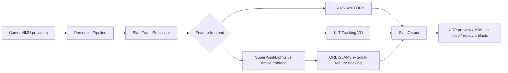

# SmartDrone

SmartDrone is a stereo / stereo-inertial drone runtime built around `ORB_SLAM3`, IMU input, UDP preview streaming, MAVLink pose publishing, and a small Android control app.

## Project Layout

```text
.
|- src/
|  |- native/        # Native runtime sources and CMake target
|  |  |- main.cpp    # CM5 flight runtime entry point
|  |  |- core/       # Runtime orchestration, sessions, modes, shared models
|  |  |- adapters/   # Camera / IMU / SLAM / telemetry concrete implementations
|  |  |- platform/   # Linux and board-specific access layers
|  |  `- common/tlv/ # Shared UDP/TLV control protocol and helpers
|  `- android/       # Android app project
|- config/           # Runtime settings files deployed with the app
|- third_party/      # MAVLink and other external code
|- ORB_SLAM3/        # SLAM dependency
`- output/           # Build caches and packaged artifacts
```

The runtime entry point is `src/native/main.cpp`.

## System Overview



## Build

Use `scripts/build.sh` as the unified build entry point:

```bash
./scripts/build.sh smart_drone
./scripts/build.sh android
./scripts/build.sh all
```

Build targets:

- `smart_drone`: build the main runtime executable only
- `android`: build the Android app, defaulting to `:app:assembleDebug`
- `all`: build `ORB_SLAM3` first, then the local C++ targets and Android app
- `test`: build and run host-side unit tests
- `replay`: build the host-side offline replay tool

Build mode parameters:

- `--clean`: remove the corresponding build directory before building
- `--reconfigure`: force CMake configure even when a cache already exists

Examples:

```bash
./scripts/build.sh smart_drone --clean --reconfigure
./scripts/build.sh all --clean
```

Android build behavior:

- Prefer `src/android/gradlew`
- If only `src/android/gradlew.bat` exists, the script uses `cmd.exe`
- If no Gradle wrapper exists in the repo, the script falls back to the system `gradle`
- Before building, the script removes `src/android/app/.cxx` to avoid stale CMake cache paths after repo moves or renames

Android build parameter:

```bash
ANDROID_GRADLE_TASK=assembleRelease ./scripts/build.sh android
```

This overrides the default Android Gradle task from `assembleDebug` to the value you provide.

Build parallelism parameter:

```bash
BUILD_JOBS=8 ./scripts/build.sh replay
```

By default `scripts/build.sh` uses `$(nproc)`.

## Workspace Customizations

Relative to the baseline repository, the current workspace includes a set of dedicated adaptations for `Jetson Orin NX + single-UVC packed stereo + SuperPoint`:

- `uvc_stereo_opencv` is now treated as one UVC device that returns one packed left-right stereo frame. A total frame size such as `1280x480` therefore means `640x480` per eye.
- The UVC path prefers `YUYV/YUV2` capture, converts it to grayscale, then splits the packed frame into left and right eye images on the device side before sending them into SLAM / SuperPoint.
- Packed stereo no longer depends on left-right timestamp pairing. Both eye images share the same software monotonic timestamp taken immediately after the grab completes.
- To preserve real-time behavior, the packed-UVC queue is forced down to `1`, so the runtime keeps the newest frame instead of accumulating stale frames behind slow SLAM/SuperPoint processing.
- The SuperPoint/LightGlue frontend supports `auto/cpu/cuda`. On Jetson, the CUDA path uses the native TensorRT SuperPoint extractor when the engine is available.
- `slam_dfx` now reports SuperPoint stage timings and payload counters so that bottlenecks can be separated into preprocessing, native input, network forward, frontend total, and stereo matching.
- UDP image delivery no longer has to stay pinned to one static IP. The runtime can resolve the current active phone peer dynamically and switch the preview destination accordingly.
- `UdpImageSender` now caps image streaming at `30 FPS`, while the Android-side `slam.input_fps` limit was raised to better match high-FPS UVC modes.
- The Android source tree was also updated so that exposure/gain/AE, packed-stereo capability handling, SuperPoint capability display, and higher SLAM FPS limits remain aligned with the updated UVC behavior.

If only the device/runtime side is being maintained, priority may be given to the native runtime and scripts; the Android-side changes are primarily intended to keep the UI and configuration protocol aligned with the updated UVC/SuperPoint pipeline.

## From Scratch On CM5 / Jetson Orin NX

The current repository is structured primarily for:

- cross-compiling on an x86_64 Linux host
- deploying the resulting artifacts to Raspberry Pi CM5 or Jetson Orin NX

Execution sequence:

1. Prepare a target device and install the runtime packages there first.
2. Export a sysroot from that device.
3. Cross-build on the host with `scripts/build.sh`.
4. Upload `output/artifacts/<platform>` to the device.
5. Run `smart_drone` on the device with the correct config, vocabulary, and optional SuperPoint/LightGlue TensorRT assets if needed.

### 1. Host Build Machine Prerequisites

Use an Ubuntu/Debian-like x86_64 host and install:

```bash
sudo apt-get update
sudo apt-get install -y \
  git cmake build-essential pkg-config rsync \
  gcc-aarch64-linux-gnu g++-aarch64-linux-gnu
```

Auxiliary tools:

- `ninja-build` for manual CMake + Ninja workflows
- `adb` for Android build and deployment workflows
- `python3` for calibration conversion, replay, and auxiliary scripts

### 2. Target Device Prerequisites

Install the target-side packages on CM5 or Jetson before exporting the sysroot.

For the default `libcamera_stereo_ov9281` provider:

```bash
sudo apt-get update
sudo apt-get install -y \
  libopencv-dev \
  libcamera-dev \
  libgpiod-dev \
  python3 python3-pip python3-venv
```

For the `uvc_stereo_opencv` provider:

- `OpenCV` is still required
- `libgpiod` is still required if you use the IMU path
- `libcamera` is not required by that provider itself; it remains applicable on systems that may switch providers later

Runtime prerequisites:

- `ORBvoc.txt` must exist on the target, or you must start the runtime with `--vocab /path/to/ORBvoc.txt`
- your selected runtime YAML in `config/` must exist on the target
- if you run with stereo-IMU or mono-IMU modes, the SPI IMU node and GPIO line must be available on the target
- if you run with the default MAVLink setup, `/dev/ttyAMA0` or your chosen serial device must exist and be accessible

### 3. SuperPoint/LightGlue Runtime Assets

SuperPoint is an optional component. The default ORB frontend does not require it.

If you want `slam.feature_frontend=superpoint_lightglue`, prepare the LightGlue repository and TensorRT engines on the target:

```bash
./scripts/export_superpoint_tensorrt.sh --repo /home/nvidia/LightGlue --width 640 --height 480
./scripts/export_lightglue_tensorrt.sh --repo /home/nvidia/LightGlue --points 768 --layers 6
```

Runtime uses C++/TensorRT inference. Python is used only by the export scripts that produce ONNX/TensorRT assets.

Point runtime arguments or config to:

- `--superpoint-repo`
- `--superpoint-device`
- `--superpoint-top-k`
- `--superpoint-max-points`
- `--superpoint-input-max-width`
- `--superpoint-input-max-height`

### 4. Export a Sysroot

The build scripts expect:

- CM5 sysroot at `../sysroots/cm5` by default
- Jetson sysroot at `../sysroots/jetson-orin-nx` by default

Example export from the target device:

```bash
mkdir -p ~/sysroot-export
sudo rsync -a --delete \
  /lib /usr/lib /usr/include /usr/share/pkgconfig /usr/lib/aarch64-linux-gnu /lib/aarch64-linux-gnu \
  ~/sysroot-export/
```

Then copy that exported tree to the host, for example as:

- `../sysroots/cm5`
- `../sysroots/jetson-orin-nx`

The sysroot should contain at least:

- `usr/include`
- `usr/lib/aarch64-linux-gnu`
- `usr/lib`
- `lib/aarch64-linux-gnu`
- target-side `pkgconfig` files

### 5. Build For CM5

If your sysroot is in the default location:

```bash
./scripts/build.sh smart_drone
./scripts/build.sh all
```

If your sysroot is elsewhere:

```bash
export SYSROOT=/opt/sysroots/cm5
./scripts/build.sh smart_drone --reconfigure
./scripts/build.sh all --clean --reconfigure
```

Artifacts are written to:

- `output/artifacts/cm5/bin/smart_drone`
- `output/artifacts/cm5/lib/`
- `output/artifacts/cm5/config/`
- `output/artifacts/cm5/scripts/`

### 6. Build For Jetson Orin NX

If your sysroot is in the default location:

```bash
./scripts/build.sh smart_drone --jetson-orin-nx
./scripts/build.sh all --jetson-orin-nx
```

If your sysroot is elsewhere:

```bash
export JETSON_SYSROOT=/opt/sysroots/jetson-orin-nx
./scripts/build.sh smart_drone --jetson-orin-nx --reconfigure
./scripts/build.sh all --jetson-orin-nx --clean --reconfigure
```

Artifacts are written to:

- `output/artifacts/jetson-orin-nx/bin/smart_drone`
- `output/artifacts/jetson-orin-nx/lib/`
- `output/artifacts/jetson-orin-nx/config/`
- `output/artifacts/jetson-orin-nx/scripts/`

The current `scripts/build.sh` also provides the following Jetson-specific workflow normalizations:

- `orb` mode is available to build `ORB_SLAM3` and its shared libraries independently.
- `--jetson-orin-nx` auto-detects common sysroot locations, cross-toolchain prefixes, and host libdirs instead of requiring all environment variables every time.
- `SMART_DRONE_CAMERA_PROVIDER=uvc_stereo_opencv` can be passed directly through to CMake from the unified build entry point.
- Artifact packaging now also attempts to include `ORBvoc.txt` and the local SuperPoint/LightGlue runtime assets.

Recommended Jetson build command on the build server:

```bash
BUILD_JOBS=4 SMART_DRONE_CAMERA_PROVIDER=uvc_stereo_opencv \
  ./scripts/build.sh smart_drone --jetson-orin-nx --reconfigure
```

### 7. Deploy To The Device

Use the built-in uploader:

```bash
./scripts/upload.sh --platform cm5 --restart
./scripts/upload.sh --platform jetson-orin-nx --restart
```

Or set the target explicitly:

```bash
TARGET_HOST=ltz@192.168.0.105 REMOTE_DIR=/home/ltz \
  ./scripts/upload.sh --platform cm5 --restart
```

`scripts/upload.sh` is normalized for both CM5 and Jetson:

- `--jetson-orin-nx` defaults to `nvidia@192.168.0.103:/home/nvidia/SmartDrone_cross`
- Jetson uses `artifact-root` deployment by default, replacing the entire `output/artifacts/jetson-orin-nx` layout atomically on the remote side
- `SSH_PASSWORD=...` is supported through `sshpass`, including unattended `sudo systemctl restart`
- artifact-root deployment carries `bin/`, `lib/`, `config/`, `scripts/`, plus packaged `ORBvoc.txt` and SuperPoint/LightGlue runtime assets when present

Recommended Jetson deploy command:

```bash
SSH_PASSWORD=nvidia ./scripts/upload.sh --jetson-orin-nx --restart
```

The uploader expects these files to exist in `output/artifacts/<platform>`:

- `bin/smart_drone`
- `lib/libORB_SLAM3.so`
- `lib/libDBoW2.so`
- `lib/libg2o.so`
- `config/stereo.yaml`
- `config/stereo_inertial.yaml`
- `config/mono_right.yaml`
- `config/mono_inertial_right.yaml`
- SuperPoint/LightGlue TensorRT engine assets when present

### 8. Initial Run On The Device

For manual execution instead of systemd:

```bash
cd /home/ltz
export LD_LIBRARY_PATH=/home/ltz
./smart_drone --auto-mode idle --settings config/stereo.yaml --vocab /path/to/ORBvoc.txt
```

Adjust these according to your setup:

- `--settings config/stereo.yaml` for stereo
- `--settings config/stereo_inertial.yaml` for stereo-IMU
- `--settings config/mono_right.yaml` for mono
- `--settings config/mono_inertial_right.yaml` for mono-IMU

If you use the bundled `smart_drone.service`, review it first:

- the sample unit file uses `User=user`, which you likely need to change
- it assumes `WorkingDirectory=~`
- it assumes `LD_LIBRARY_PATH=~`
- it uses `ExecStart=~/smart_drone --auto-mode idle`

### 9. Camera Provider Selection

Build-time provider:

```bash
-DSMART_DRONE_CAMERA_PROVIDER=libcamera_stereo_ov9281
```

Supported values:

- `libcamera_stereo_ov9281`
- `uvc_stereo_opencv`

Provider semantics:

- `libcamera_stereo_ov9281` expects two libcamera streams and uses left/right timestamp pairing
- `uvc_stereo_opencv` expects one UVC device returning a packed left-right frame
- for `uvc_stereo_opencv`, configure:
  - `camera.uvc_device_index`
  - `camera.uvc_eye_width`
  - `camera.uvc_eye_height`
  - `camera.uvc_packed_stereo=true`

Additional runtime semantics for `uvc_stereo_opencv` are as follows:

- the requested UVC capture width is `2 * camera.uvc_eye_width`
- a total frame size such as `1280x480` therefore means `640x480` per eye
- if the device negotiates `CV_8UC2`, runtime converts it through `YUYV/YUV2 -> Gray`
- the two eye images are split from the same frame and do not depend on `camera.pair_window_ms`
- to minimize queue latency, the packed-UVC frame queue is forced to `1`

### 10. Items Requiring Manual Preparation

The following items still require manual preparation:

- exporting and refreshing the target sysroot
- making sure `ORBvoc.txt` is present on the device
- preparing SuperPoint/LightGlue TensorRT engine assets when using the `superpoint_lightglue` frontend
- camera-specific permissions, device nodes, and service user setup
- Jetson-specific camera integration if you do not use the current `libcamera` or packed-UVC paths

### Jetson Orin NX Cross-Compile

Directory convention:

- build caches live under `output/build/...`
- deployable artifacts live under `output/artifacts/...`

Jetson Orin NX is now folded into the unified build entry point:

```bash
./scripts/build.sh smart_drone --jetson-orin-nx
./scripts/build.sh all --jetson-orin-nx
```

Relevant files:

- `toolchain/toolchain-jetson-orin-nx-aarch64.cmake`
- `scripts/build.sh`

Configuration defaults:

- `JETSON_SYSROOT` defaults to `../sysroots/jetson-orin-nx`
- `JETSON_TOOLCHAIN_PREFIX` defaults to `aarch64-linux-gnu`
- native build directory is `output/build/jetson-orin-nx/smart_drone`
- ORB-SLAM3 build directory is `output/build/jetson-orin-nx/orbslam3`
- packaged artifacts go to `output/artifacts/jetson-orin-nx`

Execution example:

```bash
export JETSON_SYSROOT=/opt/sysroots/jetson-orin-nx
./scripts/build.sh smart_drone --jetson-orin-nx --reconfigure
./scripts/build.sh all --jetson-orin-nx --clean --reconfigure
```

Disable ARM CPU tuning for the initial toolchain validation step, then enable target-specific tuning after the baseline build is verified:

```bash
cmake -S . -B output/build/jetson-orin-nx/smart_drone \
  -DSYSROOT="$JETSON_SYSROOT" \
  -DCMAKE_TOOLCHAIN_FILE=toolchain/toolchain-jetson-orin-nx-aarch64.cmake \
  -DENABLE_ARM_CPU_TUNING=OFF
```

If you invoke CMake manually with the normalized layout, use:

```bash
cmake -S . -B output/build/jetson-orin-nx/smart_drone \
  -DSYSROOT="$JETSON_SYSROOT" \
  -DCMAKE_TOOLCHAIN_FILE=toolchain/toolchain-jetson-orin-nx-aarch64.cmake \
  -DENABLE_ARM_CPU_TUNING=OFF
```

The native runtime now exposes the compiled camera provider as a CMake variable:

```bash
-DSMART_DRONE_CAMERA_PROVIDER=libcamera_stereo_ov9281
```

Two provider entry points are now reserved:

- `libcamera_stereo_ov9281`
- `uvc_stereo_opencv`

`uvc_stereo_opencv` currently assumes one UVC device that outputs a packed left-right stereo frame:

- `camera.uvc_device_index` selects the single UVC device
- `camera.uvc_eye_width / camera.uvc_eye_height` describe the per-eye resolution
- the actual requested UVC capture width is `2 * camera.uvc_eye_width`
- `camera.uvc_packed_stereo=true` explicitly declares packed left-right stereo output
- left and right images share the same capture timestamp to reduce software timestamp jitter

The Jetson sysroot should contain at least:

- `usr/include`
- `usr/lib/aarch64-linux-gnu`
- `usr/lib`
- `lib/aarch64-linux-gnu`
- target-side `pkgconfig` metadata
- target-installed `OpenCV`, `libcamera`, and `gpiod`

Jetson support boundary:

- native `aarch64 + sysroot + pkg-config` cross-compilation is now wired in
- the SuperPoint/LightGlue TensorRT engine assets still need to be prepared on the target device
- the runtime now has build-time entry points for both `libcamera_stereo_ov9281` and standard `uvc_stereo_opencv`; if Jetson uses a different camera stack, a dedicated provider is still required
- a successful cross-build does not by itself guarantee that the Jetson camera pipeline is runnable unchanged

## Build Manually

### Build the CM5 Runtime

```bash
cd ~/SmartDrone
./scripts/build.sh smart_drone
./scripts/build.sh all
```

### Build the Android App

```bash
cd ~/SmartDrone/src/android
rm -rf app/.cxx app/build
./gradlew :app:assembleDebug --no-daemon
adb -d install -r app/build/outputs/apk/debug/app-debug.apk
```

After the Android build, the script also syncs the newest APK to `output/artifacts/android/latest.apk`.

## Tests

Run the host-side unit tests with:

```bash
./scripts/build.sh test
```

This builds the `smart_drone_unit_tests` target and runs `ctest` in `output/build/host/unit-test`.

Host-side coverage:

- `FrameTimingTracker`
- `ModeManager`
- `PerceptionPipeline`
- `RuntimeConfigService`
- replay dataset loading and IMU window extraction
- replay runner plumbing with a fake SLAM engine

## Offline Replay

Use the host-side offline replay tool to feed recorded stereo images and IMU data into the local replay pipeline and export a pose CSV:

```bash
./scripts/build.sh replay
./output/artifacts/host/offline-replay/smart_drone_offline_replay
```

Replay parameter examples:

```bash
./output/artifacts/host/offline-replay/smart_drone_offline_replay \
  --dataset tests/data \
  --out build/offline_replay_pose.csv \
  --summary-json build/offline_replay_summary.json \
  --sensor-mode stereo-imu
```

Use stereo-only replay when a dataset does not contain sufficient motion to initialize stereo-inertial mode:

```bash
./output/artifacts/host/offline-replay/smart_drone_offline_replay \
  --stereo-only \
  --out build/offline_replay_pose_stereo.csv \
  --summary-json build/offline_replay_stereo_summary.json
```

`--summary-json` writes a small machine-readable summary with:

- `frames_out`
- `pose_valid_frames`
- `tracking_ok_frames`
- `tracking_lost_frames`
- `identity_pose_frames`

The default vocabulary path resolves to `ORB_SLAM3/Vocabulary/ORBvoc.txt`.

## Offline Replay Baseline

The replay build also registers a stereo-only integration baseline in CTest:

```bash
cd output/build/host/offline-replay
ctest -R OfflineReplayStereoOnly -V
```

The baseline runs the replay tool with `--stereo-only --summary-json ...` and then checks:

- `tracking_ok_frames == frames_out`
- `identity_pose_frames <= 1`

This provides a regression check for the current local stereo replay dataset without depending on IMU initialization quality.

EuRoC MAV sequences can be used for trajectory regression as well. Point `SMART_DRONE_EUROC_DATASET` at a sequence root or its `mav0` directory, for example `MH_01_easy`:

```bash
cd output/build/host/offline-replay
SMART_DRONE_EUROC_DATASET=/data/EuRoC/MH_01_easy \
SMART_DRONE_EUROC_MAX_FRAMES=600 \
ctest -R OfflineReplayEurocRegression -V
```

The test runs stereo-only offline replay and evaluates the output against `mav0/state_groundtruth_estimate0/data.csv` using SE(3)-aligned ATE/RPE. Defaults are `ATE RMSE <= 2.5m` and `RPE translation RMSE <= 1.0m`; override them with `SMART_DRONE_EUROC_MAX_ATE_RMSE` and `SMART_DRONE_EUROC_MAX_RPE_RMSE`. If `SMART_DRONE_EUROC_DATASET` is not set, the test is skipped.

## Calibration

### 1. Start a Kalibr Environment

Docker command example:

```bash
sudo docker run -it --rm \
  -v ~/workspace/kalibr_data:/data \
  -w /data \
  swr.cn-north-4.myhuaweicloud.com/ddn-k8s/docker.io/ulong2/ie_kalibr_image:latest \
  bash

export MPLBACKEND=Agg
source /opt/ros/noetic/setup.bash
source /data/kalibr_ws/devel/setup.bash

apt-get install -y --no-install-recommends python3-wxgtk4.0
apt-get install -y --no-install-recommends python3-igraph
apt-get install -y --no-install-recommends python3-scipy
```

### 2. Generate Stereo Calibration Parameters

The repository root `scripts/make_rosbag.py` now generates both bags in one run:

```bash
python3 scripts/make_rosbag.py
```

By default it reads:

- `/data/calib_data_0/cam0`, `/data/calib_data_0/cam1`, `/data/calib_data_0/imu.csv`
- `/data/calib_data_1/cam0`, `/data/calib_data_1/cam1`, `/data/calib_data_1/imu.csv`

And writes:

- `/data/calib_data_0.bag`
- `/data/calib_data_1.bag`

The bag generator also:

- removes trailing invalid camera images automatically
- trims trailing IMU samples after the last valid camera frame

Then run stereo camera calibration on `calib_data_0.bag`:

```bash
rosrun kalibr kalibr_calibrate_cameras \
  --bag /data/calib_runs/calib_data_0.bag \
  --target /data/aprilgrid.yaml \
  --models pinhole-radtan pinhole-radtan \
  --topics /cam0/image_raw /cam1/image_raw \
  --approx-sync 0.002
```

### 3. Generate Stereo-IMU Calibration Parameters

Then run stereo-IMU calibration on `calib_data_1.bag`:

```bash
rosrun kalibr kalibr_calibrate_imu_camera \
  --bag /data/calib_runs/calib_data_1.bag \
  --cam /data/calib_runs/calib_data_0-camchain.yaml \
  --imu /data/imu.yaml \
  --target /data/aprilgrid.yaml
```

### 4. Convert Kalibr Results To Runtime YAML

After Kalibr finishes, use `scripts/convert_kalibr_to_smartdrone_yaml.py` to convert the Kalibr output into SmartDrone runtime configs:

```bash
python3 scripts/convert_kalibr_to_smartdrone_yaml.py \
  --camchain /data/calib_A-camchain-imucam.yaml \
  --imu /data/imu.yaml
```

This generates:

- `config/stereo.yaml`
- `config/stereo_inertial.yaml`
- `config/mono_inertial_right.yaml`

`T_b_c1` notes (important):

- `T_b_c1` in `config/stereo.yaml` is the extrinsic from `body -> c1 (left camera)`.
- In pure stereo mode (`SensorMode::Stereo`), runtime converts SLAM left-camera pose to body pose before publishing.
- Transform equation: `T_w_b = T_w_c1 * (T_b_c1)^-1`.
- If neither `T_b_c1` nor `IMU.T_b_c1` exists, pose stays in camera frame in pure stereo mode.

The converter also accepts a remote Kalibr result directory:

```bash
python3 scripts/convert_kalibr_to_smartdrone_yaml.py \
  --kalibr-root ltz@192.168.0.50:~/workspace/kalibr_data/calib_runs
```

The converter will try to:

- find the latest `*camchain-imucam.yaml` or `*camchain.yaml` under that directory
- read `imu.yaml` from the parent Kalibr data directory
- write the SmartDrone YAML files locally

## Upload

Use `scripts/upload.sh` to upload the runtime executable, `ORB_SLAM3` shared libraries, and runtime config files to the target device:

```bash
./scripts/upload.sh
./scripts/upload.sh --restart
./scripts/upload.sh --platform jetson-orin-nx --restart
TARGET_HOST=ltz@192.168.0.103 REMOTE_DIR=/home/ltz ./scripts/upload.sh --restart
./scripts/upload.sh --adb-ip 192.168.0.100 --adb-port 33707
./scripts/upload.sh --restart --adb-ip 192.168.0.100 --adb-port 33707
./scripts/upload.sh --adb-only --adb-ip 192.168.0.100 --adb-port 33707
```

Deployment behavior:

- Upload `output/artifacts/cm5/bin/smart_drone`
- Upload `libORB_SLAM3.so`, `libDBoW2.so`, and `libg2o.so`
- Create `~/config` on the target when needed
- Upload `config/stereo.yaml` and `config/stereo_inertial.yaml`
- Upload `config/mono_right.yaml` and `config/mono_inertial_right.yaml`
- Upload SuperPoint/LightGlue TensorRT engine assets when they exist under `output/artifacts/<platform>/`
- Upload to temporary `*.new` files first, then atomically replace the final files with `mv`

Deployment environment variables:

- `TARGET_HOST`: default `ltz@192.168.0.105`
- `REMOTE_DIR`: default `/home/ltz`
- `REMOTE_SERVICE`: default `smart_drone`
- `RESTART_SERVICE`: if set to `1`, run `sudo systemctl restart smart_drone` after upload
- `DEPLOY_PLATFORM`: default `cm5`, selects artifacts under `output/artifacts/<platform>`
- `UPLOAD_LAYOUT`: `flat` or `artifact-root`; Jetson defaults to `artifact-root`
- `SSH_PASSWORD`: when set, `upload.sh` uses `sshpass` for `ssh/scp` and can feed `sudo -S`
- `ADB_IP` / `ADB_PORT`: if both are set (or provided with `--adb-ip` / `--adb-port`), run Android `adb connect` and install APK

Android deployment parameters:

- `--apk <path>`: APK path for `adb install -r`, default `output/artifacts/android/latest.apk`
- `--adb-only`: skip SSH/runtime upload and run Android `adb connect` + APK install only

Deployment platform parameter:

- `--platform <name>`: explicitly select artifacts under `output/artifacts/<name>`, for example `cm5` or `jetson-orin-nx`
- `--jetson-orin-nx`: shorthand for `--platform jetson-orin-nx` plus Jetson default host/path

ADB constraints:

- If either `--adb-ip` or `--adb-port` is set, both are required.

## Mobile Runtime Tuning

`CMD_RUNTIME_CONFIG` now supports two SLAM-related tuning groups from Android:

- Runtime `T_b_c1` override: `slam.tbc_override_enabled` (default off), `slam.tbc_tx_m / ty_m / tz_m`, and `slam.tbc_roll_deg / pitch_deg / yaw_deg` (Android range: roll/yaw `-10.0~10.0`, pitch `-10.0~100.0`, step `0.1`).
- ORB extractor parameters:
- `slam.orb_nfeatures`
- `slam.orb_scale_factor`
- `slam.orb_nlevels`
- `slam.orb_ini_th_fast`
- `slam.orb_min_th_fast`

Additional notes related to the current UVC/SuperPoint adaptation:

- On packed-UVC, `camera.auto_exposure` means handing control back to the UVC camera firmware / ISP auto-exposure path rather than libcamera AE.
- On packed-UVC, `camera.pair_window_ms` is kept only as a compatibility field and is not used for left-right software pairing.
- The Android-side `slam.input_fps` ceiling was raised so the UI can target high-rate modes such as `1280x400@120`, `1280x480@100`, or `1600x600@100`.
- When `stream.send_image=true`, the packed UVC frame is split into left/right eye images first, then preview and feature overlays are sent per eye.

Application semantics:

- ORB parameter changes trigger a SLAM session restart.
- Before SLAM starts, runtime generates `*.runtime_orb.yaml` from the active settings file, overrides `ORBextractor.*`, then initializes ORB-SLAM3 with that file.
- `slam.orb_min_th_fast` must be less than or equal to `slam.orb_ini_th_fast`; otherwise the config update is rejected.
