# Native Runtime Graph Topology

This is the maintained native runtime topology. Every visible node must be a task node and must declare `type` plus trigger parameters. Queue metadata is described only on edges with `type`, `depth`, and `overflow`; queue names and task port names are intentionally omitted and should be inferred by the parser/compiler from connected task types.

The graph must only show implemented runtime_graph tasks. Future target stages are added here only when the code owns a matching task and queue.

```mermaid
flowchart LR
  subgraph supervisor_graph["Runtime Supervisor Graph"]
    RuntimeSupervisorTask["type=RuntimeSupervisorTask<br/>trigger=periodic<br/>interval_ms=100"]
  end

  subgraph slam_session_graph["SLAM Session Graph"]
    NativeSlamResourceTask["type=NativeSlamResourceTask<br/>trigger=periodic<br/>interval_ms=1"]
    NativeSlamClockTask["type=NativeSlamClockTask<br/>trigger=periodic<br/>interval_ms=1"]
    NativeSlamImuGateTask["type=NativeSlamImuGateTask<br/>trigger=any_queue_ready<br/>trigger_queues=NativeSlamResourceReady+NativeSlamTick"]
    NativeSlamAcquireTask["type=NativeSlamAcquireTask<br/>stage=frame_acquire_and_prepare<br/>trigger=any_queue_ready<br/>trigger_queues=NativeSlamFrameReady"]
    NativeSlamTrackingTask["type=NativeSlamTrackingTask<br/>trigger=any_queue_ready<br/>trigger_queues=NativeSlamPreparedFrame"]
    NativeSlamPosePostprocessTask["type=NativeSlamPosePostprocessTask<br/>trigger=any_queue_ready<br/>trigger_queues=NativeSlamTrackedFrame"]
    NativeSlamPointCloudTask["type=NativeSlamPointCloudTask<br/>trigger=any_queue_ready<br/>trigger_queues=NativeSlamPublishedFrame"]
    NativeSlamLivePoseTask["type=NativeSlamLivePoseTask<br/>trigger=any_queue_ready<br/>trigger_queues=NativeSlamPublishedFrame"]
    NativeSlamMavlinkTask["type=NativeSlamMavlinkTask<br/>trigger=any_queue_ready<br/>trigger_queues=NativeSlamPublishedFrame"]
    NativeSlamUdpTask["type=NativeSlamUdpTask<br/>trigger=any_queue_ready<br/>trigger_queues=NativeSlamPublishedFrame"]
    NativeSlamDfxTask["type=NativeSlamDfxTask<br/>trigger=any_queue_ready<br/>trigger_queues=NativeSlamPublishedFrame"]
    NativeSlamMonitorTask["type=NativeSlamMonitorTask<br/>trigger=any_queue_ready<br/>trigger_queues=NativeSlamStatus"]

    NativeSlamResourceTask -->|type=NativeSlamResourceReady; depth=1; overflow=overwrite_oldest| NativeSlamImuGateTask
    NativeSlamClockTask -->|type=NativeSlamTick; depth=1; overflow=overwrite_oldest| NativeSlamImuGateTask
    NativeSlamImuGateTask -->|type=NativeSlamFrameReady; depth=1; overflow=overwrite_oldest| NativeSlamAcquireTask
    NativeSlamAcquireTask -->|type=NativeSlamPreparedFrame; depth=1; overflow=overwrite_oldest| NativeSlamTrackingTask
    NativeSlamTrackingTask -->|type=NativeSlamTrackedFrame; depth=1; overflow=overwrite_oldest| NativeSlamPosePostprocessTask
    NativeSlamPosePostprocessTask -->|type=NativeSlamPublishedFrame; depth=1; overflow=overwrite_oldest| NativeSlamPointCloudTask
    NativeSlamPointCloudTask -->|type=NativeSlamPublishedFrame; depth=1; overflow=overwrite_oldest| NativeSlamLivePoseTask
    NativeSlamLivePoseTask -->|type=NativeSlamPublishedFrame; depth=1; overflow=overwrite_oldest| NativeSlamMavlinkTask
    NativeSlamMavlinkTask -->|type=NativeSlamPublishedFrame; depth=1; overflow=overwrite_oldest| NativeSlamUdpTask
    NativeSlamUdpTask -->|type=NativeSlamPublishedFrame; depth=1; overflow=overwrite_oldest| NativeSlamDfxTask
    NativeSlamDfxTask -->|type=NativeSlamStatus; depth=4; overflow=overwrite_oldest| NativeSlamMonitorTask
  end

  subgraph calib_session_graph["Calibration Session Graph"]
    CalibResourceTask["type=CalibResourceTask<br/>trigger=periodic<br/>interval_ms=1"]
    NativeCalibClockTask["type=NativeCalibClockTask<br/>trigger=periodic<br/>interval_ms=1"]
    CalibCameraAcquireTask["type=CalibCameraAcquireTask<br/>trigger=any_queue_ready<br/>trigger_queues=CalibResourceReady+NativeCalibTick"]
    CalibPacingFilterTask["type=CalibPacingFilterTask<br/>trigger=any_queue_ready<br/>trigger_queues=CalibStereoFrame"]
    CalibStorageWriteTask["type=CalibStorageWriteTask<br/>trigger=any_queue_ready<br/>trigger_queues=CalibSavePair"]
    CalibImuWriterTask["type=CalibImuWriterTask<br/>trigger=periodic_or_any_queue_ready<br/>interval_ms=1<br/>trigger_queues=CalibResourceReady"]
    CalibUdpPreviewTask["type=CalibUdpPreviewTask<br/>trigger=any_queue_ready<br/>trigger_queues=CalibStereoFrame"]
    CalibCompletionTask["type=CalibCompletionTask<br/>trigger=any_queue_ready<br/>trigger_queues=CalibCaptureDone+CalibStorageStatus+CalibImuStatus+CalibPreviewStatus"]
    CalibFlushSyncTask["type=CalibFlushSyncTask<br/>trigger=any_queue_ready<br/>trigger_queues=CalibFlushRequest"]
    NativeCalibMonitorTask["type=NativeCalibMonitorTask<br/>trigger=any_queue_ready<br/>trigger_queues=NativeCalibStatus"]

    CalibResourceTask -->|type=CalibResourceReady; depth=1; overflow=overwrite_oldest| CalibCameraAcquireTask
    CalibResourceTask -->|type=CalibResourceReady; depth=1; overflow=overwrite_oldest| CalibImuWriterTask
    NativeCalibClockTask -->|type=NativeCalibTick; depth=1; overflow=overwrite_oldest| CalibCameraAcquireTask
    CalibCameraAcquireTask -->|type=CalibStereoFrame; depth=1; overflow=overwrite_oldest| CalibPacingFilterTask
    CalibCameraAcquireTask -->|type=CalibStereoFrame; depth=1; overflow=overwrite_oldest| CalibUdpPreviewTask
    CalibCameraAcquireTask -->|type=CalibCaptureDone; depth=1; overflow=overwrite_oldest| CalibCompletionTask
    CalibPacingFilterTask -->|type=CalibSavePair; depth=2; overflow=drop_newest| CalibStorageWriteTask
    CalibStorageWriteTask -->|type=CalibStorageStatus; depth=8; overflow=overwrite_oldest| CalibCompletionTask
    CalibImuWriterTask -->|type=CalibImuStatus; depth=8; overflow=overwrite_oldest| CalibCompletionTask
    CalibUdpPreviewTask -->|type=CalibPreviewStatus; depth=8; overflow=overwrite_oldest| CalibCompletionTask
    CalibCompletionTask -->|type=CalibFlushRequest; depth=1; overflow=overwrite_oldest| CalibFlushSyncTask
    CalibFlushSyncTask -->|type=NativeCalibStatus; depth=4; overflow=overwrite_oldest| NativeCalibMonitorTask
  end
```

