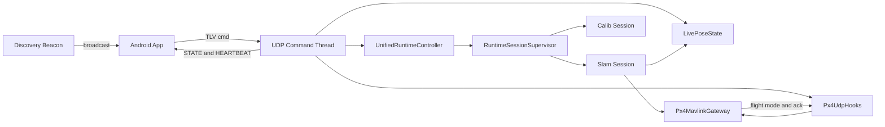
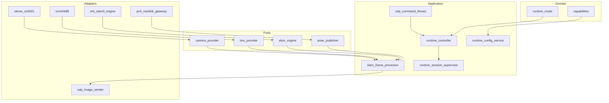
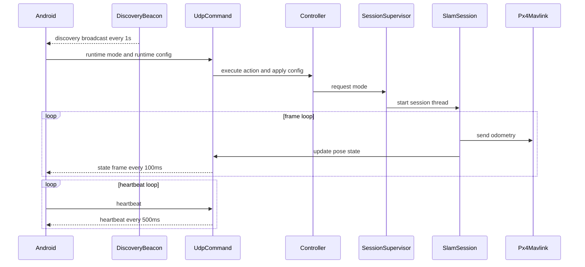
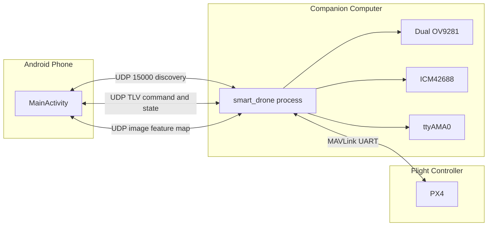
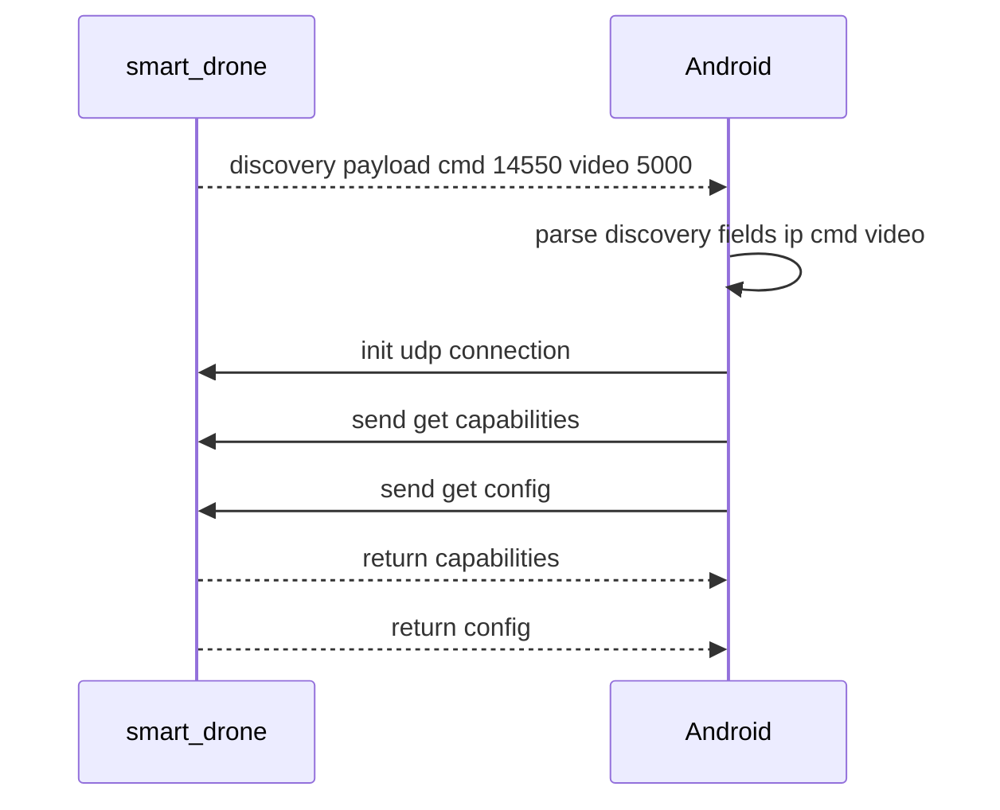
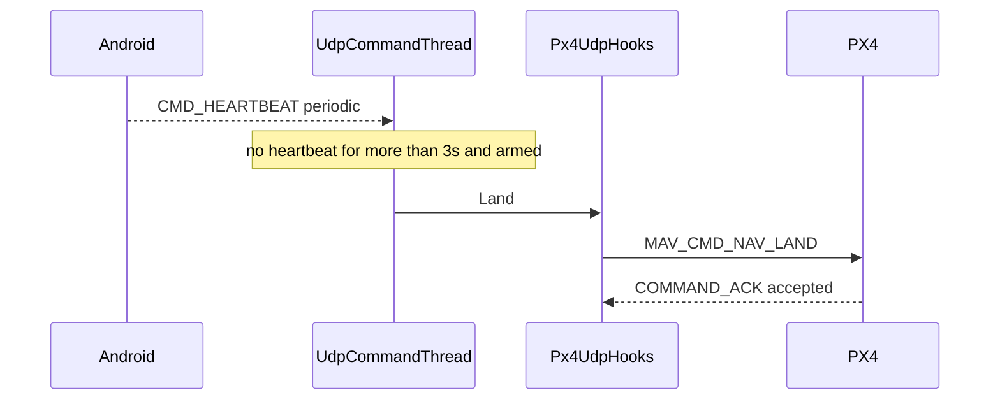

# SmartDrone Architecture Specification

> Version: V1.0  
> Scope: Architecture design, functional design, reliability design, performance design, DFX design, and 4+1 views.

## 1. Scope

This specification covers:

- Bootstrap and host runtime: `src/native/main.cpp`, `src/native/app/bootstrap/runtime_host.cpp`
- Core runtime services: `src/native/core/application/runtime/*`
- Session and processing pipeline: `src/native/core/application/session/*`
- Shared state and protocol: `src/native/core/application/state/*`, `src/native/common/tlv/*`
- Link discovery: `src/native/common/discovery/udp_discovery_beacon.cpp`
- Flight telemetry integration: `src/native/adapters/telemetry/px4_mavlink_gateway.cpp`
- Android control app: `src/android/app/src/main/java/com/example/smartdrone/MainActivity.java`

---

## 2. Architectural Overview

### 2.1 Layered Architecture

- Domain: runtime modes, capability model, domain enums (`core/domain`)
- Ports: abstraction boundaries for camera/IMU/SLAM/pose publishing/command channel (`core/ports`)
- Application: orchestration, session supervision, runtime config, live state (`core/application`)
- Adapters: concrete implementations for camera/IMU/SLAM/MAVLink/UDP (`adapters`)
- Common: TLV framing, UDP helpers, thread launch logging, discovery beacon (`common`)

### 2.2 Design Principles

- Control plane and data plane are separated
- Mode switching is centralized by `UnifiedRuntimeController`
- Session lifecycle is isolated and deterministic
- Observability is built into protocol, threading, and diagnostics

---

## 3. Functional Design

### 3.1 Startup and Lifecycle

Startup sequence:

1. `RuntimeHost::Run` initializes MAVLink gateway, live state, PX4 hooks, and runtime controller
2. Starts MAVLink RX and timesync threads
3. Starts UDP command thread
4. Starts UDP discovery beacon thread
5. Optionally enters `slam` or `calib` mode based on startup args

Shutdown sequence:

- stop controller
- stop setpoint stream
- stop MAVLink threads
- join discovery and command threads

### 3.2 Runtime Mode Management

Supported modes:

- `Idle`
- `Slam`
- `Calib`

`RuntimeSessionSupervisor` maintains desired and active modes, joins previous session, and launches the next session thread.

### 3.3 Flight Control Features

TLV commands are routed from `TlvCmdRouter` to `Px4UdpHooks`:

- flight actions: `ARM`, `DISARM`, `EMERGENCY_STOP`, `LAND`
- mode actions: `OFFBOARD`, `POSITION`, `HOLD`
- movement: `MOVE` (position/velocity/RC joystick)

Constraints:

- non-RC `MOVE` is allowed only in OFFBOARD mode
- POSITION mode does not keep setpoint streaming active
- OFFBOARD mode keeps setpoint streaming active (20 Hz)

### 3.4 SLAM Session Features

`RunSlamSession` and `SlamFrameProcessor` handle:

- stereo acquisition with optional IMU fusion window
- dynamic SLAM operation mode update
- pose post-processing and quality gating
- MAVLink odometry publishing
- image/feature/map streaming based on runtime config
- periodic and abnormal `slam_dfx` diagnostics

### 3.5 Calibration Session Features

`RunCalibSession` handles:

- auto-creating `calib_data_N` output directory
- writing stereo images and IMU records
- optional UDP image preview
- flush/fsync on stop for durability

### 3.6 Runtime Configuration Features

`CMD_RUNTIME_CONFIG` updates are validated and applied by `RuntimeConfigService`.

Config domains:

- camera: exposure/gain/AE/pair window
- SLAM: input FPS/perception mode/operation mode
- stream: UDP IP and image/feature/map flags

`ConfigRegistry` defines reload and restart semantics per key.

### 3.7 Capabilities and Config Query

- `CMD_GET_CAPABILITIES` -> `CMD_CAPABILITIES`
- `CMD_GET_CONFIG` -> `CMD_CONFIG`

Returned payload includes runtime modes, perception modes, SLAM modes, providers, and configurable keys.

### 3.8 Android App Features

Android `MainActivity` provides:

- CM5 auto-discovery on UDP 15000
- heartbeat send/monitor and timeout-triggered LAND
- command/config dispatch and ACK handling
- state, point-cloud, and video/feature visualization

---

## 4. Link Design (Including Discovery)

### 4.1 Discovery Link

Server side (`StartUdpDiscoveryBeaconThread`):

- port: `15000`
- period: `1s`
- destination: broadcast `255.255.255.255`
- payload: `smartdrone_discovery;device=cm5;cmd=<cmdPort>;video=<videoPort>`

Android side:

- binds UDP 15000
- validates discovery magic
- parses `ip/cmd/video`
- falls back to packet source IP if `ip` field is absent

### 4.2 Control Link (UDP TLV)

Frame format uses sync `0xAA 0x55`, version, command, flags, payload length, seq, time, payload, and CRC.

Key command groups:

- control: arm/disarm/offboard/hold/land/position/emergency stop
- movement: `CMD_MOVE`
- runtime: mode/config/clean calib/force restart
- query: capabilities/config
- response: ACK/STATE/POINT_CLOUD/CAPABILITIES/CONFIG/HEARTBEAT

### 4.3 Heartbeat and State Link

Server behavior (`udp_command_thread`):

- heartbeat TX: every `500ms`
- state TX: every `100ms`
- point cloud TX: on `sendMap=true` and cloud seq update

Loss handling:

- condition: active heartbeat peer + vehicle armed
- timeout: `3s`
- action: trigger `Land()`

Peer gate policy:

- active peer lock window: `5s`
- non-active peer commands are rejected

### 4.4 MAVLink Link

- transport: `/dev/ttyAMA0 @ 921600`
- threads: `mavlink_rx`, `mavlink_timesync`, `mavlink_setpoint_stream`
- capabilities: `COMMAND_LONG+ACK`, mode switch, manual control, setpoint streaming, odometry publish

---

## 5. Concurrency and Threading Model

Thread roles are unified in `thread_launch.h`:

- `RuntimeWorker`, `RuntimeSession`, `RuntimeForceRestart`
- `MavlinkRx`, `MavlinkTimesync`, `MavlinkSetpointStream`
- `UdpCommand`, `DiscoveryBeacon`
- `UdpImageCam0`, `UdpImageCam1`
- `Imu`, `CalibImuWriter`, `ManualControl`

Concurrency properties:

- single active session thread at a time
- manual control loop is persistent; streaming is gated
- setpoint stream is enabled on demand and disabled outside OFFBOARD
- `LivePoseState` is mutex-protected

---

## 6. Reliability Design

### 6.1 Protocol Reliability

- TLV CRC and parser resynchronization
- command ACK for control plane operations
- bounded ACK timeout and status codes

### 6.2 Link-loss Protection

- onboard heartbeat timeout LAND (`3s`, armed condition)
- Android-side heartbeat timeout LAND protection

### 6.3 Session Safety

- condition-variable based supervision and transition
- `WaitForIdle` for protected operations (e.g., calib cleanup)
- force-restart path is isolated in detached thread

### 6.4 Data Validity

- camera timeout and unhealthy pipeline detection
- IMU window sanitization and temporal checks
- MAVLink getters support freshness thresholds

### 6.5 Storage Durability

- calib output file and directory fsync on stop

---

## 7. Performance Design

### 7.1 Throughput Control

- configurable `slam.input_fps` with frame rate limiting
- video/preview flow rate controls
- point-cloud truncation under payload limits

### 7.2 Latency Instrumentation

- `FrameTimingTracker`: capture/in-slam/out-slam/send timestamps
- `odom_ts` logs queue/slam/send/total latency
- timesync offset/rtt/sample diagnostics

### 7.3 Resource Control

- manual-control stream and setpoint stream are separated
- setpoint stream disabled outside OFFBOARD
- image/feature/map streams are independently switchable

---

## 8. DFX Design

### 8.1 Design for Development

- strong separation between core logic and adapters
- centralized runtime configuration registry

### 8.2 Design for Test

- unit tests for mode manager/config service/perception/timing
- offline replay tool for pipeline verification

### 8.3 Design for Explainability and Observability

- diagnostics channels: `slam_dfx`, `odom_ts`, ACK logs, timesync logs
- role-based thread launch logging
- remote capability and config query endpoints

### 8.4 Design for Extensibility

- ports keep algorithm and device replacement open
- TLV runtime-config payload supports version compatibility
- mode enums are extensible for future features

---

## 9. 4+1 Views (Mermaid)

### 9.1 Logical View

### 9.2 Development View

### 9.3 Process View

### 9.4 Physical View

### 9.5 Scenario View

Scenario A: discovery and connection bootstrap

Scenario B: heartbeat timeout landing

