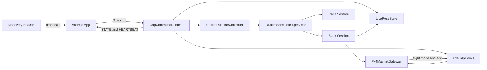
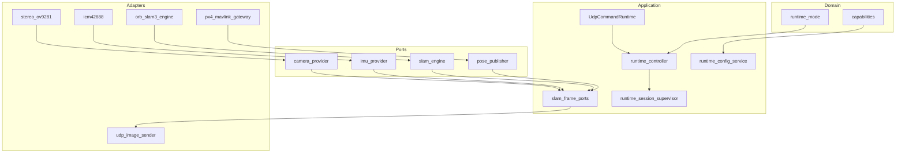
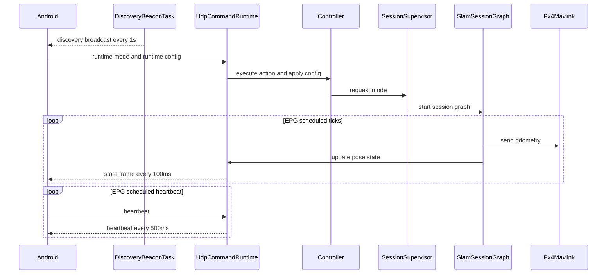
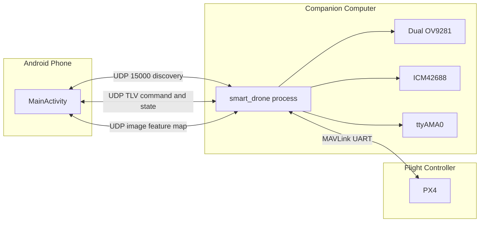
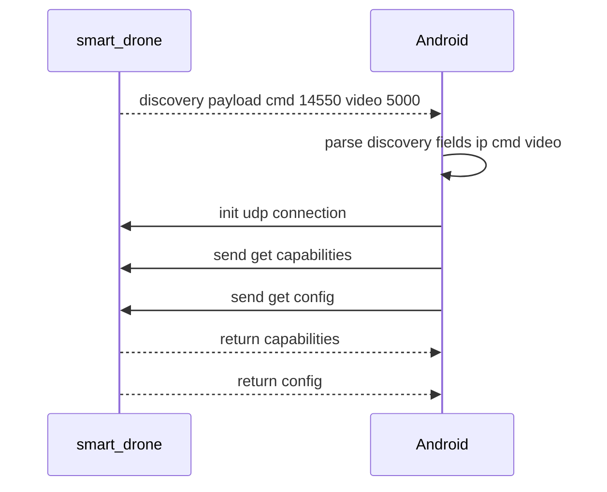
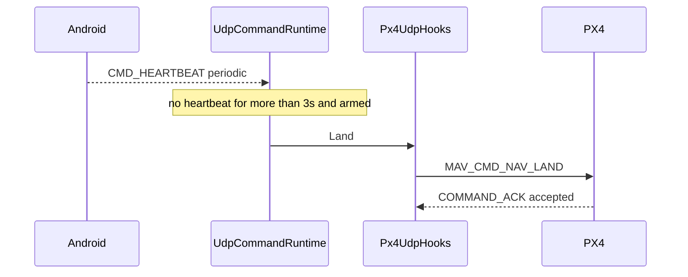

# SmartDrone Architecture Specification

> Version: V1.0  
> Scope: Architecture design, functional design, reliability design, performance design, DFX design, and 4+1 views.

## 1. Scope

This specification covers:

- Bootstrap and host runtime: `src/native/main.cpp`, `src/native/app/bootstrap/runtime_host.cpp`
- Core runtime services: `src/native/core/application/runtime/*`
- Session and processing pipeline: `src/native/core/application/session/*`
- Shared state and protocol: `src/native/core/application/state/*`, `src/native/common/tlv/*`
- Link discovery: `DiscoveryBeaconTask` in `src/native/core/application/runtime/system_runtime_graph_service.cpp`
- Flight telemetry integration: `src/native/adapters/telemetry/px4_mavlink_gateway.cpp`
- Android control app: `src/android/app/src/main/java/com/example/smartdrone/MainActivity.java`

---

## 2. Architectural Overview

### 2.1 Layered Architecture

- Domain: runtime modes, capability model, domain enums (`core/domain`)
- Ports: abstraction boundaries for camera/IMU/SLAM/pose publishing/command channel (`core/ports`)
- Application: orchestration, session supervision, runtime config, live state (`core/application`)
- Adapters: concrete implementations for camera/IMU/SLAM/MAVLink/UDP (`adapters`)
- Common: TLV framing, UDP helpers, EPG scheduling, runtime stop state (`common`)

### 2.2 Design Principles

- Control plane and data plane are separated
- Mode switching is centralized by `UnifiedRuntimeController`
- Session lifecycle is isolated and deterministic
- Observability is built into protocol, EPG scheduling, and diagnostics

---

## 3. Functional Design

### 3.1 Startup and Lifecycle

Startup sequence:

1. `RuntimeHost::Run` initializes MAVLink gateway, live state, PX4 hooks, and runtime controller
2. Starts `SystemRuntimeGraph`
3. `SystemRuntimeGraph` schedules MAVLink RX, setpoint stream, UDP command, manual control, force restart, runtime supervisor, and discovery beacon tasks
4. Optionally enters `slam` or `calib` mode based on startup args

`SystemRuntimeGraph` keeps persistent control-plane graph lifecycle in `system_runtime_graph_service`, task
registration in `system_runtime_task_factory`, and individual EPG task behavior in `system_runtime_tasks`.

Shutdown sequence:

- stop `SystemRuntimeGraph`
- stop controller
- stop setpoint stream
- close MAVLink resources

### 3.2 Runtime Mode Management

Supported modes:

- `Idle`
- `Slam`
- `Calib`

`RuntimeSessionSupervisor` maintains desired and active modes, requests the active session graph to stop, and launches the next session graph when the previous one is joined.

### 3.3 Flight Control Features

TLV commands are routed from `TlvCmdRouter` to `Px4UdpHooks`:

- flight actions: `ARM`, `DISARM`, `EMERGENCY_STOP`, `LAND`
- mode actions: `OFFBOARD`, `POSITION`, `HOLD`
- movement: `MOVE` (position/velocity/RC joystick)

Constraints:

- non-RC `MOVE` is allowed only in OFFBOARD mode
- POSITION mode does not keep setpoint streaming active
- OFFBOARD mode keeps setpoint streaming active (20 Hz)

### 3.4 SLAM Session Features

`SlamSessionGraphRuntime` and the SLAM frame ports handle:

- stereo acquisition with optional IMU fusion window
- dynamic SLAM operation mode update
- pose post-processing and quality gating
- MAVLink odometry publishing
- image/feature/map streaming based on runtime config
- periodic and abnormal `slam_dfx` diagnostics

`SlamSessionRuntime` owns session lifecycle and hardware/backend resources. Per-frame work is delegated through
`SlamFramePortSet`, which assembles input, tracking, pose-postprocess, and output ports with stage-local context and
state objects. This keeps EPG tasks responsible for scheduling and queue transfer while the ports own frame algorithms
and side effects. Backend control operations are routed through `SlamRuntimeControlPort`, so independently scheduled
frame ports do not share direct access to the backend control surface.
SLAM IMU polling uses `Icm42688SampleSource`, a shared non-blocking IMU sample interface that owns the ICM42688
SPI/DRDY open, configuration, and raw sample conversion flow.

The current implementation also introduces several UVC/streaming/real-time policies on top of the baseline SLAM session:

- Single-UVC packed stereo:
  `uvc_stereo_opencv` is now treated as one UVC device that returns one packed left-right stereo frame. Runtime splits the frame on-device and no longer depends on dual-camera timestamp pairing.
- Software timestamp strategy:
  for packed-UVC, the timestamp is taken from the monotonic clock immediately after frame grab completion, and both eye images share that same timestamp.
- Newest-frame priority:
  the packed-UVC path forces its internal frame queue to `1`, thereby preferring fresh frames over preserving stale frames behind slow SLAM or learned-frontend processing.
- Dynamic preview destination:
  `SlamSessionRuntime` resolves the UDP image destination from the current active peer stored in `LivePoseState`, thereby avoiding a permanently hard-coded phone IP.
- Preview rate limiting:
  `UdpImageSender` now rate-limits image output independently, with a maximum image send rate of `30 FPS`, decoupled from the SLAM input rate.

### 3.5 Visual Localization And Feature Frontend Adaptations

SuperPoint/LightGlue and XFeat/LightGlue are modeled as visual feature frontends. In the default runtime they are not
the production backend; `klt` is the native default and `dpvo_tensorrt` is a separate backend-level route. The current
learned-feature injection path is available through the optional legacy `orbslam3` adapter, where a generic visual
feature frontend prepares stereo feature packets for ORB-SLAM3-compatible tracking.

The SLAM stack is split around reusable ports:

- feature extraction and descriptors: `IVisualFeatureFrontend`, `IVisualDescriptorProvider`
- stereo preprocessing and pair construction: `IStereoFramePreprocessor`, `IStereoPairBuilder`,
  `IStereoMatchSelector`
- temporal feature carry and feature packet build: `ITemporalStereoProcessor`, `IStereoFeaturePacketBuilder`
- backend tracking, trajectory, map stats, and tracked visual data: `ISlamTrackingBackend`
- KLT/PnP back-end stages: `IVisualPnpObservationBuilder`, `IVisualPnpPoseBackend`
- place recognition vocabulary: `IVisualVocabulary`

ORB-SLAM3 source is built from `src/native/adapters/slam/orb_slam3` as internal modules. Third-party dependencies such
as Sophus, DBoW2, and g2o remain under `third_party`.

The implementation contains the following visual-feature adaptations:

- Native TensorRT frontend execution:
  `smart_drone` owns a `SuperPointLightGlueFrontendClient`, which delegates SuperPoint keypoint and descriptor extraction to `SuperPointNativeExtractor` and keeps keypoints plus `CV_32F` descriptors in process.
- Runtime-selectable execution device:
  the frontend accepts `auto/cuda` device selection in the current native TensorRT runtime. The Jetson path resolves to CUDA/TensorRT when the native engine is available.
- Jetson CUDA optimizations:
  on the CUDA path, TensorRT engine selection is derived from `SMART_DRONE_SUPERPOINT_TRT_ENGINE` or from the configured SuperPoint/LightGlue repo and input-size limits.
- Runtime-configurable SuperPoint tuning:
  runtime config exposes `slam.superpoint_top_k`, `slam.superpoint_max_points`, `slam.superpoint_input_max_width`, and `slam.superpoint_input_max_height`. Changes are applied through the runtime-config pipeline and restart the SLAM session so that the native frontend uses the updated limits.
- Stereo batch inference:
  left and right images are submitted through one stereo frontend call in stereo mode, keeping output split per image while sharing the native extractor path.
- Input-size adaptation:
  frontend input images are downscaled by the shared `StereoFeatureFrontendRunner` path in order to cap frontend cost
  on embedded targets. The width and height limits are runtime-configurable. A value of `0` disables the limit on that
  dimension. Setting both limits to `0` disables downscaling.
- Rectified-image stereo injection for the ORB-SLAM3 backend:
  for stereo pinhole configurations that require rectification, learned features are extracted on the same prepared
  image geometry that the ORB-SLAM3 runtime passes to ORB-SLAM3 prepared stereo tracking. This keeps feature
  coordinates and tracking images in the same rectified coordinate system.
- Backend availability gate:
  learned-feature injection runs only when the selected backend exposes a stereo-feature tracking path. Today that
  means the optional `orbslam3` backend; KLT and DPVO ignore the visual-feature client and run their own
  backend implementations.
- Separate raw-display and injected-feature semantics:
  the runtime records raw SuperPoint detections for diagnostics and overlay output, while the features injected into ORB-SLAM3 are the stereo-matched subset. This avoids conflating display density with the effective tracking input.
- Stereo-specific pair construction:
  injected stereo features are required to be pre-matched. The adaptation layer performs left-right pairing with
  epipolar and disparity constraints and emits `matchedStereoPairs=true` before entering ORB-SLAM3.
- Float-descriptor matcher compatibility:
  the ORB-SLAM3 descriptor provider can recompute ORB descriptors at learned-feature locations, and it keeps the old experimental
  `CV_32F` descriptor injection path explicit because SuperPoint/XFeat descriptors are not native ORB binary
  descriptors.
- BoW compatibility limits remain explicit:
  `Frame::ComputeBoW()` and `KeyFrame::ComputeBoW()` still only build BoW vectors for `CV_8U` descriptors. As a result, the SuperPoint path is compatible with tracking injection, but it does not replace the full ORB vocabulary-based frontend assumptions.
- Explicit runtime diagnostics:
  `slam_dfx` reports `superpoint_used`, `superpoint_raw_left/right`, `superpoint_match_stereo`, and `superpoint_injected_left/right`, allowing the runtime to distinguish frontend availability, stereo-pair quality, and injected-feature success.
- Stage-level timing and payload diagnostics:
  `slam_dfx` additionally reports `superpoint_prepare_ms`, `superpoint_input_ms`, `superpoint_forward_ms`, `superpoint_frontend_ms`, `superpoint_match_ms`, `superpoint_total_ms`, `superpoint_image_count`, and `superpoint_payload_bytes`, enabling direct bottleneck identification.

### 3.6 Calibration Session Features

`CalibSessionGraphRuntime` handles:

- auto-creating `calib_data_N` output directory
- writing stereo images and IMU records
- optional UDP image preview
- flush/fsync on stop for durability

The calibration graph keeps lifecycle in `CalibSessionGraphRuntime`, task registration in
`calib_session_task_factory`, queue-level scheduling in `calib_session_tasks`, session resource composition behind
`CalibSessionPortSet`, camera capture behind
`CalibCameraInputPort`, save-pair pacing behind `CalibSavePacingPort`, IMU capture behind `CalibImuSamplePort`,
preview access and open-status propagation behind `CalibPreviewPort`, UDP image output behind `CalibPreviewPublisher`, serialized storage access
behind `CalibStoragePort`, and output directory, image/CSV writing, image-normalization, and final fsync behind `CalibOutputStore`. Calibration IMU sampling reuses `Icm42688SampleSource`,
matching the SLAM IMU hardware path while keeping CSV writing inside the calibration output store.
Hot-path calibration task calls snapshot the session port set and then run through port-local locks, avoiding a
session-wide mutex around capture, pacing, storage, preview, and IMU work.

### 3.7 Runtime Configuration Features

`CMD_RUNTIME_CONFIG` updates are validated and applied by `RuntimeConfigService`.

Config domains:

- camera: exposure/gain/AE/pair window
- SLAM: input FPS/perception mode/operation mode
- runtime `T_b_c1` override: enable flag, translation (tx/ty/tz), and rotation (roll/pitch/yaw)
- ORB extractor: `nFeatures`, `scaleFactor`, `nLevels`, `iniThFAST`, `minThFAST`
- SuperPoint extractor: `top_k`, `max_points`, `input_max_width`, `input_max_height`
- stream: UDP IP and image/feature/map flags

The current implementation adds two provider-specific semantics on top of those keys:

- on packed-UVC, `camera.auto_exposure` means handing control back to the UVC camera firmware / ISP auto-exposure path
- on packed-UVC, `camera.pair_window_ms` stays in the protocol for compatibility but is not used for left-right pairing

`ConfigRegistry` defines reload and restart semantics per key.

### 3.8 Capabilities and Config Query

- `CMD_GET_CAPABILITIES` -> `CMD_CAPABILITIES`
- `CMD_GET_CONFIG` -> `CMD_CONFIG`

Returned payload includes runtime modes, perception modes, SLAM modes, providers, and configurable keys.

### 3.9 Android App Features

Android `MainActivity` provides:

- CM5 auto-discovery on UDP 15000
- heartbeat send/monitor and timeout-triggered LAND
- command/config dispatch and ACK handling
- state, point-cloud, and video/feature visualization

The current implementation also updates the Android source so that it remains aligned with the packed-UVC and SuperPoint/LightGlue pipeline:

- only the perception modes that match the compiled provider are exposed in the UI/capability handling path
- exposure, gain, and auto-exposure ranges were widened to fit the current UVC camera behavior
- the `slam.input_fps` UI ceiling was raised to `120` for high-rate UVC modes
- config/capability text now explicitly describes UVC AE semantics and the fact that pair-window is not used for a single packed frame

---

## 4. Link Design (Including Discovery)

### 4.1 Discovery Link

Server side (`DiscoveryBeaconTask` via `SystemRuntimeGraph`):

- port: `15000`
- period: `1s`
- destination: broadcast `255.255.255.255`
- payload: `smartdrone_discovery;device=cm5;cmd=<cmdPort>;video=<videoPort>`

Android side:

- binds UDP 15000
- validates discovery magic
- parses `ip/cmd/video`
- falls back to packet source IP if `ip` field is absent

### 4.2 Control Link (UDP TLV)

Frame format uses sync `0xAA 0x55`, version, command, flags, payload length, seq, time, payload, and CRC.

Key command groups:

- control: arm/disarm/offboard/hold/land/position/emergency stop
- movement: `CMD_MOVE`
- runtime: mode/config/clean calib/force restart
- query: capabilities/config
- response: ACK/STATE/POINT_CLOUD/CAPABILITIES/CONFIG/HEARTBEAT

### 4.3 Heartbeat and State Link

Server behavior (`UdpCommandRuntime` via EPG):

- heartbeat TX: every `500ms`
- state TX: every `100ms`
- point cloud TX: on `sendMap=true` and cloud seq update

Loss handling:

- condition: active heartbeat peer + vehicle armed
- timeout: `3s`
- action: trigger `Land()`

Peer gate policy:

- active peer lock window: `5s`
- non-active peer commands are rejected

### 4.4 MAVLink Link

- transport: `/dev/ttyAMA0 @ 921600`
- EPG tasks: `MavlinkRxTask`, `SetpointStreamTask`
- capabilities: `COMMAND_LONG+ACK`, mode switch, manual control, setpoint streaming, odometry publish

---

## 5. EPG Scheduling Model

Runtime work is unified under EPG graphs:

- `SystemRuntimeGraph`: persistent control-plane and telemetry tasks
- `SlamSessionGraphRuntime`: SLAM resource, clock, IMU polling, frame processing, backend ticks, and monitor tasks
- `CalibSessionGraphRuntime`: calibration resource, camera acquisition, IMU writing, storage, preview, completion, flush, and monitor tasks

Common EPG type registration and DOT topology compilation live in `core/application/epg`, outside session-specific
code, because the same registry services system, SLAM, and calibration graphs. Shared sensor resource interfaces live
in `core/application/sensors`: `camera_runtime_provider` exposes the selected camera provider factory,
`icm42688_sample_source` owns non-blocking IMU sampling, and `imu_sensor_poller` adapts the sample source into the SLAM
IMU buffer.

Concurrency properties:

- single active session graph at a time
- manual control and setpoint streaming are persistent system tasks; behavior is gated by runtime state
- setpoint stream is enabled on demand and disabled outside OFFBOARD
- `LivePoseState` is mutex-protected

---

## 6. Reliability Design

### 6.1 Protocol Reliability

- TLV CRC and parser resynchronization
- command ACK for control plane operations
- bounded ACK timeout and status codes

### 6.2 Link-loss Protection

- onboard heartbeat timeout LAND (`3s`, armed condition)
- Android-side heartbeat timeout LAND protection

### 6.3 Session Safety

- session transitions use nonblocking graph stop requests and join checks
- protected operations such as calibration cleanup run only when the supervisor reports idle
- force restart is scheduled by `ForceRestartTask`

### 6.4 Data Validity

- camera timeout and unhealthy pipeline detection
- IMU window sanitization and temporal checks
- MAVLink getters support freshness thresholds

### 6.5 Storage Durability

- calib output file and directory fsync on stop

---

## 7. Performance Design

### 7.1 Throughput Control

- configurable `slam.input_fps` with frame rate limiting
- video/preview flow rate controls
- point-cloud truncation under payload limits

Throughput control in the current implementation is centered on the following behavior:

- camera acquisition and SLAM processing are decoupled so that freshness is preferred over processing every historical frame
- `slam.input_fps` caps the rate entering SLAM or the selected learned frontend
- `UdpImageSender` separately caps preview output to the phone at `30 FPS`, so phone preview FPS does not have to match SLAM/frontend FPS

### 7.2 Latency Instrumentation

- `FrameTimingTracker`: capture/in-slam/out-slam/send timestamps
- `odom_ts` logs queue/slam/send/total latency
- timesync offset/rtt/sample diagnostics

### 7.3 Resource Control

- manual-control stream and setpoint stream are separated
- setpoint stream disabled outside OFFBOARD
- image/feature/map streams are independently switchable

---

## 8. DFX Design

### 8.1 Design for Development

- strong separation between core logic and adapters
- centralized runtime configuration registry

### 8.2 Design for Test

- unit tests for mode manager/config service/perception/timing
- offline replay tool for pipeline verification

### 8.3 Design for Explainability and Observability

- diagnostics channels: `slam_dfx`, `odom_ts`, ACK logs, timesync logs
- EPG DFX snapshots and task timing logs
- EPG graph snapshots are written to `/tmp/smartdrone_epg_system.json`, `/tmp/smartdrone_epg_slam.json`, and `/tmp/smartdrone_epg_calib.json`
- EPG solver profiles are written beside snapshots as `/tmp/smartdrone_epg_*_profile.json`; `EpgOptimizeTask` runs inside the system EPG graph and refreshes `output/epg/optimized_*_graph.json`, while `tools/epg_solver.py` and `tools/epg_optimize_all.py` provide manual/offline reproduction plus reports with objective, constraints, score, and per-task or per-queue decisions
- EPG task profiles include task catalog metadata, topology version, loop percentiles, utilization, budget/deadline misses, scheduling errors, and queue throughput rates so the solver can tune topology from measured runtime pressure instead of static guesses
- remote capability and config query endpoints

Additional observability points introduced in the current implementation:

- config payloads now include `camera.auto_exposure_note` and `camera.pair_window_ms_note` to explain packed-UVC-specific semantics
- startup logs from `runtime_aliases` explicitly print `pixelFormat=YUYV_packed_stereo`, `packed_stereo=Y/N`, and `stereo_input_note=single_uvc_frame_split_left_right_no_timestamp_pairing`
- `UdpImageSender` logs destination peer changes, which helps debug cases where the phone is connected but still receives no preview

### 8.4 Design for Extensibility

- ports keep algorithm and device replacement open
- TLV runtime-config payload supports version compatibility (`legacy/v2/v3/v4/v5/v6/v7/v8/v9/v10`)
- mode enums are extensible for future features

---

## 9. 4+1 Views (Mermaid)

### 9.1 Logical View

### 9.2 Development View

### 9.3 Process View

### 9.4 Physical View

### 9.5 Scenario View

Scenario A: discovery and connection bootstrap

Scenario B: heartbeat timeout landing

---

## 10. Protocol and Config Quick Reference

### 10.1 TLV Command Reference

- control commands: `0x10`~`0x16`
- movement command: `CMD_MOVE=0x20`
- runtime commands: `CMD_RUNTIME_MODE=0x30`, `CMD_RUNTIME_CONFIG=0x31`
- `CMD_RUNTIME_CONFIG` payload compatibility: `legacy/v2/v3/v4/v5/v6/v7/v8/v9/v10`
- query commands: `CMD_GET_CAPABILITIES=0x33`, `CMD_GET_CONFIG=0x34`
- response commands: `CMD_ACK=0xF0`, `CMD_STATE=0xF1`, `CMD_HEARTBEAT=0xF5`

### 10.2 Key Timing Parameters

- discovery beacon period: `1s`
- heartbeat period: `500ms`
- heartbeat LAND timeout: `3s`
- command peer lock window: `5s`
- state TX period: `100ms`

### 10.3 Core Runtime Config Keys

- `camera.exposure_us`
- `camera.gain`
- `camera.auto_exposure`
- `camera.pair_window_ms`
- `camera.uvc_device_index`
- `camera.uvc_eye_width`
- `camera.uvc_eye_height`
- `camera.uvc_packed_stereo`
- `slam.input_fps`
- `slam.feature_frontend`
- `slam.perception_mode`
- `slam.operation_mode`
- `slam.tbc_override_enabled`
- `slam.tbc_tx_m`
- `slam.tbc_ty_m`
- `slam.tbc_tz_m`
- `slam.tbc_roll_deg`
- `slam.tbc_pitch_deg`
- `slam.tbc_yaw_deg`
- `slam.orb_nfeatures`
- `slam.orb_scale_factor`
- `slam.orb_nlevels`
- `slam.orb_ini_th_fast`
- `slam.orb_min_th_fast`
- `slam.superpoint_top_k`
- `slam.superpoint_max_points`
- `slam.superpoint_input_max_width`
- `slam.superpoint_input_max_height`
- `slam.lk_superpoint_seeding`
- `slam.lk_per_frame_accel`
- `slam.orb_accel`
- `stream.udp_enabled`
- `stream.udp_ip`
- `stream.send_image`
- `stream.send_feature`
- `stream.send_map`

### 10.4 `T_b_c1` Parameter (`config/*.yaml`)

- Definition: `T_b_c1` is the 4x4 homogeneous extrinsic (`SE3`) from `body -> c1` (left camera).
- Loading rule: in pure stereo mode, the runtime first reads `T_b_c1`, then falls back to `IMU.T_b_c1`.
- Activation scope: this transform is applied only in `SensorMode::Stereo` (without IMU fusion).
- Usage: raw SLAM pose is `T_w_c1`, then converted to body pose before publish:
  `T_w_b = T_w_c1 * (T_b_c1)^-1`.
- Fallback behavior: if neither `T_b_c1` nor `IMU.T_b_c1` exists, pose remains in camera frame and a log hint is printed.

### 10.5 Full Pose Processing Path (SLAM to external outputs)

1. The selected SLAM engine returns a `SlamOutput` pose in world-camera form. The ORB-SLAM3 runtime converts
   ORB-SLAM3 `T_cw` into `T_w_c`; KLT and DPVO publish their native pose estimate through the same output contract.
2. `SlamFramePosePostprocessPort` forwards the raw pose to `PosePostprocessor::ProcessPose`.
3. In pure stereo mode with loaded `T_b_c1`, it converts `T_w_c1` to `T_w_b` using `T_w_b = T_w_c1 * (T_b_c1)^-1`.
4. In pure stereo mode, the first usable tracking frame is used as a session reference origin to produce relative continuous output.
5. `ContinuityMapper` bridges map switches/relocalization and updates `resetCounter/resetMapCount`.
6. `StartupAligner` aligns startup pose (prefers PX4 local `z`, then fallback strategy), and sets `Good/Weak/Lost` quality.
7. The final pose is published through two paths in parallel:
   - MAVLink: `MavlinkPosePublisher -> SendOdometry` with `MAV_FRAME_LOCAL_NED / MAV_FRAME_BODY_FRD`.
   - UDP state: stored in `LivePoseState`, then packed by `UdpCommandRuntime` into `CMD_STATE`.

### 10.6 ORB-SLAM3 Parameter Apply Path

1. Android can still send ORB parameters (`slam.orb_*`) via `CMD_RUNTIME_CONFIG` for compatibility.
2. `RuntimeConfigService` validates and restart-gates those values only when the selected backend is `orbslam3`.
3. Before ORB-SLAM3 startup, `SlamSessionRuntime` generates `*.runtime_orb.yaml` from the active settings file and overrides `ORBextractor.*`.
4. ORB-SLAM3 is initialized from that runtime YAML; values are fixed for that session and further changes apply after restart.

---

## 11. Implementation Status Summary

- Core architecture is implemented, including control/data planes, session lifecycle, telemetry integration, and discovery link.
- Discovery has been integrated with Android auto-connect behavior.
- Setpoint behavior is split as designed: OFFBOARD streams setpoints; POSITION mode stops setpoint streaming.
- Heartbeat timeout LAND is implemented on both companion and Android sides for redundant fail-safe coverage.
- The current implementation now provides a runnable `Jetson Orin NX + single-UVC packed stereo + SuperPoint/LightGlue native frontend + dynamic UDP preview destination` path, but final SLAM and preview quality still depend on stereo mounting, calibration quality, and the phone reconnecting after redeploy.
