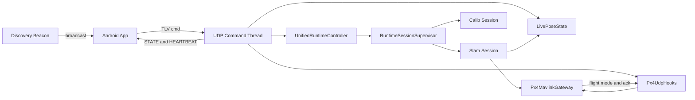
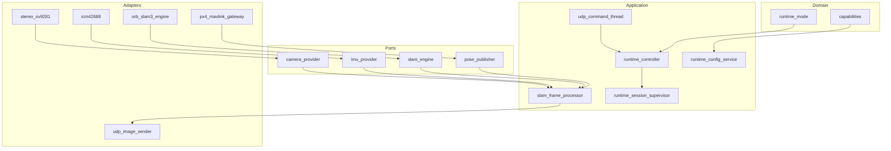
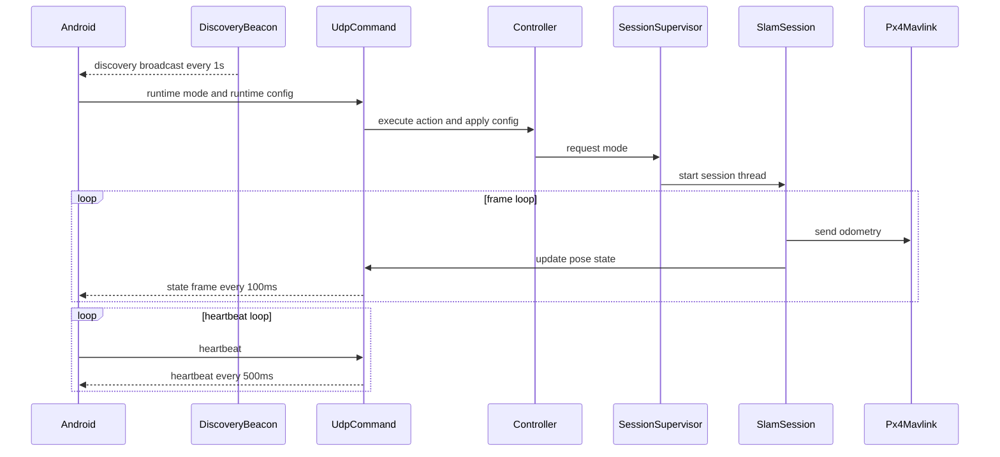
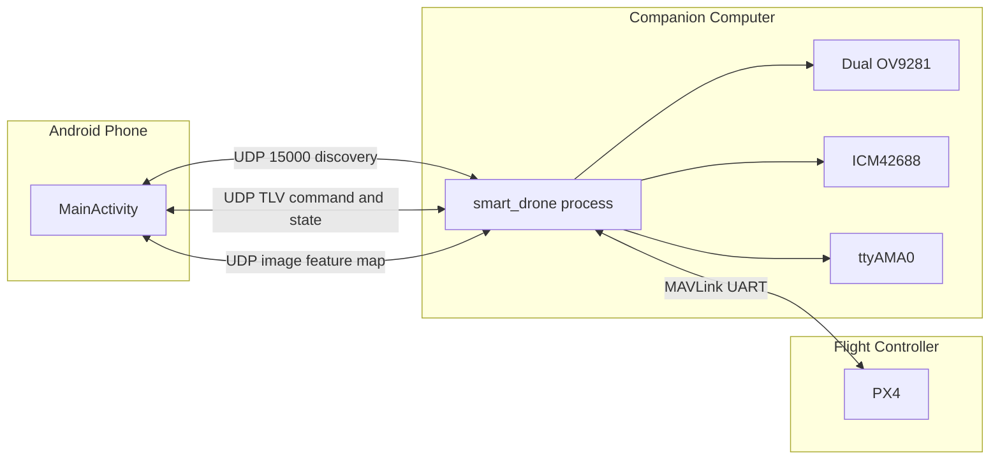
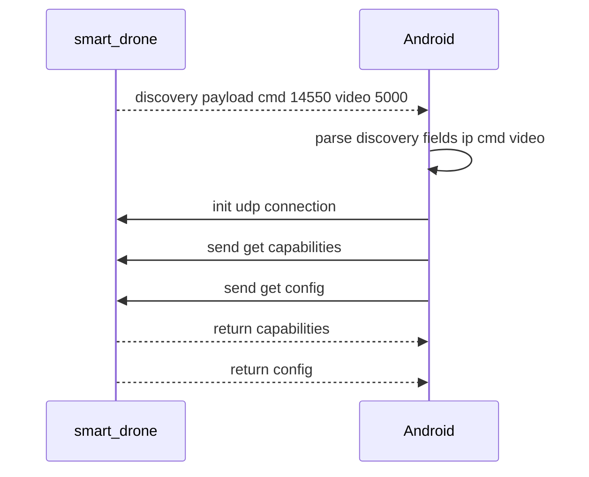
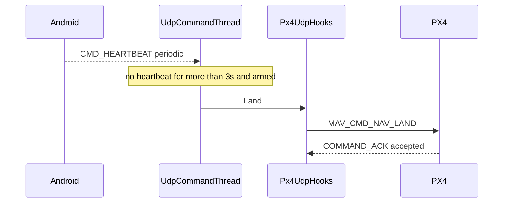

# SmartDrone 架构设计说明

> 版本：V1.0  
> 内容：覆盖架构设计、功能设计、可靠性设计、性能设计、DFX 设计及 4+1 视图。

## 1. 文档范围

本说明覆盖以下实现域：

- 启动与托管：`src/native/main.cpp`，`src/native/app/bootstrap/runtime_host.cpp`
- 核运行时：`src/native/core/application/runtime/*`
- 会话与处理流水线：`src/native/core/application/session/*`
- 共享状态与协议：`src/native/core/application/state/*`，`src/native/common/tlv/*`
- 链路发现：`src/native/common/discovery/udp_discovery_beacon.cpp`
- 飞控遥测：`src/native/adapters/telemetry/px4_mavlink_gateway.cpp`
- Android 控制端：`src/android/app/src/main/java/com/example/smartdrone/MainActivity.java`

---

## 2. 架构总览

### 2.1 分层架构

- Domain 层：运行模式、能力模型、业务枚举（`core/domain`）
- Ports 层：相机、IMU、SLAM、位姿发布、命令通道等抽象（`core/ports`）
- Application 层：控制器、会话监督、配置服务、状态聚合（`core/application`）
- Adapters 层：相机/IMU/SLAM/MAVLink/UDP 等具体实现（`adapters`）
- Common 层：TLV 协议、UDP 服务、线程启动与日志、发现广播（`common`）

### 2.2 关键设计原则

- 控制面与数据面分离：UDP TLV 控制与 MAVLink 遥测/控制独立
- 模式切换可控：统一通过 `UnifiedRuntimeController` 与 `RuntimeSessionSupervisor`
- 会话资源封装：SLAM/Calib 的线程、设备、输出由会话独立管理
- 观测优先：关键链路均有 ACK、超时、状态回传与 DFX 日志

---

## 3. 功能设计

### 3.1 启动与生命周期

启动流程：

1. `RuntimeHost::Run` 创建 MAVLink 网关、实时状态、Hook、控制器
2. 启动 `MAVLink RX` 与 `Timesync`
3. 启动 `UDP 命令线程`
4. 启动 `UDP 发现广播线程`
5. 根据参数可自动进入 `slam` 或 `calib` 模式

停止流程：

- 控制器停机 -> 停止 setpoint stream -> 停止 MAVLink 线程 -> 回收 discovery/cmd 线程

### 3.2 运行模式管理

支持模式：

- `Idle`
- `Slam`
- `Calib`

机制：

- `RuntimeSessionSupervisor` 维护 `desired/active` 状态
- 切换时先停旧会话并 join，再启动新会话线程
- `ForceRestart` 通过延迟触发 `SIGKILL`，交由 systemd 拉起

### 3.3 飞控控制功能

TLV 指令经 `TlvCmdRouter` -> `Px4UdpHooks`，主要能力：

- 飞行动作：`ARM`、`DISARM`、`EMERGENCY_STOP`、`LAND`
- 模式控制：`OFFBOARD`、`POSITION`、`HOLD`
- 运动控制：`MOVE`（位置/速度/RC 摇杆三种）

约束条件：

- 非 RC `MOVE` 仅允许在 OFFBOARD 模式下执行
- `POSITION` 模式会停止 setpoint stream，避免持续 Setpoint
- `OFFBOARD` 模式才保持 setpoint stream（20Hz）

### 3.4 SLAM 会话功能

`RunSlamSession` + `SlamFrameProcessor` 负责：

- 采集双目（可选 IMU）
- SLAM 模式动态更新（mapping/localization/auto 等）
- 位姿后处理与质量评估
- 里程计经 MAVLink 发布到 PX4
- 按配置发送图像/特征/点云
- 输出 `slam_dfx` 与时延诊断

### 3.4A XFeat 集成适配

当前 `xfeat` 集成属于叠加在 ORB-SLAM3 现有跟踪主链上的外部前端适配层，不是完整的原生前端替换。

当前实现包含以下 XFeat 专项适配：

- Worker 进程执行：
  `smart_drone` 通过 `XFeatFrontendClient` 启动独立 Python worker，使用二进制管道协议传输灰度图，并接收关键点与 `CV_32F` 描述子。
- 运行设备可选：
  worker 支持 `auto/cpu/cuda` 三种设备选择。`auto` 在 Jetson 类目标上优先选择 CUDA，在 CM5 类目标上回落到 CPU。
- XFeat 运行时参数化：
  runtime config 额外暴露 `slam.xfeat_top_k`、`slam.xfeat_max_points`、`slam.xfeat_input_max_width`、`slam.xfeat_input_max_height`。参数更新通过运行时配置链路生效，并触发 SLAM 会话重启，使 worker 与前端限制同步切换到新值。
- 双目 batch 推理：
  stereo 模式下左右图会合并成一次 worker 请求与一次模型调用，以降低每帧 IPC 和 Python 调度开销；返回结果仍按左右图分别拆分。
- 输入尺寸适配：
  `orbslam3_engine` 在送入 XFeat 前会先对输入图像缩放，以限制嵌入式平台上的前端计算开销。宽高上限为运行时参数；单个维度设为 `0` 表示该维度不再限制；宽高同时为 `0` 表示关闭 XFeat 下采样。
- 基于矫正图像的 stereo 注入：
  对于需要 rectification 的双目 pinhole 配置，XFeat 提取发生在与 ORB-SLAM3 跟踪完全一致的 prepared image 上。为此新增了 `System::PrepareStereoImagesForTracking(...)` 和 `System::TrackStereoPreparedWithFeatures(...)`，保证特征坐标与跟踪图像处于同一 rectified 坐标系。
- 注入前稳定性门禁：
  只有当 worker 正常运行，且上一帧 ORB-SLAM3 跟踪状态为稳定状态（`OK` 或 `OK_KLT`）时，才启用 XFeat 注入。初始化、恢复和不稳定阶段仍沿用原始 ORB 路径。
- 原始显示点与注入点分离：
  运行时会分别保留原始 XFeat 检测点与真正注入 ORB-SLAM3 的特征点。显示与诊断使用 raw XFeat 点，跟踪输入使用 stereo 配对后的子集，避免将显示密度误解为实际跟踪输入密度。
- 双目预配对约束：
  外部注入的双目特征必须先完成左右配对。适配层会结合极线约束和视差约束完成 left-right 配对，并以 `matchedStereoPairs=true` 的形式送入 ORB-SLAM3。
- 浮点描述子匹配兼容：
  ORB-SLAM3 的 `ORBmatcher::DescriptorDistance(...)` 已扩展为支持 `CV_32F` 描述子，并通过类余弦距离评分实现匹配兼容；这是因为 XFeat 描述子不是 ORB 二值描述子。
- BoW 兼容边界保持显式：
  `Frame::ComputeBoW()` 与 `KeyFrame::ComputeBoW()` 仍只对 `CV_8U` 描述子构建 BoW 向量。因此当前 XFeat 路径兼容“跟踪注入”，但并未替换 ORB 词袋前端的全部假设。
- 显式运行诊断：
  `slam_dfx` 会输出 `xfeat_used`、`xfeat_raw_left/right`、`xfeat_match_stereo`、`xfeat_injected_left/right` 等字段；`orbslam3_engine` 还会输出 `xfeat_runtime_status=...`，用于区分 worker 可用性、跟踪状态门禁以及 prepared-image 注入是否启用。

### 3.5 标定会话功能

`RunCalibSession` 负责：

- 自动创建 `calib_data_N` 输出目录
- 保存双目图像与 IMU 数据
- 可选 UDP 预览
- 退出时执行 flush/fsync，降低断电数据丢失风险

### 3.6 运行时配置功能

`CMD_RUNTIME_CONFIG` 支持远程更新并统一进入 `RuntimeConfigService`：

- 相机：曝光、增益、自动曝光、配对窗
- SLAM：输入帧率、感知模式、工作模式
- `T_b_c1` 运行时覆盖：开关、平移（tx/ty/tz）与姿态（roll/pitch/yaw）
  纯双目且已加载 YAML `T_b_c1` 时，运行时 `pitch` 解释为“相对基准外参的动态俯仰增量”，用于前视到下视等大角度俯仰。
- ORB 提取器：`nFeatures`、`scaleFactor`、`nLevels`、`iniThFAST`、`minThFAST`
- XFeat 提取器：`top_k`、`max_points`、`input_max_width`、`input_max_height`
- 流媒体：UDP 目标 IP、image/feature/map 开关

`ConfigRegistry` 标注每个配置项的：

- 是否 hot reload
- 是否要求 pipeline restart
- 是否要求设备重启

### 3.7 能力与配置查询功能

- `CMD_GET_CAPABILITIES` -> `CMD_CAPABILITIES`
- `CMD_GET_CONFIG` -> `CMD_CONFIG`

返回文本包括：

- 支持运行模式、感知模式、SLAM 模式
- 相机/IMU/SLAM/命令通道能力
- 可配置键集合与行为说明

### 3.8 Android 端控制与显示功能

Android `MainActivity` 实现：

- 自动发现 CM5（UDP 15000）并更新目标 IP/端口
- 周期发送 heartbeat，超时本地触发 `LAND`
- 发送模式/配置/动作 TLV 指令并处理 ACK
- 接收 `STATE`、`POINT_CLOUD`、视频与特征叠加显示

---

## 4. 链路设计（含链路发现）

### 4.1 发现链路 Discovery

服务端：`StartUdpDiscoveryBeaconThread`

- 端口：`15000`
- 周期：`1s`
- 广播地址：`255.255.255.255`
- 报文格式：`smartdrone_discovery;device=cm5;cmd=<cmdPort>;video=<videoPort>`

客户端（Android）：

- 绑定 `15000` 端口监听广播
- 校验 `DISCOVERY_MAGIC=smartdrone_discovery`
- 解析字段 `ip/cmd/video`
- 若未携带 `ip`，回退为 UDP 源地址

### 4.2 控制链路 UDP TLV

帧头：`0xAA 0x55` + `ver/cmd/flags/len/seq/time/payload/crc`

命令集合：

- 控制：`CMD_ARM` `CMD_DISARM` `CMD_OFFBOARD` `CMD_HOLD` `CMD_LAND` `CMD_POSITION` `CMD_EMERGENCY_STOP`
- 运动：`CMD_MOVE`
- 运行时：`CMD_RUNTIME_MODE` `CMD_RUNTIME_CONFIG` `CMD_CALIB_CLEAN` `CMD_FORCE_RESTART`
- 查询：`CMD_GET_CAPABILITIES` `CMD_GET_CONFIG`
- 回传：`CMD_ACK` `CMD_STATE` `CMD_POINT_CLOUD` `CMD_CAPABILITIES` `CMD_CONFIG` `CMD_HEARTBEAT`

### 4.3 心跳与状态链路

服务端 `udp_command_thread`：

- 向 active peer 回发 heartbeat：`500ms`
- `STATE` 回传周期：`100ms`
- 点云：仅在 `sendMap=true` 且 `pointCloudSeq` 更新时发送

失联策略：

- 仅当“已建立 heartbeat peer 且飞行器 armed”时生效
- 超时阈值：`3s`
- 动作：触发 `Land()`

Peer 锁定策略：

- `CommandPeerGate` 对命令源做 5 秒锁定窗口
- 非 active peer 的命令会被拒绝（并限频打印日志）

### 4.4 飞控链路 MAVLink

- 串口：`/dev/ttyAMA0 @ 921600`
- 线程：`mavlink_rx`、`mavlink_timesync`、`mavlink_setpoint_stream`
- 能力：
  - `COMMAND_LONG + ACK` 同步等待
  - `OFFBOARD/POSCTL` 模式切换
  - `MANUAL_CONTROL` 摇杆输入
  - `SET_POSITION_TARGET_LOCAL_NED` setpoint 流
  - `ODOMETRY` 里程计发布

---

## 5. 并发与线程模型

线程角色统一由 `thread_launch.h` 记录：

- `RuntimeWorker`
- `RuntimeSession`
- `MavlinkRx`
- `MavlinkTimesync`
- `MavlinkSetpointStream`
- `UdpCommand`
- `DiscoveryBeacon`
- `UdpImageCam0` `UdpImageCam1`
- `Imu` `CalibImuWriter`
- `ManualControl`

并发要点：

- 会话线程单实例：切换必须 stop+join 后再 start
- 手动控制线程常驻，但是否发送由 `m_manualControlStreaming` 控制
- setpoint stream 按需开启，OFFBOARD 以外主动停止
- `LivePoseState` 通过互斥保护快照读写

---

## 6. 可靠性设计

### 6.1 控制链路可靠性

- TLV CRC 校验与解析重同步
- 所有控制命令统一 ACK
- ACK 超时与错误码可追踪

### 6.2 失联保护

- 机端 heartbeat 超时 `3s` 触发 LAND（armed 条件）
- Android 侧同样具备 heartbeat 超时 LAND 保护逻辑
- 双端失联策略形成冗余保护

### 6.3 模式与会话安全

- `RuntimeSessionSupervisor` 使用条件变量协调切换
- `WaitForIdle` 保护标定清理等敏感操作
- 强制重启使用独立线程，避免阻塞控制主循环

### 6.4 传感与数据有效性

- 相机采集超时/异常会触发会话退出
- IMU 窗口做时间与数值有效性清洗
- MAVLink 读取接口支持 `maxAge` 新鲜度约束

### 6.5 存储可靠性

- 标定落盘流程执行文件与目录 fsync
- 降低异常断电时的索引与数据不一致概率

---

## 7. 性能设计

### 7.1 吞吐控制

- `slam.input_fps` 可配置，低于相机帧率时执行丢帧限流
- 视频流最大帧率限制（Android 端解码/显示保护）
- 点云帧长度按协议上限裁剪并记录 truncation

### 7.2 时延观测

- `FrameTimingTracker` 打点：采集、入 SLAM、出 SLAM、发送
- `odom_ts` 输出 queue/slam/send/total 延迟
- timesync 记录 offset/rtt/sample，并检测突变

### 7.3 资源控制

- setpoint stream 与 manual stream 分离
- 非 OFFBOARD 关闭 setpoint stream，减少冗余发送
- 预览与特征发送可独立开关

---

## 8. DFX 设计

### 8.1 Design for Development

- 核心逻辑集中在 `core/application`
- 设备/协议能力通过 adapter 注入
- 配置键集中定义于 `ConfigRegistry`

### 8.2 Design for Test

- 单元测试覆盖：ModeManager、RuntimeConfigService、PerceptionPipeline、FrameTimingTracker
- 离线回放工具验证 SLAM 管线基础正确性

### 8.3 Design for eXplainability and Observability

- 关键日志：`slam_dfx`、`odom_ts`、`ACK`、`timesync`、`stereo_timeout`
- 线程启动统一带 role 和 owner
- 能力查询与配置查询支持远程获取运行状态

### 8.4 Design for eXtensibility

- Ports 接口保留设备与算法替换空间
- TLV 命令字与 payload 版本兼容（runtime config 支持 legacy/v2/v3/v4/v5/v6/v7/v8/v9/v10）
- Runtime mode 与 slam mode 枚举支持持续扩展

---

## 9. 4+1 视图（Mermaid）

### 9.1 Logical View

### 9.2 Development View

### 9.3 Process View

### 9.4 Physical View

### 9.5 Scenario View

场景 A：链路发现与连接建立

场景 B：失联保护触发 LAND

---

## 10. 协议与配置速查

### 10.1 TLV 命令速查

- 控制命令：`0x10`~`0x16`
- 运动命令：`CMD_MOVE=0x20`
- 运行时命令：`CMD_RUNTIME_MODE=0x30`，`CMD_RUNTIME_CONFIG=0x31`
- `CMD_RUNTIME_CONFIG` payload 兼容版本：`legacy/v2/v3/v4/v5/v6/v7/v8/v9/v10`
- 查询命令：`CMD_GET_CAPABILITIES=0x33`，`CMD_GET_CONFIG=0x34`
- 回传命令：`CMD_ACK=0xF0`，`CMD_STATE=0xF1`，`CMD_HEARTBEAT=0xF5`

### 10.2 关键时间参数

- Discovery 广播周期：`1s`
- Heartbeat 周期：`500ms`
- Heartbeat LAND 超时：`3s`
- 命令 peer 锁定窗口：`5s`
- 状态回传周期：`100ms`

### 10.3 核心可配置键

- `camera.exposure_us`
- `camera.gain`
- `camera.auto_exposure`
- `camera.pair_window_ms`
- `slam.input_fps`
- `slam.perception_mode`
- `slam.operation_mode`
- `slam.tbc_override_enabled`
- `slam.tbc_tx_m`
- `slam.tbc_ty_m`
- `slam.tbc_tz_m`
- `slam.tbc_roll_deg`
- `slam.tbc_pitch_deg`
- `slam.tbc_yaw_deg`
  其中 `slam.tbc_pitch_deg` 在纯双目 + 已加载 YAML 外参时表示动态俯仰增量；`0` 为 YAML 基准姿态。
- `slam.orb_nfeatures`
- `slam.orb_scale_factor`
- `slam.orb_nlevels`
- `slam.orb_ini_th_fast`
- `slam.orb_min_th_fast`
- `stream.udp_enabled`
- `stream.udp_ip`
- `stream.send_image`
- `stream.send_feature`
- `stream.send_map`

### 10.4 `T_b_c1` 参数说明（`config/*.yaml`）

- 定义：`T_b_c1` 是 `body -> c1(左目相机)` 的 4x4 齐次外参（`SE3`）。
- 读取逻辑：纯双目模式优先读取 `T_b_c1`，若不存在则回退读取 `IMU.T_b_c1`。
- 生效条件：仅在 `SensorMode::Stereo`（不带 IMU）时由应用层后处理使用。
- 变换用途：SLAM 原始位姿是左目相机位姿 `T_w_c1`，发布前会换算为机体位姿：
  `T_w_b = T_w_c1 * (T_b_c1)^-1`。
- 缺省行为：若 YAML 未提供 `T_b_c1/IMU.T_b_c1`，系统保留相机坐标系位姿并打印提示日志。

### 10.5 位姿全路径处理（从 SLAM 到外发）

1. ORB-SLAM3 输出 `T_cw`（相机位姿），`orbslam3_engine` 内部求逆得到 `T_w_c` 并输出平移+四元数。
2. `SlamFrameProcessor` 将原始位姿送入 `PosePostprocessor::ProcessPose`。
3. 纯双目模式下，若已加载 `T_b_c1`，执行 `T_w_b = T_w_c1 * (T_b_c1)^-1`，把左目位姿转换为机体位姿。
4. 纯双目模式下首次可用跟踪帧会被设为会话参考原点，后续输出相对该原点的连续位姿。
5. `ContinuityMapper` 在 map 切换/重定位后维护连续桥接，并累计 `resetCounter/resetMapCount`。
6. `StartupAligner` 做启动对齐：优先用 PX4 本地 `z` 对齐，高度不可用时按超时策略回退，质量标记为 `Good/Weak/Lost`。
7. 对外发布分两路并行：
   - MAVLink：`MavlinkPosePublisher -> SendOdometry`，以 `MAV_FRAME_LOCAL_NED / MAV_FRAME_BODY_FRD` 发布里程计。
   - UDP 状态：写入 `LivePoseState`，由 `udp_command_thread` 周期打包 `CMD_STATE`（包含位姿、reset 计数、飞控模式等）。

### 10.6 ORB 参数运行时生效路径

1. Android 通过 `CMD_RUNTIME_CONFIG` 下发 ORB 参数（`slam.orb_*`）。
2. `RuntimeConfigService` 校验参数范围，并在参数变化时触发会话重启。
3. `SlamSessionRuntime` 启动前基于当前 settings 生成 `*.runtime_orb.yaml`，覆盖 `ORBextractor.*`。
4. ORB-SLAM3 使用该 runtime YAML 初始化；初始化后参数在本会话内固定，下一次配置变更通过重启生效。

---

## 11. 实现状态摘要

- 架构主干完整，控制面、数据面、会话管理、飞控接口与发现链路均已实现。
- 链路发现机制已实现，并与 Android 自动连接流程联动。
- OFFBOARD 与 POSITION 的 setpoint 策略已分离：OFFBOARD 发送，POSITION 不持续发送。
- 失联 LAND 机制在机端与客户端均已实现，形成冗余保护。

