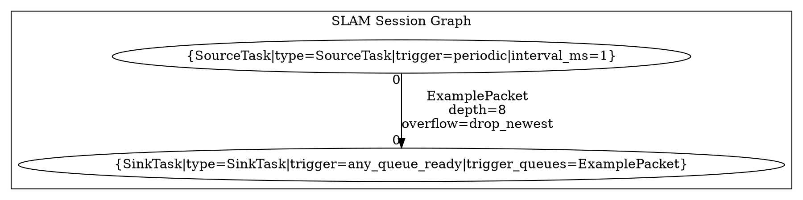

# EPG Framework Design

EPG is short for `EventPipelineGraph`. It is a generic C++ execution framework for
event-driven pipeline graphs.

The design center is:

- event-driven task wakeup
- typed message queues between tasks
- explicit pipeline topology
- topology-driven graph compilation and validation
- graph-level optimization hooks for scheduling, buffering, and visualization

EPG is intentionally independent from SmartDrone business code. SmartDrone native
sessions register their own message/task types and provide DOT topology files, but
the graph runtime itself lives under `src/native/common/epg`.

## Core Model

An EPG graph is compiled into `epg::GraphConfig`.

`GraphConfig` contains:

- `QueueConfig`: queue name, message type, depth, overflow policy
- `TaskConfig`: task name, task type, trigger config, input ports, output ports
- `TriggerConfig`: trigger mode, optional interval, optional trigger queues
- `TaskSchedulingConfig`: resource tag, optional CPU affinity, runtime budget,
  deadline, and realtime priority hints

Tasks communicate only through typed queues. Each task sees queues through numeric
port ids:

- input ports are addressed by `TaskContext::TryPop<T>(PortId)`
- output ports are addressed by `TaskContext::Push<T>(PortId, item)`
- input and output port id spaces are separate per task

The graph compiler is responsible for turning topology edges into queue configs and
task port bindings.

## Runtime Components

`epg::Registry`

Stores message types and task types. It validates queue types and task port types
when a graph is configured.

`epg::TypeCatalog`

Stores reflected registrations emitted by the `EPG_REGISTER_*` macros. Session code
uses this so task declarations can stay near task implementations.

`epg::EventPipelineGraph`

Owns queues and task runners. `Configure` validates the graph, creates queues,
binds task input/output ports, and builds task runners. `Start` launches task
runner threads; `Stop` joins them.

`epg::TaskContext`

The task-facing API for typed queue access. It prevents tasks from accessing
undeclared ports and checks message type consistency.

`epg::SpscSharedPtrQueue<T>`

The default typed queue implementation. It is single-producer/single-consumer and
supports bounded depth with `drop_newest` or `overwrite_oldest` overflow behavior.

## Task Registration

Message types are registered with:

```cpp
EPG_REGISTER_MESSAGE(SlamTick, "SlamTick")
```

Task types are registered with:

```cpp
EPG_REGISTER_TASK_TYPE(SlamClockTask, "SlamClockTask")
```

When ports are declared directly in C++, use:

```cpp
EPG_REGISTER_TASK(
    SourceTask, "SourceTask",
    std::vector<epg::PortSpec>{},
    std::vector<epg::PortSpec>{EPG_PORT(0, "ExamplePacket")})
```

For DOT-compiled graphs, prefer `EPG_REGISTER_TASK_TYPE`; graph-declared ports are
merged into the registry during DOT compilation.

## Trigger Modes

Supported trigger modes:

- `periodic`: run at a fixed interval
- `any_queue_ready`: run when any trigger input queue has data
- `all_queue_ready`: run when all trigger input queues have data
- `periodic_or_any_queue_ready`: run periodically or when a trigger queue wakes it

Periodic tasks must set `interval_ms`.

For queue-triggered tasks, `trigger_queues` may be omitted; in that case all input
queues are trigger queues.

## Interrupt Events

External interrupt-like events enter the graph through `CreateExternalIngress<T>`.

The ingress binds to a queue that has no task producer. Pushing into the ingress
uses the same queue notifier path as task-produced messages, so queue-triggered
tasks wake naturally.

```cpp
auto ingress = graph.CreateExternalIngress<StopEvent>("stop_event");
ingress.Emplace();
```

Use this for signals, command-channel events, hardware callbacks, and other events
that originate outside the graph runner.

## Terminal DFX Panel

`tools/epg_tui.py` is a lightweight terminal DFX panel for field debugging. It is
modeled after tools such as `jtop`: it refreshes in place, lists queues and tasks,
and uses colored bars to show pressure.

Run the SLAM graph demo:

```sh
python3 tools/epg_tui.py --graph cluster_slam_session_graph
```

Run the calibration graph demo:

```sh
python3 tools/epg_tui.py --graph cluster_calib_session_graph
```

The panel currently supports two data modes:

- demo mode: parses `config/epg/epg_topology.dot` and generates simulated live metrics
- snapshot mode: reads a JSON snapshot file with `--snapshot <path>`

EPG graph sessions write live snapshots every 500 ms:

```sh
python3 tools/epg_tui.py --graph cluster_system_runtime_graph --snapshot /tmp/smartdrone_epg_system.json
python3 tools/epg_tui.py --graph cluster_slam_session_graph --snapshot /tmp/smartdrone_epg_slam.json
python3 tools/epg_tui.py --graph cluster_calib_session_graph --snapshot /tmp/smartdrone_epg_calib.json
```

Each snapshot tick also writes a solver profile:

- `/tmp/smartdrone_epg_system_profile.json`
- `/tmp/smartdrone_epg_slam_profile.json`
- `/tmp/smartdrone_epg_calib_profile.json`

Profiles include `topologyVersion` and `taskCatalog`. The catalog records task
role, resource, budget, deadline, and replaceability metadata so solver decisions
are tied to declared task semantics instead of only to task names.

The system runtime graph contains `EpgOptimizeTask`, which periodically consumes
fresh profiles and refreshes the optimized config files inside the EPG schedule.
The command-line tools remain useful for manual review and offline reproduction.

Solve a profile into a deployable graph config and a reviewable report:

```sh
python3 tools/epg_solver.py \
  --profile /tmp/smartdrone_epg_slam_profile.json \
  --output output/epg/optimized_slam_session_graph.json \
  --report output/epg/optimized_slam_session_graph_report.json
```

Solve every available runtime profile in one command:

```sh
python3 tools/epg_optimize_all.py
```

The deployable config keeps the standard GraphConfig shape plus provenance
fields: `schema`, `targetGraph`, `topologyVersion`, `solverVersion`, and source
profile timestamp. The report records the objective, constraints, score, and
per-queue or per-task decisions so an optimization can be reviewed before the
next runtime start picks it up.

At startup, the runtime first looks for the optimized config declared in the
EPG manifest. If it is missing, the graph falls back to
`config/epg/epg_topology.dot`; if it exists, the optimized JSON is parsed,
validated against the same task manifest, `targetGraph`, and `topologyVersion`,
and deployed as the active graph.

Queue rows show current size, depth, congestion percentage, and drop/overwrite
counters. Task rows show last/max loop cost, percentile loop cost, loop count,
budget/deadline violations, scheduling errors, and error count.

Color rules:

- green: below 50%
- yellow: 50% to 80%
- red: above 80%, or a new drop/overwrite/error since the previous refresh

Snapshot JSON shape:

```json
{
  "timestampMs": 12345678,
  "queues": {
    "SourceTask_0_to_SinkTask_0": {
      "size": 1,
      "pushed": 100,
      "popped": 99,
      "droppedNewest": 0,
      "overwrittenOldest": 0,
      "pushedPerSecond": 60,
      "poppedPerSecond": 59,
      "droppedPerSecond": 0
    }
  },
  "tasks": {
    "SourceTask": {
      "lastLoopUs": 900,
      "maxLoopUs": 1300,
      "p90LoopUs": 1200,
      "p99LoopUs": 1300,
      "loopCount": 100,
      "errorCount": 0,
      "idleWakeups": 0,
      "budgetOverrunCount": 0,
      "deadlineMissCount": 0
    }
  }
}
```

## Graph Compilation Flow

The native SmartDrone flow is:

1. Business code registers message and task types.
2. A DOT subgraph is selected from `config/epg/epg_topology.dot`.
3. The DOT compiler reads task nodes and edges.
4. Edges become queues.
5. Edge endpoint labels become numeric task port bindings.
6. Graph-declared task ports are merged into `epg::Registry`.
7. `epg::EventPipelineGraph::Configure` performs final runtime validation.

This keeps topology in one maintained source: the DOT file is both the visual graph
source and the compilation source.

## DOT Topology Format

Use one `digraph` with one `subgraph cluster_*` per compilable runtime domain.



The native compiler currently selects:

- `cluster_slam_session_graph`
- `cluster_calib_session_graph`

### Task Nodes

Every compilable node must be a task node with a record `label`.

Required fields:

- first record field: node display name, normally the same as the DOT node id
- `type`: registered EPG task type
- `trigger`: task trigger mode

Optional fields:

- `interval_ms`: required for `periodic` and `periodic_or_any_queue_ready`
- `trigger_queues`: queue type names or queue names separated by `+`
- `resource`: scheduling resource tag, default `cpu`
- `cpu_affinity`: Linux CPU id, or `-1` to leave affinity unchanged
- `budget_us`: expected per-loop runtime budget used by diagnostics and solver
- `deadline_us`: per-loop deadline used by diagnostics and solver
- `backpressure_outputs`: output port ids separated by `+`; the EPG runner skips
  the task when those output queues are already full
- `realtime` and `priority`: optional Linux realtime scheduling hint
- other fields such as `stage` are allowed for humans and ignored by the compiler

Example:

```dot
SlamAcquireTask [
  label="{SlamAcquireTask|type=SlamAcquireTask|stage=frame_acquire_and_prepare|trigger=any_queue_ready|trigger_queues=SlamFrameReady|resource=cpu|budget_us=12000|deadline_us=16000|backpressure_outputs=0}"
];
```

### Edges And Ports

Every compilable edge must connect two declared task nodes and include:

- `taillabel`: source task output `PortId`
- `headlabel`: target task input `PortId`
- `label`: queue metadata

Example:

```dot
SlamClockTask -> SlamImuGateTask [
  taillabel="0", headlabel="1", label="SlamTick\ndepth=1\noverflow=overwrite_oldest"
];
```

For SLAM, `SlamClockTask` should represent the configured SLAM input cadence, not a busy polling
tick. The maintained DOT uses a safe default, and the runtime session overrides the compiled
interval from the active SLAM input FPS before starting the graph.

Port ids are unsigned integers. Input ports and output ports are separate
namespaces per task.

### Edge Label Format

The edge `label` is parsed line by line.

Line 1 is the queue message type.

Required metadata lines:

- `depth=<positive_integer>`
- `overflow=<policy>`

Recommended format:

```dot
label="SlamPreparedFrame\ndepth=1\noverflow=overwrite_oldest"
```

The parser also accepts legacy compact metadata:

```dot
label="SlamPreparedFrame\ndepth=1 overwrite_oldest"
```

Supported overflow policies:

- `drop_newest`
- `overwrite_oldest`
- aliases: `tail_drop`, `circular_overwrite`

### Queue Names

Do not write queue names in DOT.

The compiler derives queue names automatically:

```text
<source_node>_<source_port>_to_<target_node>_<target_port>
```

Example:

```dot
SlamClockTask -> SlamImuGateTask [
  taillabel="0", headlabel="1", label="SlamTick\ndepth=1\noverflow=overwrite_oldest"
];
```

Compiles to:

```text
SlamClockTask_0_to_SlamImuGateTask_1
```

### Trigger Queue Resolution

For queue-triggered tasks, `trigger_queues` may refer to:

- explicit queue names generated by the compiler
- queue message types

Prefer message types in hand-written DOT:

```dot
label="{SlamImuGateTask|type=SlamImuGateTask|trigger=any_queue_ready|trigger_queues=SlamResourceReady+SlamTick}"
```

If omitted, all input queues are used as trigger queues.

### DOT Validation

The DOT compiler validates:

- selected subgraph exists
- each task node has `type` and `trigger`
- each task `type` is registered
- each edge references declared task nodes
- each edge has integer `taillabel` and `headlabel`
- each edge has queue type, positive `depth`, and valid overflow policy
- each input port is connected at most once
- each output port is connected at most once
- port type consistency when graph-declared ports are merged into the task registry

`EventPipelineGraph::Configure` performs additional validation:

- queue type is registered
- task type is registered
- task input/output port exists
- input/output queue type matches port type
- SPSC queues have exactly one producer and at most one consumer
- trigger queues exist and are task inputs

### Graphviz Styling

These attributes are rendering-only and ignored by the compiler:

- top-level `graph`, `node`, and `edge` attributes
- subgraph `label`, `color`, and `style`
- node styling such as `shape`, `fillcolor`, `fontname`
- edge styling such as `color`, `fontsize`, `labeldistance`, `labelangle`

Use styling freely, but do not encode runtime behavior in styling attributes.

## Authoring Rules

Do:

- keep every compilable task node inside its domain subgraph
- use numeric port ids in `taillabel` and `headlabel`
- keep queue metadata in edge labels
- keep task ids stable; generated queue names depend on them
- use `trigger_queues` as message type names for readability

Do not:

- put `inputs=` or `outputs=` in node labels; edge endpoint labels already define ports
- use string port names such as `ready`, `status`, or `published`
- write queue names manually in DOT
- rely on node or edge colors/styles for compiler behavior
- connect one output port to multiple queues unless EPG supports that producer pattern
- connect multiple edges to the same input port
