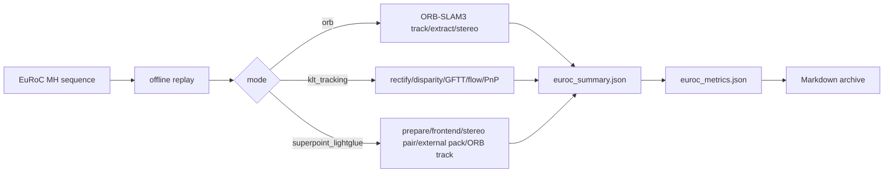

# Jetson EuRoC Key-Path Profiling

- Device: NVIDIA Orin NX Developer Kit (`aarch64`, Jetson Linux 5.10.216-tegra)
- Run directory: `/home/nvidia/euroc_eval/results/mh_three_modes_key_profile_20260503_080401`
- Local raw summaries: `output/jetson_profiles/mh_three_modes_key_profile_20260503_080401/`
- Dataset: EuRoC Machine Hall `MH_01_easy` through `MH_05_difficult`
- Modes: `orb`, `klt_tracking`, `superpoint_lightglue`
- Metrics: ATE uses SE3 alignment, RPE delta is 10 frames, association window is 50 ms

## Profiling Scope

## Findings

- ORB average SLAM path is `34.84 ms/frame`; most of it is ORB-SLAM3 tracking/extraction (`orb_track_ms_mean` average `34.21 ms`).
- KLT average SLAM path is `48.10 ms/frame`; the main cost is stereo disparity at `32.62 ms/frame`, followed by GFTT at `9.65 ms/frame`.
- SuperPoint + LightGlue average SLAM path is `101.85 ms/frame`; TensorRT frontend inference averages `64.73 ms/frame`, then ORB tracking still costs `33.70 ms/frame`.
- In this run, `external_pack_ms`, `superpoint_frontend_ms`, and SP stereo-pair timing stayed at zero while frontend inference was nonzero. Treat this as a frontend-on/fallback measurement until the SP+LG keypoint output/injection path is verified.

## Accuracy

| Mode | Sequence | Matched frames | ATE RMSE (m) | ATE Max (m) | RPE RMSE (m) |
| --- | --- | ---: | ---: | ---: | ---: |
| ORB | MH_01_easy | 3640 | 0.0482 | 0.1533 | 0.0106 |
| ORB | MH_02_easy | 3001 | 0.0476 | 0.1017 | 0.0103 |
| ORB | MH_03_medium | 2632 | 0.0454 | 0.1069 | 0.0193 |
| ORB | MH_04_difficult | 1978 | 0.0685 | 0.1696 | 0.0244 |
| ORB | MH_05_difficult | 2223 | 0.0682 | 0.2254 | 0.0246 |
| KLT Tracking | MH_01_easy | 3640 | 0.1813 | 0.4515 | 0.0256 |
| KLT Tracking | MH_02_easy | 3001 | 0.2783 | 0.7150 | 0.0389 |
| KLT Tracking | MH_03_medium | 2632 | 0.4096 | 1.0862 | 0.0425 |
| KLT Tracking | MH_04_difficult | 1977 | 1.2510 | 2.0127 | 0.0678 |
| KLT Tracking | MH_05_difficult | 2223 | 1.1349 | 1.8093 | 0.0647 |
| SuperPoint + LightGlue | MH_01_easy | 3640 | 0.0398 | 0.0984 | 0.0107 |
| SuperPoint + LightGlue | MH_02_easy | 3001 | 0.0441 | 0.1055 | 0.0102 |
| SuperPoint + LightGlue | MH_03_medium | 2632 | 0.0695 | 0.1872 | 0.0229 |
| SuperPoint + LightGlue | MH_04_difficult | 1978 | 0.0699 | 0.1892 | 0.0227 |
| SuperPoint + LightGlue | MH_05_difficult | 2223 | 0.0485 | 0.1482 | 0.0199 |

## Pipeline Timing

Mean milliseconds per output frame.

| Mode | Sequence | Acquire | SLAM total | Prepare | Frontend | ORB track | ORB extract | ORB stereo | GPU mean/max % | RAM mean/max MB |
| --- | --- | ---: | ---: | ---: | ---: | ---: | ---: | ---: | ---: | ---: |
| ORB | MH_01_easy | 4.85 | 36.10 | 0 | 0 | 35.38 | 19.39 | 1.31 | - | - |
| ORB | MH_02_easy | 4.85 | 34.25 | 0 | 0 | 33.68 | 19.29 | 1.29 | - | - |
| ORB | MH_03_medium | 4.82 | 34.61 | 0 | 0 | 34.07 | 19.09 | 1.39 | - | - |
| ORB | MH_04_difficult | 4.91 | 34.61 | 0 | 0 | 33.95 | 17.67 | 1.48 | - | - |
| ORB | MH_05_difficult | 4.82 | 34.63 | 0 | 0 | 33.96 | 17.97 | 1.49 | - | - |
| KLT Tracking | MH_01_easy | 4.81 | 48.22 | 1.46 | 46.62 | 0 | 0 | 0 | - | - |
| KLT Tracking | MH_02_easy | 4.74 | 48.75 | 1.48 | 47.17 | 0 | 0 | 0 | - | - |
| KLT Tracking | MH_03_medium | 4.76 | 48.04 | 1.51 | 46.43 | 0 | 0 | 0 | - | - |
| KLT Tracking | MH_04_difficult | 4.83 | 47.70 | 1.54 | 46.07 | 0 | 0 | 0 | - | - |
| KLT Tracking | MH_05_difficult | 4.81 | 47.77 | 1.50 | 46.17 | 0 | 0 | 0 | - | - |
| SuperPoint + LightGlue | MH_01_easy | 4.79 | 104.20 | 2.72 | 66.16 | 34.70 | 18.88 | 1.28 | - | - |
| SuperPoint + LightGlue | MH_02_easy | 4.85 | 102.38 | 2.74 | 66.32 | 32.82 | 18.66 | 1.28 | - | - |
| SuperPoint + LightGlue | MH_03_medium | 4.85 | 101.90 | 2.84 | 64.82 | 33.70 | 18.36 | 1.34 | - | - |
| SuperPoint + LightGlue | MH_04_difficult | 4.91 | 100.78 | 2.90 | 63.14 | 33.98 | 16.83 | 1.44 | - | - |
| SuperPoint + LightGlue | MH_05_difficult | 4.84 | 100.00 | 2.76 | 63.22 | 33.33 | 16.81 | 1.44 | - | - |

## KLT Breakdown

| Sequence | Rectify | Disparity | GFTT | Flow | Candidate/depth | PnP | State update |
| --- | ---: | ---: | ---: | ---: | ---: | ---: | ---: |
| MH_01_easy | 1.46 | 32.52 | 9.76 | 3.08 | 0.31 | 0.95 | 0.09 |
| MH_02_easy | 1.48 | 32.68 | 9.80 | 3.17 | 0.29 | 1.23 | 0.09 |
| MH_03_medium | 1.51 | 32.47 | 9.72 | 3.06 | 0.26 | 0.91 | 0.09 |
| MH_04_difficult | 1.54 | 32.65 | 9.39 | 2.91 | 0.21 | 0.91 | 0.09 |
| MH_05_difficult | 1.49 | 32.76 | 9.55 | 2.73 | 0.21 | 0.91 | 0.08 |

## SuperPoint + LightGlue Breakdown

| Sequence | Frontend infer | Stereo pair | External pack | Mono augment | ORB track |
| --- | ---: | ---: | ---: | ---: | ---: |
| MH_01_easy | 66.16 | 0.00 | 0 | 0 | 34.70 |
| MH_02_easy | 66.32 | 0.00 | 0 | 0 | 32.82 |
| MH_03_medium | 64.82 | 0.00 | 0 | 0 | 33.70 |
| MH_04_difficult | 63.14 | 0.00 | 0 | 0 | 33.98 |
| MH_05_difficult | 63.22 | 0.00 | 0 | 0 | 33.33 |

## Artifacts

Each remote run directory contains `replay.log`, `eval.log`, `tegrastats.log`, `euroc_summary.json`, `euroc_metrics.json`, and `euroc_pose.csv`. Local copied summaries are under `output/jetson_profiles/mh_three_modes_key_profile_20260503_080401/`.
