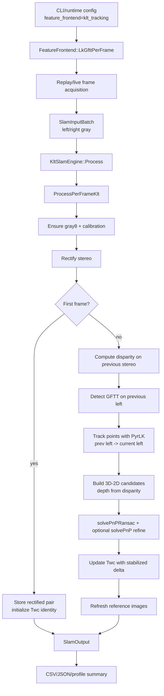
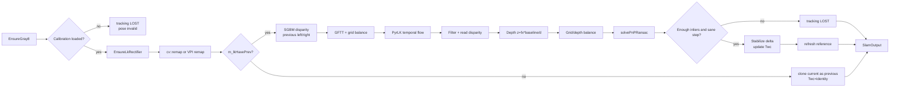

# KLT Tracking Mode Technical Flow

## Purpose

KLT Tracking mode (`--slam-backend klt --feature-frontend klt_tracking`) is the default lightweight stereo visual-odometry backend. It bypasses ORB-SLAM3 entirely and reuses SmartDrone's stereo acquisition, calibration/rectification, output contract, and profiling infrastructure.

The mode is implemented by `KltSlamEngine::ProcessPerFrameKlt(...)`.

## Main Flow



## Code Entry Points

| Layer | Code | Responsibility |
| --- | --- | --- |
| CLI/offline replay | `tests/euroc/offline_replay_main.cpp` | Parses `klt_tracking`, applies `--lk-per-frame-accel`, runs replay. |
| Replay loop | `tests/euroc/support/replay_slam_runner.cpp` | Builds input batches and records process-level profiling. |
| Live loop | `src/native/core/application/session/slam_frame_input_port.cpp` | Applies frontend mode and adaptive input FPS in runtime sessions. |
| KLT engine | `src/native/adapters/slam/klt_slam_engine.cpp` | Owns KLT frontend selection and pose output. |
| KLT implementation | `src/native/adapters/slam/klt_per_frame_frontend.cpp`, `src/native/adapters/slam/klt_pnp_observation_builder.cpp`, `src/native/adapters/slam/klt_pose_estimator.cpp` | Implements rectification, disparity, GFTT, LK flow, depth, PnP, pose update. |
| Output contract | `src/native/core/ports/slam_engine.h` | Carries KLT timing and pose fields in `SlamOutput`. |

## Mode Selection

The CLI string `klt_tracking` maps to `FeatureFrontend::LkGfttPerFrame`. `CreateSlamEngine(...)` selects `KltSlamEngine` when `--slam-backend klt` is active, and `KltSlamEngine::SetFeatureFrontend(...)` chooses the per-frame KLT route:

```cpp
if (frontend != FeatureFrontend::LK && frontend != FeatureFrontend::LkGfttPerFrame) {
    frontend = FeatureFrontend::LkGfttPerFrame;
}
```

The engine ignores `extractPointCloud` because this VO path produces pose and tracking diagnostics only. The per-frame KLT implementation lives in `src/native/adapters/slam/klt_per_frame_frontend.cpp` and related KLT helper modules.

The EuRoC profiling script uses:

```bash
--feature-frontend klt_tracking --lk-per-frame-accel cpu
```

`SetLkPerFrameAcceleration(...)` stores the backend selector. In CPU baseline mode, VPI paths are not used and OpenCV CPU implementations dominate the runtime.

## Input Contract

KLT receives the shared `SlamInputBatch` shape:

- `input.stereo.left.gray`
- `input.stereo.right.gray`
- `input.frameId`
- `input.captureTimestampNs`
- `input.frameTimeSec`
- optional IMU vector, unused by this KLT VO path

The input acquisition flow is shared by all SLAM backends. `PerceptionPipeline::AcquireNextStereoBatch(...)` handles SLAM FPS limiting and paired timestamp generation before KLT sees the frame.

## Detailed Stage Flow



## Stage 1: Preparation and Calibration

`RunKltPerFrameFrontend(...)` starts with:

```cpp
cv::Mat leftGray = EnsureGray8(input.stereo.left.gray);
cv::Mat rightGray = EnsureGray8(input.stereo.right.gray);
```

If either image is empty or `m_lkCalibrationLoaded` is false, the output is marked:

- `trackingState = kSlamTrackingLost`
- `poseValid = false`

The implementation then initializes rectification maps:

```cpp
EnsureLkRectifier(leftGray.size());
```

Timing fields:

- `input_prepare_ms`
- `lk_rectify_ms`

## Stage 2: Rectification

For the CPU baseline, rectification uses OpenCV remap:

```cpp
cv::remap(leftGray, leftRect, m_lkMap1x, m_lkMap1y, cv::INTER_LINEAR);
cv::remap(rightGray, rightRect, m_lkMap2x, m_lkMap2y, cv::INTER_LINEAR);
```

The code can try VPI remap when `m_lkPerFrameAcceleration` requests it and environment flags allow it, but the documented baseline is CPU.

## Stage 3: First-Frame Initialization

On the first valid rectified pair:

```cpp
m_lkPrevLeft = leftRect.clone();
m_lkPrevRight = rightRect.clone();
m_lkTwc = Sophus::SE3f();
m_lkPerFrameReferenceTwc = m_lkTwc;
m_lkHavePrev = true;
```

There is no motion estimate yet. The first pose is the local origin.

## Stage 4: Disparity on Previous Stereo Pair

For subsequent frames, KLT computes disparity from the previous rectified stereo pair:

```cpp
m_lkPerFrameSgbm->compute(m_lkPrevLeft, m_lkPrevRight, disp16);
disp16.convertTo(disp, CV_32F, 1.0 / 16.0);
```

The disparity belongs to `m_lkPrevLeft`, matching the 3D reference points used for temporal tracking.

Timing field:

- `lk_disparity_ms`

Design implication: CPU SGBM is the major cost center in the current Jetson baseline.

## Stage 5: GFTT Detection and Grid Balance

Features are detected on the previous left image:

```cpp
cv::goodFeaturesToTrack(m_lkPrevLeft, rawPts0, ...);
pts0 = SelectGfttPointsGridBalanced(rawPts0, m_lkPrevLeft.size(), ...);
```

The grid balance prevents corners from concentrating in a small image region, improving PnP conditioning.

Timing field:

- `lk_gftt_ms`

## Stage 6: Temporal LK Tracking

The selected points are tracked from previous left to current left:

```cpp
cv::calcOpticalFlowPyrLK(m_lkPrevLeft, leftRect, pts0, pts1, status, err, cv::Size(21, 21), 3);
```

Optional checks:

- `SMART_DRONE_LK_PER_FRAME_FB_CHECK`
- max flow guard `kLkMaxFlowPx`
- image-bound guards for both previous and current points

Timing field:

- `lk_flow_ms`

## Stage 7: Candidate Construction and Depth

For every successfully tracked point, the code:

1. Checks LK status and bounds.
2. Rejects excessive flow.
3. Optionally runs forward-backward consistency.
4. Reads robust disparity around the previous point with `ReadConsistentDisparity(...)`.
5. Converts disparity into depth:

```cpp
z = m_lkFx * m_lkBaseline / d;
```

6. Builds a 3D point in previous camera coordinates:

```cpp
X = (p0.x - cx) * z / fx
Y = (p0.y - cy) * z / fy
Z = z
```

7. Pairs that 3D point with the current 2D location `p1`.

Optional depth/grid balancing is controlled by `SMART_DRONE_LK_PER_FRAME_DEPTH_BALANCE`.

Timing field:

- `lk_candidate_ms`

## Stage 8: PnP and Pose Update

If at least `kLkMinPnPPoints` candidates exist, the code runs:

```cpp
cv::solvePnPRansac(objectPoints, imagePoints, K, cv::Mat(), rvec, tvec, ...);
```

Then it optionally refines inliers with iterative `cv::solvePnP(...)`.

The rotation vector is converted to a matrix with `cv::Rodrigues(...)`, then to a Sophus SE3 delta. The update is accepted only if:

- PnP succeeds
- inlier count is at least `kLkMinPnPInliers`
- translation norm is finite
- translation norm does not exceed `kLkMaxStepMeters`

Pose update:

```cpp
const Sophus::SE3f TcurrPrev(Sophus::SO3f(R), t);
const Sophus::SE3f delta = StabilizeLkCameraDelta(TcurrPrev.inverse());
m_lkTwc = m_lkTwc * delta;
```

Timing field:

- `lk_pnp_ms`

If the update fails, the frame is marked lost and pose invalid.

## Stage 9: Reference Refresh

Reference refresh is controlled by keyframe settings and inlier quality:

```cpp
m_lkPrevLeft = leftRect.clone();
m_lkPrevRight = rightRect.clone();
m_lkPerFrameReferenceTwc = m_lkTwc;
```

Timing field:

- `lk_update_ms`

## Output and Artifacts

KLT writes pose directly from `m_lkTwc`; it does not call ORB-SLAM3 for pose tracking.

Output fields:

- `pose`
- `poseValid`
- `trackingState`
- `matchesInliers`
- `trackedMapPointCount`
- `localMapPointCount`
- optional visualized feature points
- all `lk_*` timing fields

Offline replay serializes these to:

- `euroc_pose.csv`
- `euroc_summary.json`
- `euroc_metrics.json`
- `profile_summary.md`

## Profiling Interpretation

| Field | Meaning |
| --- | --- |
| `slam_total_ms` | Full KLT `Process(...)` time. |
| `input_prepare_ms` | Gray conversion plus rectification preparation. |
| `frontend_ms` | Sum of disparity, GFTT, flow, candidate construction, and PnP. |
| `lk_rectify_ms` | Stereo rectification time. |
| `lk_disparity_ms` | SGBM/VPI disparity time. |
| `lk_gftt_ms` | GFTT detection plus grid selection. |
| `lk_flow_ms` | Temporal PyrLK tracking. |
| `lk_candidate_ms` | 3D-2D candidate construction and filtering. |
| `lk_pnp_ms` | RANSAC PnP and optional refinement. |
| `lk_update_ms` | Reference image/state refresh. |

ORB-specific timing fields should remain zero because ORB-SLAM3 tracking is not used.

## Jetson EuRoC Result

Latest archived run:

`docs/jetson_euroc_key_profile_20260503_080401.md`

Summary:

- Average SLAM path: `48.10 ms/frame`
- Average disparity: `32.62 ms/frame`
- Average GFTT: `9.65 ms/frame`
- LK flow: about `2.73-3.17 ms/frame`
- PnP: about `0.91-1.23 ms/frame`

## Engineering Interpretation

KLT Tracking is a practical CPU VO baseline, but its bottleneck is clear: CPU StereoSGBM dominates the frame budget. The pose pipeline is simple and inspectable, which makes it useful for debugging calibration and timing, but it drifts more than map-based ORB-SLAM3 on difficult EuRoC sequences because it does not maintain a full map or loop closure path in the documented baseline.
