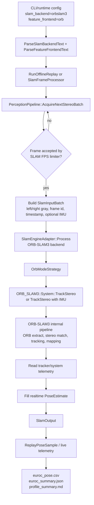
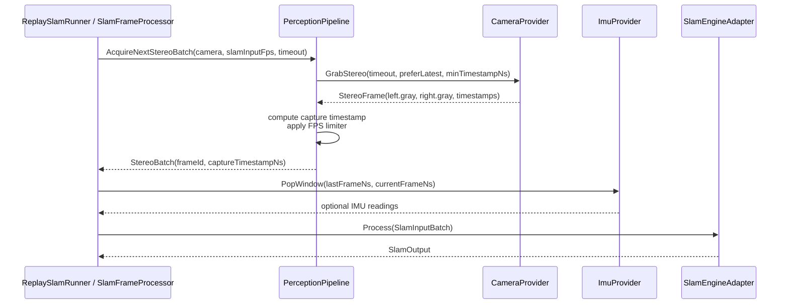
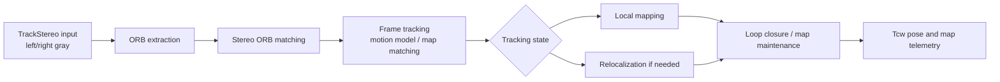
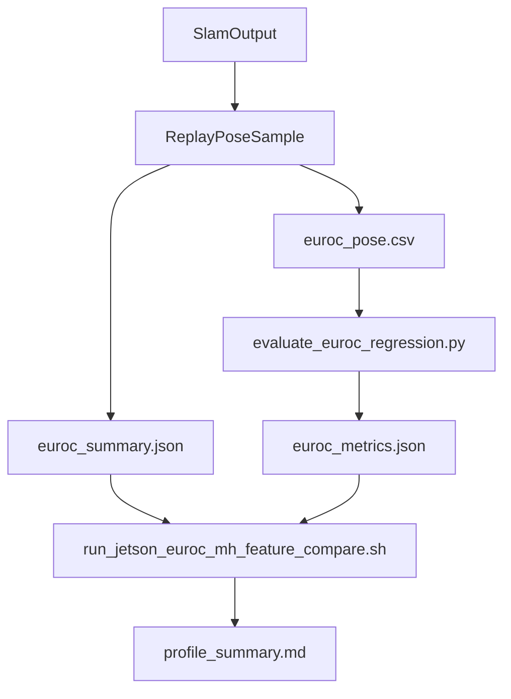

# ORB Mode Technical Flow

## Purpose

ORB mode (`--slam-backend orbslam3 --feature-frontend orb`) uses the absorbed ORB-SLAM3 backend and remains a historical EuRoC accuracy reference. It is available only when SmartDrone is built with `SMART_DRONE_ENABLE_ORB_SLAM3=ON`. The default production path is now the native KLT/PnP backend, with DPVO TensorRT as a backend-level alternative.

## Main Flow



## Code Entry Points

| Layer | Code | Responsibility |
| --- | --- | --- |
| CLI/offline replay | `tests/euroc/offline_replay_main.cpp` | Parse `--slam-backend orbslam3 --feature-frontend orb`, create ORB-SLAM3 system when compiled, run EuRoC replay, export CSV/JSON. |
| Replay loop | `tests/euroc/support/replay_slam_runner.cpp` | Pull stereo frames and IMU windows, call `ISlamEngine::Process`, collect per-frame timing. |
| Live loop | `src/native/core/application/session/slam_frame_processor.cpp` | Read runtime tuning, apply frontend mode, acquire camera frames, call SLAM engine. |
| Rate limiter | `src/native/core/application/state/perception_pipeline.cpp` | Enforce SLAM input FPS and derive stable capture/logical timestamps. |
| Mode strategy | `src/native/adapters/slam/slam_mode_strategy.cpp`, `src/native/adapters/slam/orb_mode_strategy.cpp` | Select `FeatureFrontend::Orb`, call ORB-SLAM3, and convert pose/telemetry to `SlamOutput`. |
| Engine state | `src/native/adapters/slam/slam_engine_adapter.cpp`, `src/native/adapters/slam/orb_slam3_backend.cpp` | Own ORB-SLAM3 system lifetime, calibration, shared state, and runtime setters. |
| Output contract | `src/native/core/ports/slam_engine.h` | Defines `SlamInputBatch` and `SlamOutput`. |

## Configuration and Mode Selection

Offline replay reads:

```bash
--feature-frontend orb
--slam-backend orbslam3
--sensor-mode stereo
--settings config/euroc/stereo_orb_official.yaml
--vocab /home/nvidia/ORBvoc.txt
```

`ParseSlamBackendText(...)` maps `orbslam3` to `SlamBackend::OrbSlam3`, and `ParseFeatureFrontendText(...)` maps `orb` to `FeatureFrontend::Orb`. `RunOfflineReplay(...)` then constructs the ORB engine only when the target was compiled with ORB support:

```cpp
auto orbSystem = std::make_unique<ORB_SLAM3::System>(opts.vocab, opts.settings, sensor, false);
SlamEngineAdapter slamEngine(std::move(orbSystem), ResolveSlamInputMode(opts.sensorMode),
                             UseImu(opts.sensorMode), opts.settings);
slamEngine.SetFeatureFrontend(opts.featureFrontend);
```

Live runtime follows the same backend/frontend enum path. `SlamFrameProcessor` reads `m_ctx.tuning.featureFrontend` and applies it through the generic `ISlamRuntimeControl` interface when the selected backend supports runtime frontend switching.

## Input Pipeline



Important implementation details:

- `PerceptionPipeline::AcquireNextStereoBatch(...)` computes `minTimestampNs` from the last accepted capture timestamp and requested SLAM FPS.
- It drops frames by returning `DroppedByRateLimiter` when the logical timestamp is too early.
- It uses the midpoint of left/right timestamps as `captureTimestampNs`.
- Offline EuRoC replay uses `ReplayCameraProvider::GrabStereo(...)`, which loads left/right grayscale images from disk.
- IMU samples are converted to `ORB_SLAM3::IMU::Point` only if the sensor mode uses IMU. The documented EuRoC run uses `--stereo-only`, so no IMU is passed.

## ORB Strategy Dispatch

`SlamEngineAdapter::Process(...)` delegates mode selection to `SlamModeStrategy`. `CreateSlamModeStrategy(...)` maps `FeatureFrontend::Orb` to `OrbModeStrategy`, and that strategy owns the ORB backend execution:

```cpp
return RunSlamTrackingBackend(engine, input, extractFeatures, extractPointCloud, nullptr);
```

The ORB mode entry point disables external SP+LG feature injection and executes the native ORB-SLAM3 path:

```cpp
const auto orbTrackStartTp = std::chrono::steady_clock::now();
tcw = m_system->TrackStereo(input.stereo.left.gray, input.stereo.right.gray, input.frameTimeSec);
const auto orbTrackEndTp = std::chrono::steady_clock::now();
out.orbTrackMs = duration(orbTrackEndTp - orbTrackStartTp);
```

If stereo-IMU is enabled, the adapter calls the overload that passes `input.imu`.

## Internal ORB-SLAM3 Responsibilities

SmartDrone delegates these steps to ORB-SLAM3:



The adapter reads ORB-SLAM3 telemetry after tracking:

- `tracker->mCurrentFrame.mTimeORB_Ext` -> `orbExtractMs`
- `tracker->mCurrentFrame.mTimeStereoMatch` -> `orbStereoMatchMs`
- wall-clock `TrackStereo(...)` duration -> `orbTrackMs`
- `m_system->GetTrackingState()` -> `trackingState`
- `m_system->GetCurrentMapId()` -> `mapId`
- `m_system->GetMatchesInliers()` -> `matchesInliers`
- `m_system->GetTrackedMapPointCount()` -> `trackedMapPointCount`
- `m_system->GetLocalMapPointCount()` -> `localMapPointCount`

## Pose Conversion

ORB-SLAM3 returns `Tcw`. By default the adapter converts the current `Tcw` to world-camera pose for realtime output.
The EuRoC-style reference-keyframe trajectory pose can still be enabled with
`SMART_DRONE_ORB_LIVE_EUROC_TRAJECTORY_POSE=1` for diagnostics, but it is not the strict realtime output path because
LocalMapping can update the reference pose asynchronously:

```cpp
const Sophus::SE3f twc = tcw.inverse();
const Eigen::Vector3f t = twc.translation();
const Eigen::Quaternionf q(twc.so3().unit_quaternion());
```

Then it validates every translation/quaternion component with `std::isfinite(...)`. Valid poses are copied into
`PoseEstimate` and marked with `poseValid=true`. When `SMART_DRONE_REALTIME_POSE_CONTINUITY=1`, transient current-frame
lost outputs can be filled from the last realtime stable pose, but previous rows are never rewritten.

## Output Artifacts



`RunOfflineReplay(...)` writes `euroc_pose.csv` from the replay frame callback and flushes each row immediately. The
official CSV is the realtime stream; shutdown trajectory export is not allowed to overwrite or backfill it. Evaluation
therefore checks the same per-frame pose path used by live runtime telemetry.

## Profiling Design

ORB mode is instrumented at two levels:

| Field | Source | Meaning |
| --- | --- | --- |
| `replay_acquire_ms` | `ReplaySlamRunner` | Time to acquire the next accepted stereo batch. |
| `replay_imu_ms` | `ReplaySlamRunner` | Time to collect/convert IMU samples. Usually zero for `--stereo-only`. |
| `slam_total_ms` | `ReplaySlamRunner` | Full `ISlamEngine::Process(...)` call. |
| `orb_track_ms` | `OrbSlam3Backend::Track(...)` | Wall time around ORB-SLAM3 `TrackStereo(...)`. |
| `orb_extract_ms` | ORB-SLAM3 current frame | ORB extraction time. |
| `orb_stereo_ms` | ORB-SLAM3 current frame | Stereo matching time. |

Fields that should stay zero in ORB mode:

- `frontend_ms`
- `stereo_pair_ms`
- `external_pack_ms`
- KLT-specific `lk_*` fields

## Failure and Recovery Behavior

- Empty or missing `m_system` returns an empty `SlamOutput`.
- ORB-SLAM3 can report lost/not-initialized states through `trackingState`; the adapter still emits the state for downstream logic.
- Rate-limited frames are dropped before SLAM and do not produce `SlamOutput`.
- Camera timeout/unhealthy status is handled in `PerceptionPipeline`/session code, not inside ORB.

## Jetson EuRoC Result

Latest archived run:

`docs/jetson_euroc_key_profile_20260503_080401.md`

Summary:

- Average SLAM path: `34.84 ms/frame`
- Average ORB track: `34.21 ms/frame`
- ORB extraction ranges roughly `17.67-19.39 ms/frame` across Machine Hall.

## Engineering Interpretation

ORB mode is now a legacy reference path: acquisition and rate limiting are SmartDrone responsibilities, but pose estimation is native ORB-SLAM3 when the optional internal backend is compiled in. It remains useful for archived accuracy comparisons and for detecting regressions in calibration, timestamp handling, ORB-SLAM3 integration, or trajectory export.
