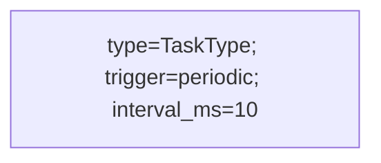
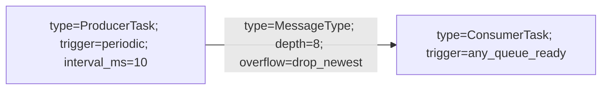
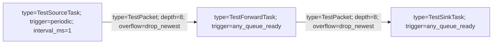

# Runtime Graph Mermaid Format

This is a constrained Mermaid subset used to compile a visual topology into
`RuntimeGraphConfig`. It is intentionally smaller than full Mermaid syntax.

## Header

The first non-comment line may be:

```mermaid
flowchart LR
```

`graph LR` is also accepted. The direction token is ignored by the runtime.

## Comments

Text after `%%` is ignored.

```mermaid
%% This is a comment.
```

## Task Nodes

Each task node uses this form:



Fields:

- `type`: required registered task type.
- `trigger`: required. One of `periodic`, `any_queue_ready`, `all_queue_ready`,
  `periodic_or_any_queue_ready`.
- `interval_ms`: required for `periodic` and `periodic_or_any_queue_ready`.
- `trigger_queues`: optional documentation field for queue-triggered tasks. Use
  message type names joined by `+` to make wakeup sources explicit in the
  diagram, for example `trigger_queues=FrameReady+ControlTick`.

For queue-triggered tasks, the compiler infers trigger queues from all incoming
edges. `trigger_queues` is validated by convention in topology review, but it
does not override the inferred graph wiring.

## Queue Edges

When compiling with the task `Registry`, each edge can omit port names and queue
names. The compiler infers ports from registered task input/output specs and
generates queue names.



Fields:

- `type`: required registered message type.
- `depth`: required queue depth.
- `overflow`: required. One of `drop_newest`, `tail_drop`,
  `overwrite_oldest`, `circular_overwrite`.
- `from`: optional source output port. Usually inferred from the source task.
- `to`: optional target input port. Usually inferred from the target task.
- `name`: optional queue name. Usually generated as
  `producer_output_port_to_consumer_input_port`.

Each edge becomes one SPSC queue, so one edge has exactly one producer and one
consumer.

For ambiguous multi-port tasks, the compiler uses registered port types, node
names, peer ports, and already-used ports. If ambiguity remains, it reports a
clear error and the edge can add `from` or `to` explicitly.

## Example



The edges auto-generate these queue names:

```text
source_out_to_forward_in
forward_out_to_sink_in
```
