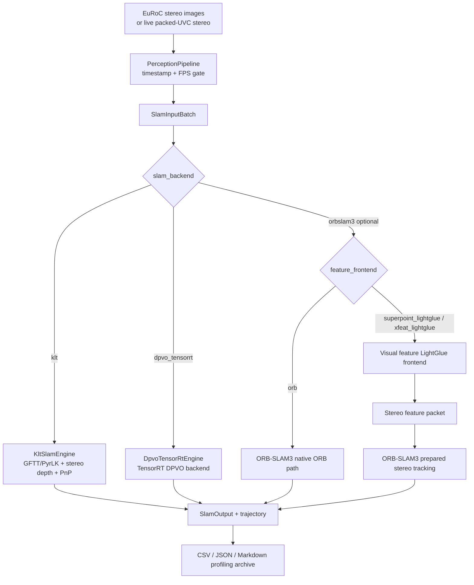

# SLAM Backend/Frontend Modes and EuRoC Regression

This document lists the backend/frontend combinations used by SmartDrone and the EuRoC Machine Hall regression results
that drove earlier tuning. The current production-facing defaults are native `klt` and optional `dpvo_tensorrt`;
`orbslam3` and SP+LG injection are optional reference paths that require an ORB-enabled build.

## End-to-End Mode Topology



## Supported Modes

| UI label | CLI / config value | Backend path | Recommendation |
| --- | --- | --- | --- |
| KLT Tracking | `--slam-backend klt --feature-frontend lk_gftt_per_frame` | `KltSlamEngine`: GFTT feature detection, OpenCV/VPI pyramidal LK, stereo depth, and PnP | Default lightweight runtime |
| DPVO TensorRT | `--slam-backend dpvo_tensorrt --feature-frontend lk_gftt_per_frame` | `DpvoTensorRtEngine`: backend-level learned VO route | Optional Jetson learned-VO backend |
| ORB | `--slam-backend orbslam3 --feature-frontend orb` | Optional absorbed ORB-SLAM3 backend with native ORB extraction, stereo tracking, local mapping, loop closure, and relocalization | Historical accuracy reference |
| SuperPoint + LightGlue | `--slam-backend orbslam3 --feature-frontend superpoint_lightglue` | Optional ORB-SLAM3 backend with TensorRT SuperPoint/LightGlue stereo-feature injection | Archived learned-feature reference/experiment path |

Detailed flow documents:

- ORB: `docs/orb_mode_flow.md`
- KLT Tracking: `docs/klt_tracking_mode_flow.md`
- DPVO TensorRT: `docs/dpvo_tensorrt_backend.md`
- SuperPoint + LightGlue: `docs/superpoint_lightglue_mode_flow.md`

Notes:

- Android exposes backend-aware tracking choices based on runtime capabilities. ORB/SP+LG choices are shown only when
  the native target reports ORB support.
- Backend/frontend switching is allowed only while SLAM is not running; switching restarts the SLAM session.
- Python inference helper processes are not part of the runtime path.
- ORB mode uses `config/euroc/stereo_orb_official.yaml` for the archived EuRoC regression.

## SuperPoint + LightGlue Runtime

The SuperPoint + LightGlue frontend runs inference fully in C++ TensorRT at runtime, but the documented injection path
requires the optional ORB backend.

Default EuRoC regression engines:

- SuperPoint: `superpoint_dense_640x409_fp16.engine`
- LightGlue: `lightglue_superpoint_512_fp16.engine`

Recommended runtime parameters:

```bash
SMART_DRONE_LIGHTGLUE_POINTS=512
SMART_DRONE_SUPERPOINT_MAX_POINTS=512
SMART_DRONE_LIGHTGLUE_EVERY_N=4
SMART_DRONE_LIGHTGLUE_SCORE_ORIENTATION=direct
SMART_DRONE_SUPERPOINT_DESCRIPTOR_LIMIT=512
SMART_DRONE_SUPERPOINT_DESCRIPTOR_NEAREST=1
SMART_DRONE_TRT_PINNED_HOST_OUTPUT=1
SMART_DRONE_SUPERPOINT_PARALLEL_POST=1
SMART_DRONE_LIGHTGLUE_MIN_SCORE=0.02
SMART_DRONE_LIGHTGLUE_MAX_Y_DIFF_PX=1.5
SMART_DRONE_LIGHTGLUE_MIN_DISPARITY_PX=0.8
SMART_DRONE_EXTERNAL_STEREO_INIT_MIN_FEATURES=72
SMART_DRONE_EXTERNAL_STEREO_INIT_MIN_CLOSE_POINTS=24
SMART_DRONE_EXTERNAL_STEREO_INIT_MIN_CLOSE_RATIO=0.30
SMART_DRONE_SP_LG_INIT_TRUST_FRONTEND_PAIRS=1
SMART_DRONE_SP_LG_RECOVERY_TRUST_FRONTEND_PAIRS=1
SMART_DRONE_SP_LG_BOOTSTRAP_TRUST_FRONTEND_PAIRS=1
SMART_DRONE_SP_LG_TRUST_FRONTEND_PAIRS_OK_STREAK=20
SMART_DRONE_SP_LG_FILTERED_STEREO_INJECT=1
SMART_DRONE_EXTERNAL_STEREO_DEPTH_SCALE=0.965
SMART_DRONE_ORB_WAIT_LOCAL_MAPPING_IDLE=1
SMART_DRONE_ORB_WAIT_LOCAL_MAPPING_IDLE_TIMEOUT_MS=35
SMART_DRONE_ORB_LIVE_EUROC_TRAJECTORY_POSE=0
SMART_DRONE_REALTIME_POSE_CONTINUITY=1
SMART_DRONE_SUPERPOINT_INPUT_MAX_WIDTH=640
SMART_DRONE_SUPERPOINT_INPUT_MAX_HEIGHT=409
SMART_DRONE_EXTERNAL_STEREO_MAX_PAIRS_PER_CELL=10
```

`SMART_DRONE_SP_LG_ORB_LEFT_AUGMENT=1` can be enabled for experiments that append left-only ORB features after
initialization. It is disabled by default because it adds another ORB extraction pass.

`SMART_DRONE_LIGHTGLUE_EVERY_N=4` runs LightGlue once every four stereo frames and uses descriptor stereo matching on
the skipped frames. In the strict realtime MH04/MH05 replay run below, cadence 4 passed the no-missing-pose gate with
`ATE RMSE < 0.1 m` on both sequences. `EVERY_N=5` was faster in older trials but failed MH04 badly
(`ATE RMSE=5.2553 m`, `RPE RMSE=1.6089 m`), so keep 4 as the current runtime setting.

`SMART_DRONE_SP_LG_ADAPTIVE_CADENCE=1` is an experimental mode that can switch from the base cadence to
`SMART_DRONE_SP_LG_STABLE_LIGHTGLUE_EVERY_N` after a stable tracking streak. It is disabled by default. MH04 trials with
adaptive `4 -> 5` were rejected because they did not provide a useful speed/accuracy tradeoff:
`tracked_mps>=96` gave `ATE RMSE=0.9757 m`, `RPE RMSE=0.0979 m`, and `Replay FPS=26.91`; `tracked_mps>=128` gave
`ATE RMSE=0.9441 m`, `RPE RMSE=0.1765 m`, and `Replay FPS=26.79`.

`SMART_DRONE_EXTERNAL_STEREO_INIT_MIN_CLOSE_RATIO=0.30` and
`SMART_DRONE_EXTERNAL_STEREO_INIT_MIN_CLOSE_POINTS=24` are the current SP+LG stereo bootstrap thresholds. MH04/MH05
regression showed `0.48` can leave hundreds of frames in `NOT_INITIALIZED`, while `0.08` accepts first-frame geometry
that degrades MH04 ATE. The selected threshold keeps initialization early without taking the weakest bootstrap.

`SMART_DRONE_EXTERNAL_STEREO_INIT_MIN_FEATURES=72` is the current SP+LG initialization floor. It accepts the early
SuperPoint/LightGlue frames in EuRoC MH04/MH05 while still blocking very sparse bootstrap attempts.

Keep SuperPoint input at `640x409` for the current EuRoC-oriented runtime. MH04 validation showed it is noticeably
more accurate than `480x360` while still staying within the current Jetson budget.

Keep `SMART_DRONE_LIGHTGLUE_POINTS=512` and `SMART_DRONE_SUPERPOINT_MAX_POINTS=512` as the stable pair. A
`LightGlue=448, SuperPoint max=512` experiment once matched baseline accuracy (`ATE RMSE=0.0354 m`), but the repeat run
with the same configuration failed badly (`ATE RMSE=4.9613 m`, `RPE RMSE=0.6458 m`). `LightGlue=448, SuperPoint max=448`
was more repeatable in speed but degraded MH01 accuracy (`ATE RMSE=0.0428 m`). Do not make the 448-point engines the
default.

`SMART_DRONE_SUPERPOINT_DESCRIPTOR_LIMIT=512` keeps the stereo candidate budget above the consumer limit while sampling
descriptors only for points consumed by LightGlue and descriptor fallback. On MH01 this preserved accuracy and reduced
SuperPoint post-processing time.

`SMART_DRONE_SUPERPOINT_DESCRIPTOR_NEAREST=1` uses nearest-grid descriptor sampling instead of bilinear interpolation.
On MH01 repeat runs it reduced descriptor sampling from about `3.1 ms` to `1.9 ms` while keeping trajectory metrics in
the stable range (`ATE RMSE` around `0.035 m`, `RPE RMSE` around `0.010 m`).

`SMART_DRONE_LIGHTGLUE_SCORE_ORIENTATION=direct` skips the transpose score-layout decode path after MH01 DFX showed the
TensorRT LightGlue engine consistently using direct orientation. This reduced LightGlue decode from about `0.61 ms` to
`0.34 ms` and brought the MH01 SP+LG frontend mean to about `19.0 ms`. Leave the variable unset or set it to `auto` when
validating a new LightGlue engine layout.

`SMART_DRONE_SUPERPOINT_STEREO_EXTRACTION_BUDGET=544` was tested and rejected on MH01 because it degraded trajectory
quality (`ATE RMSE=0.1205 m`, `RPE RMSE=0.0365 m`). Keep the derived default extraction slack unless a new dataset proves
otherwise.

`SMART_DRONE_SUPERPOINT_FAST_NMS=1` was also rejected on MH04. It produced `ATE RMSE=0.9320 m` but degraded
`RPE RMSE` to `0.2358 m` and did not improve the end-to-end frontend mean, so keep the default OpenCV dilation NMS.

`superpoint_dense_480x360_fp16_output.engine` was tested and rejected on MH01. The half-output engine increased
`sp_convert_ms` from about `0.77 ms` to `3.68 ms` due host-side half-to-float conversion and degraded trajectory quality
(`ATE RMSE=0.1309 m`, `RPE RMSE=0.0392 m`). Use `superpoint_dense_480x360_fp16.engine`, whose TensorRT execution is FP16
but whose exported outputs remain FP32.

`SMART_DRONE_SP_LG_NATIVE_DESCRIPTOR_INJECT=1` skips ORB descriptor recomputation and injects SuperPoint `CV_32F`
descriptors directly into ORB-SLAM3. On MH01 it reduced `external_pack_ms` from `2.75 ms` to `0.43 ms` and reduced
`slam_total_ms` from `34.54 ms` to `32.30 ms`, but trajectory quality was slightly worse (`ATE RMSE=0.0370 m`,
`RPE RMSE=0.0116 m`, identity frames `19` vs `4`). Keep it as an explicit speed experiment rather than the default.

`SMART_DRONE_SP_LG_FILTERED_STEREO_INJECT=1` is now the default SP+LG stereo injection path. It only injects stereo
pairs that pass the ZNCC, epipolar, disparity, and grid-balance checks. Strict realtime validation on MH04/MH05 uses
this path with the SP+LG external depth scale set to `0.965`.

`SMART_DRONE_ORB_WAIT_LOCAL_MAPPING_IDLE=1` is part of the current SP+LG realtime pose profile. It waits up to
`SMART_DRONE_ORB_WAIT_LOCAL_MAPPING_IDLE_TIMEOUT_MS=35` after each stereo tracking call so the pose published for the
current replay frame can see the latest LocalMapping update. This is intentionally a latency/accuracy tradeoff: the
strict MH04/MH05 run below averaged about `55-56 ms/frame` on Jetson.

`SMART_DRONE_ORB_LIVE_EUROC_TRAJECTORY_POSE=0` publishes the current pose returned by ORB-SLAM3 `Track()`. The
EuRoC-style reference-keyframe trajectory pose is kept as an opt-in diagnostic path, not the strict realtime output
contract. `SMART_DRONE_REALTIME_POSE_CONTINUITY=1` fills only the current frame when tracking has a transient
lost/recently-lost output; it never rewrites earlier CSV rows and does not use future frames as a post-processing补点
step.

`SMART_DRONE_REALTIME_POSE_MAP_BRIDGE=1` is enabled by default for SP+LG realtime output. When ORB-SLAM3 switches to a
new map, the output path aligns the new raw map pose to the last published stable pose before writing the current frame.
This is a causal continuity bridge for no-jump output; it does not use future frames or ground truth. A 2026-05-15 MH04
diagnostic showed it can remove map-switch jumps, but it does not by itself reduce global ATE drift.

`SMART_DRONE_EXTERNAL_STEREO_REQUIRE_MAP_INLIERS=1` is an opt-in experiment that forces external-stereo
bootstrap/stabilizing frames to meet local-map inlier floors before ORB-SLAM3 accepts the frame as tracked. It is off by
default because MH04 tests with local-map floors `8/16/30` and `16/32/45` kept realtime output stable but did not reach
the `ATE <= 0.04 m` target.

Two additional pack/prepare experiments were rejected. Fixed-point OpenCV remap maps for SP+LG preparation raised
`input_prepare_ms` from `3.20 ms` to `3.54 ms` and increased identity frames from `4` to `17`. Parallel ORB descriptor
packing did not help either: `external_pack_ms` increased from `2.75 ms` to `2.90 ms`.

TensorRT export commands:

```bash
./scripts/export_superpoint_tensorrt.sh --repo /home/nvidia/LightGlue --width 480 --height 360 --max-batch 2
./scripts/export_lightglue_tensorrt.sh --repo /home/nvidia/LightGlue --points 512 --layers 6
```

Python is used only for offline ONNX export. Runtime inference does not depend on Python helper processes.

## EuRoC Regression Setup

- Dataset: Jetson `~/euroc/machine_hall`
- Sequences: `MH_01_easy` through `MH_05_difficult`
- Replay tool: `/home/nvidia/euroc_eval/bin/smart_drone_offline_replay`
- Evaluation script: `tests/euroc/evaluate_euroc_regression.py`
- Profiling artifacts: per-run `time.log`, `tegrastats.log`, `replay.log`, `eval.log`, `euroc_summary.json`, and `euroc_metrics.json`
- Profiling archive: generated at `$EUROC_OUT/profile_summary.md`
- Latest Jetson key-path archive: `docs/jetson_euroc_key_profile_20260503_080401.md`
- ATE alignment: SE3 rigid alignment, no Sim3 scale correction
- RPE delta: 10 frames
- Timestamp association window: 50 ms
- Strict realtime gate: `evaluate_euroc_regression.py --require-realtime-pose`
- Replay pose output: `euroc_pose.csv` is written and flushed during each replay frame callback; shutdown trajectory
  export is not allowed to overwrite or backfill the official CSV.

Three-mode Jetson profiling command:

```bash
SUPERPOINT_TRT_ENGINE=/home/nvidia/LightGlue/weights/superpoint_dense_640x409_fp16.engine \
SMART_DRONE_LIGHTGLUE_POINTS=512 \
SMART_DRONE_SUPERPOINT_MAX_POINTS=512 \
SMART_DRONE_LIGHTGLUE_EVERY_N=4 \
SMART_DRONE_LIGHTGLUE_SCORE_ORIENTATION=direct \
SMART_DRONE_SUPERPOINT_DESCRIPTOR_LIMIT=512 \
SMART_DRONE_SUPERPOINT_DESCRIPTOR_NEAREST=1 \
SMART_DRONE_TRT_PINNED_HOST_OUTPUT=1 \
SMART_DRONE_SUPERPOINT_PARALLEL_POST=1 \
SMART_DRONE_LIGHTGLUE_MIN_SCORE=0.02 \
SMART_DRONE_LIGHTGLUE_MAX_Y_DIFF_PX=1.5 \
SMART_DRONE_LIGHTGLUE_MIN_DISPARITY_PX=0.8 \
SMART_DRONE_EXTERNAL_STEREO_MAX_PAIRS_PER_CELL=10 \
SMART_DRONE_ORB_WAIT_LOCAL_MAPPING_IDLE=1 \
SMART_DRONE_ORB_WAIT_LOCAL_MAPPING_IDLE_TIMEOUT_MS=35 \
SMART_DRONE_ORB_LIVE_EUROC_TRAJECTORY_POSE=0 \
SMART_DRONE_REALTIME_POSE_CONTINUITY=1 \
EUROC_SEQUENCES="MH_01_easy MH_02_easy MH_03_medium MH_04_difficult MH_05_difficult" \
EUROC_MODES="orb klt_tracking superpoint_lightglue" \
EUROC_OUT=/home/nvidia/euroc_eval/results/mh_three_modes_profile_YYYYMMDD_HHMMSS \
/home/nvidia/euroc_eval/scripts/run_jetson_euroc_mh_feature_compare.sh
```

The script captures `nvpmodel`, `jetson_clocks --show`, `/usr/bin/time -v`, and `tegrastats` when those tools are available, then writes the Markdown archive under the result directory.

SP+LG-only full-run command:

```bash
SUPERPOINT_TRT_ENGINE=/home/nvidia/LightGlue/weights/superpoint_dense_640x409_fp16.engine \
SMART_DRONE_LIGHTGLUE_POINTS=512 \
SMART_DRONE_SUPERPOINT_MAX_POINTS=512 \
SMART_DRONE_LIGHTGLUE_EVERY_N=4 \
SMART_DRONE_LIGHTGLUE_SCORE_ORIENTATION=direct \
SMART_DRONE_SUPERPOINT_DESCRIPTOR_LIMIT=512 \
SMART_DRONE_SUPERPOINT_DESCRIPTOR_NEAREST=1 \
SMART_DRONE_TRT_PINNED_HOST_OUTPUT=1 \
SMART_DRONE_SUPERPOINT_PARALLEL_POST=1 \
SMART_DRONE_LIGHTGLUE_MIN_SCORE=0.02 \
SMART_DRONE_LIGHTGLUE_MAX_Y_DIFF_PX=1.5 \
SMART_DRONE_LIGHTGLUE_MIN_DISPARITY_PX=0.8 \
SMART_DRONE_EXTERNAL_STEREO_MAX_PAIRS_PER_CELL=10 \
SMART_DRONE_ORB_WAIT_LOCAL_MAPPING_IDLE=1 \
SMART_DRONE_ORB_WAIT_LOCAL_MAPPING_IDLE_TIMEOUT_MS=35 \
SMART_DRONE_ORB_LIVE_EUROC_TRAJECTORY_POSE=0 \
SMART_DRONE_REALTIME_POSE_CONTINUITY=1 \
EUROC_SEQUENCES="MH_01_easy MH_02_easy MH_03_medium MH_04_difficult MH_05_difficult" \
EUROC_MODES=superpoint_lightglue \
EUROC_OUT=/home/nvidia/euroc_eval/results/sp_lg_512_all_mh_YYYYMMDD_HHMMSS \
/home/nvidia/euroc_eval/scripts/run_jetson_euroc_mh_feature_compare.sh
```

## Regression Results

ORB reference directory:
`/home/nvidia/euroc_eval/results/orb_official_cfg_all_mh`

SuperPoint + LightGlue 768-point directory:
`/home/nvidia/euroc_eval/results/sp_lg_480_conservative_all_mh_20260502_104439`

KLT Tracking CPU directory:
`/home/nvidia/euroc_eval/results/klt_tracking_fixed_all_mh_20260430_105409`

Strict realtime SP+LG directory:
`/home/nvidia/euroc_eval/results/mh04_mh05_splg_realtime_wait35_strict_20260507_184710`

The strict realtime run wrote each `euroc_pose.csv` row during replay and passed `--require-realtime-pose`; no final
trajectory export or post-run fill was used.

| Mode | Sequence | Output rows | Pose-valid rows | ATE RMSE (m) | ATE Max (m) | RPE RMSE (m) | SLAM mean/max (ms) |
| --- | --- | ---: | ---: | ---: | ---: | ---: | ---: |
| SuperPoint + LightGlue realtime | MH_04_difficult | 2032 | 2032 | 0.0970 | 0.2118 | 0.0258 | 56.20 / 97.48 |
| SuperPoint + LightGlue realtime | MH_05_difficult | 2273 | 2273 | 0.0686 | 0.2152 | 0.0246 | 54.98 / 102.16 |

| Mode | Sequence | Matched frames | ATE RMSE (m) | ATE Max (m) | RPE RMSE (m) |
| --- | --- | ---: | ---: | ---: | ---: |
| ORB | MH_01_easy | 3640 | 0.0392 | 0.1071 | 0.0113 |
| ORB | MH_02_easy | 3001 | 0.0484 | 0.1196 | 0.0105 |
| ORB | MH_03_medium | 2632 | 0.0465 | 0.1243 | 0.0208 |
| ORB | MH_04_difficult | 1978 | 0.0556 | 0.1766 | 0.0253 |
| ORB | MH_05_difficult | 2223 | 0.0512 | 0.1498 | 0.0212 |
| KLT Tracking | MH_01_easy | 3640 | 0.1297 | 0.3237 | 0.0194 |
| KLT Tracking | MH_02_easy | 3001 | 0.2134 | 0.5905 | 0.0232 |
| KLT Tracking | MH_03_medium | 2632 | 0.4350 | 1.1500 | 0.0405 |
| KLT Tracking | MH_04_difficult | 1978 | 1.2671 | 2.1380 | 0.0626 |
| KLT Tracking | MH_05_difficult | 2223 | 1.0448 | 1.7149 | 0.0548 |
| SuperPoint + LightGlue | MH_01_easy | 3640 | 0.0480 | 0.1433 | 0.0115 |
| SuperPoint + LightGlue | MH_02_easy | 3001 | 0.0456 | 0.1280 | 0.0100 |
| SuperPoint + LightGlue | MH_03_medium | 2632 | 0.0650 | 0.2603 | 0.0265 |
| SuperPoint + LightGlue | MH_04_difficult | 1978 | 0.0669 | 0.1536 | 0.0232 |
| SuperPoint + LightGlue | MH_05_difficult | 2223 | 0.0712 | 0.1983 | 0.0216 |

## Interpretation

- ORB remains a historical native ORB-SLAM3 EuRoC accuracy reference when the optional internal ORB-SLAM3 backend is enabled.
- SuperPoint + LightGlue uses the native TensorRT frontend path and is close to ORB on MH_01 and MH_02 in the archived regression.
- SuperPoint + LightGlue is slightly better than ORB on MH_02 and much improved on MH_04/MH_05 relative to the previous SP+LG regression, but MH_03 remains behind the ORB reference.
- KLT Tracking is a real GFTT plus pyramidal KLT VO path. It is suitable as a lightweight tracking baseline, but it still drifts more than ORB or SuperPoint + LightGlue on difficult Machine Hall sequences.
- VPI CUDA PyrLK was smoke-tested on MH_01 and produced identity-pose output, so it remains opt-in through `SMART_DRONE_VPI_LK=1` and is not the documented KLT baseline.

## Metric Definitions

- ATE RMSE: root-mean-square absolute translation error after SE3 rigid trajectory alignment. This measures global drift.
- ATE Max: maximum absolute translation error over the trajectory.
- RPE RMSE: root-mean-square relative translation error at a 10-frame delta. This measures local VO stability.
