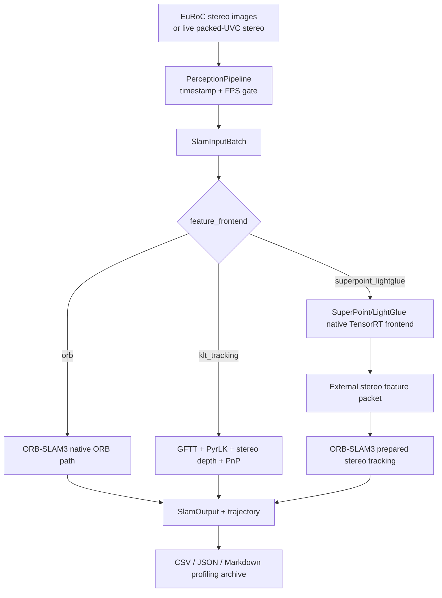

# SLAM Frontend Modes and EuRoC Regression

This document lists the supported visual frontend modes and the current EuRoC Machine Hall regression results for the production-facing modes.

## End-to-End Mode Topology



## Supported Modes

| UI label | CLI / config value | Backend path | Recommendation |
| --- | --- | --- | --- |
| ORB | `orb` | Native ORB-SLAM3 ORB extraction, stereo tracking, local mapping, loop closure, and relocalization | Accuracy reference and baseline mode |
| KLT Tracking | `klt_tracking` + `--lk-per-frame-accel cpu` | GFTT feature detection, OpenCV pyramidal KLT tracking, CPU stereo depth, and CPU PnP | Jetson tracking baseline |
| SuperPoint + LightGlue | `superpoint_lightglue` | Native TensorRT SuperPoint detection/description, LightGlue stereo matching when available, descriptor-match fallback, then ORB-SLAM3 prepared stereo tracking | Learned-feature accuracy mode |

Detailed flow documents:

- ORB: `docs/orb_mode_flow.md`
- KLT Tracking: `docs/klt_tracking_mode_flow.md`
- SuperPoint + LightGlue: `docs/superpoint_lightglue_mode_flow.md`

Notes:

- Android exposes only these three frontend choices.
- Frontend switching is allowed only while SLAM is not running; switching restarts the SLAM session.
- Python inference helper processes are not part of the runtime path.
- ORB mode uses `config/euroc/stereo_orb_official.yaml` for EuRoC regression.

## SuperPoint + LightGlue Runtime

The SuperPoint + LightGlue frontend runs inference fully in C++ TensorRT at runtime.

Default EuRoC regression engines:

- SuperPoint: `superpoint_dense_640x480_fp16.engine`
- LightGlue: `lightglue_superpoint_768_fp16.engine`

Recommended runtime parameters:

```bash
SMART_DRONE_LIGHTGLUE_POINTS=768
SMART_DRONE_LIGHTGLUE_MIN_SCORE=0.02
SMART_DRONE_LIGHTGLUE_MAX_Y_DIFF_PX=1.5
SMART_DRONE_LIGHTGLUE_MIN_DISPARITY_PX=0.8
SMART_DRONE_SUPERPOINT_INPUT_MAX_WIDTH=640
SMART_DRONE_SUPERPOINT_INPUT_MAX_HEIGHT=480
SMART_DRONE_EXTERNAL_STEREO_MAX_LEFT_FEATURES=1200
SMART_DRONE_EXTERNAL_STEREO_MAX_PAIRS_PER_CELL=10
```

TensorRT export commands:

```bash
./scripts/export_superpoint_tensorrt.sh --repo /home/nvidia/LightGlue --width 640 --height 480
./scripts/export_lightglue_tensorrt.sh --repo /home/nvidia/LightGlue --points 768 --layers 6
```

Python is used only for offline ONNX export. Runtime inference does not depend on Python helper processes.

## EuRoC Regression Setup

- Dataset: Jetson `~/euroc/machine_hall`
- Sequences: `MH_01_easy` through `MH_05_difficult`
- Replay tool: `/home/nvidia/euroc_eval/bin/smart_drone_offline_replay`
- Evaluation script: `tests/euroc/evaluate_euroc_regression.py`
- Profiling artifacts: per-run `time.log`, `tegrastats.log`, `replay.log`, `eval.log`, `euroc_summary.json`, and `euroc_metrics.json`
- Profiling archive: generated at `$EUROC_OUT/profile_summary.md`
- Latest Jetson key-path archive: `docs/jetson_euroc_key_profile_20260503_080401.md`
- ATE alignment: SE3 rigid alignment, no Sim3 scale correction
- RPE delta: 10 frames
- Timestamp association window: 50 ms

Three-mode Jetson profiling command:

```bash
SUPERPOINT_TRT_ENGINE=/home/nvidia/LightGlue/weights/superpoint_dense_640x480_fp16.engine \
SMART_DRONE_LIGHTGLUE_POINTS=768 \
SMART_DRONE_LIGHTGLUE_MIN_SCORE=0.02 \
SMART_DRONE_LIGHTGLUE_MAX_Y_DIFF_PX=1.5 \
SMART_DRONE_LIGHTGLUE_MIN_DISPARITY_PX=0.8 \
SMART_DRONE_EXTERNAL_STEREO_MAX_LEFT_FEATURES=1200 \
SMART_DRONE_EXTERNAL_STEREO_MAX_PAIRS_PER_CELL=10 \
EUROC_SEQUENCES="MH_01_easy MH_02_easy MH_03_medium MH_04_difficult MH_05_difficult" \
EUROC_MODES="orb klt_tracking superpoint_lightglue" \
EUROC_OUT=/home/nvidia/euroc_eval/results/mh_three_modes_profile_YYYYMMDD_HHMMSS \
/home/nvidia/euroc_eval/scripts/run_jetson_euroc_mh_feature_compare.sh
```

The script captures `nvpmodel`, `jetson_clocks --show`, `/usr/bin/time -v`, and `tegrastats` when those tools are available, then writes the Markdown archive under the result directory.

SP+LG-only full-run command:

```bash
SUPERPOINT_TRT_ENGINE=/home/nvidia/LightGlue/weights/superpoint_dense_640x480_fp16.engine \
SMART_DRONE_LIGHTGLUE_POINTS=768 \
SMART_DRONE_LIGHTGLUE_MIN_SCORE=0.02 \
SMART_DRONE_LIGHTGLUE_MAX_Y_DIFF_PX=1.5 \
SMART_DRONE_LIGHTGLUE_MIN_DISPARITY_PX=0.8 \
SMART_DRONE_EXTERNAL_STEREO_MAX_LEFT_FEATURES=1200 \
SMART_DRONE_EXTERNAL_STEREO_MAX_PAIRS_PER_CELL=10 \
EUROC_SEQUENCES="MH_01_easy MH_02_easy MH_03_medium MH_04_difficult MH_05_difficult" \
EUROC_MODES=superpoint_lightglue \
EUROC_OUT=/home/nvidia/euroc_eval/results/sp_lg_768_all_mh_YYYYMMDD_HHMMSS \
/home/nvidia/euroc_eval/scripts/run_jetson_euroc_mh_feature_compare.sh
```

## Regression Results

ORB reference directory:
`/home/nvidia/euroc_eval/results/orb_official_cfg_all_mh`

SuperPoint + LightGlue 768-point directory:
`/home/nvidia/euroc_eval/results/sp_lg_480_conservative_all_mh_20260502_104439`

KLT Tracking CPU directory:
`/home/nvidia/euroc_eval/results/klt_tracking_fixed_all_mh_20260430_105409`

| Mode | Sequence | Matched frames | ATE RMSE (m) | ATE Max (m) | RPE RMSE (m) |
| --- | --- | ---: | ---: | ---: | ---: |
| ORB | MH_01_easy | 3640 | 0.0392 | 0.1071 | 0.0113 |
| ORB | MH_02_easy | 3001 | 0.0484 | 0.1196 | 0.0105 |
| ORB | MH_03_medium | 2632 | 0.0465 | 0.1243 | 0.0208 |
| ORB | MH_04_difficult | 1978 | 0.0556 | 0.1766 | 0.0253 |
| ORB | MH_05_difficult | 2223 | 0.0512 | 0.1498 | 0.0212 |
| KLT Tracking | MH_01_easy | 3640 | 0.1297 | 0.3237 | 0.0194 |
| KLT Tracking | MH_02_easy | 3001 | 0.2134 | 0.5905 | 0.0232 |
| KLT Tracking | MH_03_medium | 2632 | 0.4350 | 1.1500 | 0.0405 |
| KLT Tracking | MH_04_difficult | 1978 | 1.2671 | 2.1380 | 0.0626 |
| KLT Tracking | MH_05_difficult | 2223 | 1.0448 | 1.7149 | 0.0548 |
| SuperPoint + LightGlue | MH_01_easy | 3640 | 0.0480 | 0.1433 | 0.0115 |
| SuperPoint + LightGlue | MH_02_easy | 3001 | 0.0456 | 0.1280 | 0.0100 |
| SuperPoint + LightGlue | MH_03_medium | 2632 | 0.0650 | 0.2603 | 0.0265 |
| SuperPoint + LightGlue | MH_04_difficult | 1978 | 0.0669 | 0.1536 | 0.0232 |
| SuperPoint + LightGlue | MH_05_difficult | 2223 | 0.0712 | 0.1983 | 0.0216 |

## Interpretation

- ORB remains the native ORB-SLAM3 accuracy reference on EuRoC Machine Hall.
- SuperPoint + LightGlue uses the native TensorRT frontend path and is close to ORB on MH_01 and MH_02 in the archived regression.
- SuperPoint + LightGlue is slightly better than ORB on MH_02 and much improved on MH_04/MH_05 relative to the previous SP+LG regression, but MH_03 remains behind the ORB reference.
- KLT Tracking is a real GFTT plus pyramidal KLT VO path. It is suitable as a lightweight tracking baseline, but it still drifts more than ORB or SuperPoint + LightGlue on difficult Machine Hall sequences.
- VPI CUDA PyrLK was smoke-tested on MH_01 and produced identity-pose output, so it remains opt-in through `SMART_DRONE_VPI_LK=1` and is not the documented KLT baseline.

## Metric Definitions

- ATE RMSE: root-mean-square absolute translation error after SE3 rigid trajectory alignment. This measures global drift.
- ATE Max: maximum absolute translation error over the trajectory.
- RPE RMSE: root-mean-square relative translation error at a 10-frame delta. This measures local VO stability.
