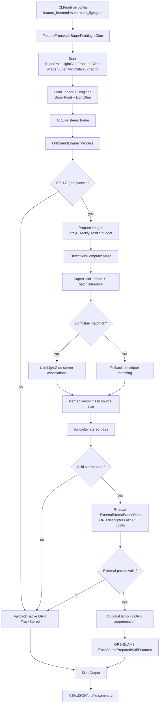
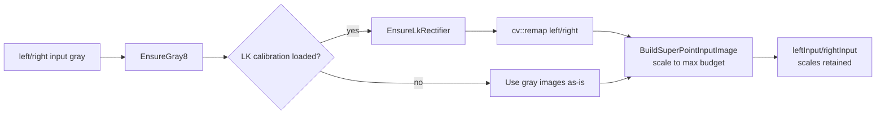
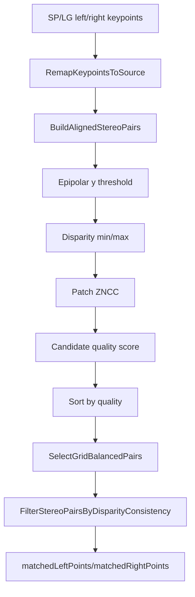
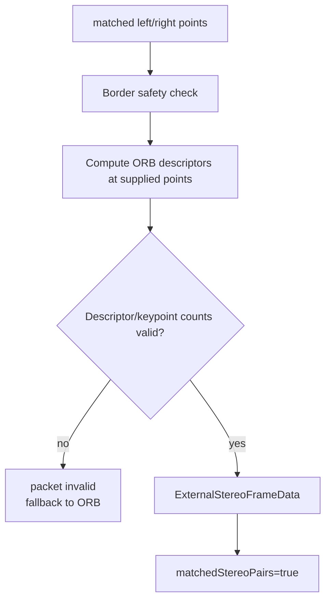
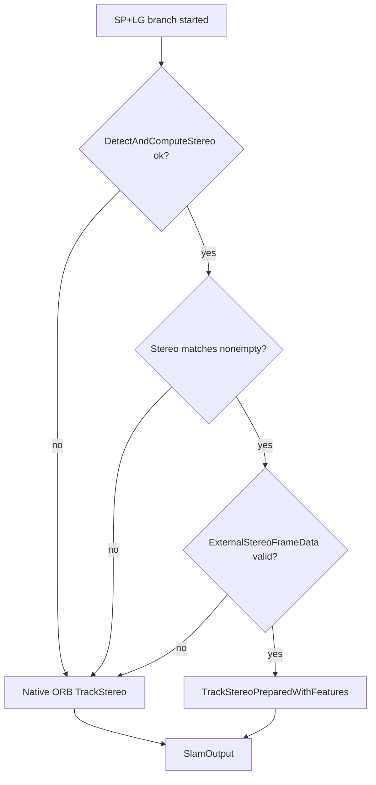

# SuperPoint + LightGlue Mode Technical Flow

## Purpose

SuperPoint + LightGlue mode (`--feature-frontend superpoint_lightglue`) uses a learned stereo frontend while keeping ORB-SLAM3 as the backend tracker and map manager. The current runtime architecture is:

1. TensorRT SuperPoint detects/describes features.
2. LightGlue matching is attempted when the TensorRT LightGlue engine is available.
3. Descriptor matching is used as an in-process fallback when LightGlue matching cannot produce a valid stereo association.
4. SmartDrone filters stereo pairs and converts them into ORB-SLAM3-compatible external feature packets.
5. ORB-SLAM3 tracks using `TrackStereoPreparedWithFeatures(...)`.

The current code also has a deliberate fallback: if external feature injection does not succeed, the frame falls back to native ORB tracking.

## Main Flow



## Code Entry Points

| Layer | Code | Responsibility |
| --- | --- | --- |
| CLI/offline replay | `tests/euroc/offline_replay_main.cpp` | Parses SP+LG options, starts frontend client, runs replay. |
| Live runtime | `src/native/core/application/session/slam_session_runtime.cpp` | Resolves repo/engine paths and starts TensorRT frontend for runtime sessions. |
| Live frame loop | `src/native/core/application/session/slam_frame_processor.cpp` | Applies frontend mode, load shedding, input size budget, and calls SLAM engine. |
| Frontend client | `src/native/adapters/slam/superpoint_lightglue_frontend_client.cpp` | Owns frontend lifetime and delegates native extraction/matching to `SuperPointNativeExtractor`. |
| TensorRT frontend | `src/native/adapters/slam/superpoint_native_extractor.cpp` | Loads engines, runs SuperPoint batch inference, attempts LightGlue matching, applies descriptor-match fallback, records stats. |
| SLAM adapter | `src/native/adapters/slam/orbslam3_engine.cpp` | Prepares images, filters stereo pairs, builds external feature data, calls ORB-SLAM3 or fallback. |

## Startup and Engine Loading

Offline replay starts the frontend only in SP+LG mode:

```cpp
if (opts.featureFrontend == FeatureFrontend::SuperPointLightGlue && SuperPointLightGlueInjectionEnabled()) {
    slamEngine.SetSuperPointLightGlueFrontendClient(&superpointFrontendClient);
    superpointFrontendClient.Start(opts.superpointRepo, opts.superpointDevice,
                              opts.superpointTopK, opts.superpointMaxPoints, &superpointErr);
}
```

`SuperPointLightGlueFrontendClient::Start(...)` creates `SuperPointNativeExtractor` and calls its `Start(...)`.

`SuperPointNativeExtractor::Start(...)` creates an implementation object and loads:

- SuperPoint TensorRT engine
- LightGlue TensorRT engine

The engine resolution logic prefers names such as:

- `superpoint_dense_640x480_fp16.engine`
- `lightglue_superpoint_768_fp16.engine`

Runtime parameters are controlled by CLI flags and environment variables:

- `--superpoint-repo`
- `--superpoint-device`
- `--superpoint-top-k`
- `--superpoint-max-points`
- `--superpoint-input-max-width`
- `--superpoint-input-max-height`
- `SMART_DRONE_LIGHTGLUE_POINTS`
- `SMART_DRONE_LIGHTGLUE_MIN_SCORE`
- `SMART_DRONE_LIGHTGLUE_MAX_Y_DIFF_PX`
- `SMART_DRONE_LIGHTGLUE_MIN_DISPARITY_PX`

## Runtime Gate and Load Budget

The SP+LG branch in `OrbSlam3Engine::Process(...)` runs only if:

```cpp
m_featureFrontend == FeatureFrontend::SuperPointLightGlue &&
!monoMode &&
m_superpointFrontendClient != nullptr &&
m_superpointFrontendClient->Running()
```

Live runtime also applies adaptive input-size budgeting. `SlamFrameProcessor` computes `superpointLoadSheddingLevel`, derives a budget, and calls:

```cpp
m_ctx.slamEngine.SetSuperPointInputSizeLimit(superpointBudgetWidth, superpointBudgetHeight);
```

This means SP+LG may run at a lower input size under load, while ORB backend tracking continues to receive the prepared stereo frame.

## Image Preparation



The adapter records preparation time in `input_prepare_ms`.

The scale factors from `BuildSuperPointInputImage(...)` are retained so keypoints can be mapped back to the source/rectified image coordinate system after inference.

## TensorRT Frontend

`SuperPointLightGlueFrontendClient::DetectAndComputeStereo(...)` calls:

```cpp
m_superPointNativeExtractor->DetectAndComputeStereo(leftGray, rightGray, ...)
```

`SuperPointNativeExtractor::DetectAndComputeStereo(...)` performs:

1. `PrepareGrayImage(...)` for left and right.
2. Batched SuperPoint inference:

```cpp
m_impl->DetectAndComputeBatch({leftGray8, rightGray8}, extractionBudget, rawOutputs,
                              &inputMs, &forwardMs, &postMs, err)
```

3. LightGlue matching:

```cpp
m_impl->MatchWithLightGlue(rawOutputs[0], rawOutputs[1], maxPoints, width, height,
                           leftFeatures, rightFeatures, &lightGlueMatchMs, err)
```

4. If LightGlue fails, fallback descriptor matching:

```cpp
MatchStereoPairs(rawOutputs[0], rawOutputs[1], maxPoints, leftFeatures, rightFeatures);
```

5. Stats update:

- `prepareMs`
- `inputMs`
- `forwardMs`
- `postMs`
- `inferMs`
- `totalMs`
- `imageCount`
- `payloadBytes`

The replay log prints:

```text
[superpoint_trt_perf] batch=2 input_ms=... gpu_forward_ms=... cpu_post_ms=...
lightglue=Y lightglue_ms=... total_ms=... left_pts=... right_pts=...
```

The adapter exposes native frontend time through both the generic `frontend_ms` path-level field and the SuperPoint-specific `superpoint_frontend_ms` aggregate used in replay summaries.

## Stereo Pair Construction



Important implementation details:

- `BuildAlignedStereoPairs(...)` assumes corresponding left/right feature vectors are already ordered as matched pairs.
- It rejects pairs with high vertical error, invalid disparity, low ZNCC, or low candidate quality.
- `SelectGridBalancedPairs(...)` limits feature concentration per image grid cell.
- `SMART_DRONE_EXTERNAL_STEREO_MAX_PAIRS_PER_CELL` can tune pair density.

Profiling fields:

- `stereo_pair_ms`
- `superpointMatchedStereoCount`

## External Feature Packet

`FinalizeStereoExternalFromPairs(...)` converts filtered SP/LG points into ORB-SLAM3 external feature data.



Why ORB descriptors are computed here:

- ORB-SLAM3's backend expects ORB-style binary descriptors.
- SP/LG supplies point locations and stereo association.
- SmartDrone computes ORB descriptors at learned-feature point positions so ORB-SLAM3 can consume them.

Profiling field:

- `external_pack_ms`

## Optional Mono Augmentation

If ORB-SLAM3 has already initialized, the adapter can append left-only ORB features:

```cpp
AppendOrbLeftOnlyFeatures(tracker->GetLeftORBExtractor(), leftPrepared, externalData, maxLeftFeatures);
```

This improves left-image feature availability while preserving the pre-matched stereo pairs. The cap is controlled by:

- `SMART_DRONE_EXTERNAL_STEREO_MAX_LEFT_FEATURES`

Profiling field:

- `mono_augment_ms`

## Backend Tracking

When external data is valid:

```cpp
tcw = m_system->TrackStereoPreparedWithFeatures(leftPrepared, rightPrepared,
                                                externalData, input.frameTimeSec);
```

If IMU is enabled, the overload with `input.imu` is used.

ORB-SLAM3 still owns:

- pose tracking
- map state
- tracking state
- inlier counts
- local/tracked map point counts
- trajectory export

Profiling fields:

- `orb_track_ms`
- `orb_extract_ms`
- `orb_stereo_ms`
- `superpoint_total_ms`

`superpoint_total_ms` is set only when external tracking succeeds and covers the external frontend path through backend tracking.

## Fallback Path

Fallback is deliberate and frame-local:



This matters for interpreting results. A run may show:

- nonzero `frontend_ms`
- zero `external_pack_ms`
- zero `superpoint_total_ms`
- ORB-like `orb_track_ms`

That means TensorRT frontend ran, but external injection did not drive tracking for that frame.

## Output and Artifacts

`SlamOutput` includes:

- SP/LG counts:
  - `superpointRawLeftCount`
  - `superpointRawRightCount`
  - `superpointMatchedStereoCount`
  - `superpointInjectedLeftCount`
  - `superpointInjectedRightCount`
- SP/LG timing:
  - `inputPrepareMs`
  - `superpointPrepareMs`
  - `superpointInputMs`
  - `superpointForwardMs`
  - `superpointFrontendMs`
  - `frontendMs`
  - `stereoPairMs`
  - `externalPackMs`
  - `monoAugmentMs`
  - `superpointTotalMs`
- ORB backend timing:
  - `orbTrackMs`
  - `orbExtractMs`
  - `orbStereoMatchMs`
- pose, map, and tracking telemetry

Offline replay writes these to `euroc_pose.csv`, aggregates means/maxes into `euroc_summary.json`, evaluates trajectory metrics into `euroc_metrics.json`, and the run script rolls them into `profile_summary.md`.

## Profiling Interpretation

| Field | Meaning |
| --- | --- |
| `input_prepare_ms` | Gray conversion, rectification, and frontend input scaling. |
| `frontend_ms` | Generic path-level frontend wall time as observed by the adapter. |
| `superpoint_input_ms` | Native TensorRT input upload/preparation time inside `SuperPointNativeExtractor`. |
| `superpoint_forward_ms` | SuperPoint network forward time. |
| `superpoint_frontend_ms` | SuperPoint-specific native frontend total reported by the extractor/client. |
| `stereo_pair_ms` | SmartDrone stereo pair filtering after frontend keypoint output. |
| `external_pack_ms` | ORB descriptor computation and `ExternalStereoFrameData` creation. |
| `mono_augment_ms` | Optional left-only ORB augmentation. |
| `superpoint_total_ms` | Full external path through ORB-SLAM3 tracking when injection succeeds. |
| `orb_track_ms` | ORB-SLAM3 backend tracking call, with or without external features. |

## Current Jetson Finding

Latest archived run:

`docs/jetson_euroc_key_profile_20260503_080401.md`

Summary:

- Average SLAM path: `101.85 ms/frame`
- Average TensorRT frontend: `64.73 ms/frame`
- Average ORB tracking after frontend: `33.70 ms/frame`

Important caveat:

- The run showed nonzero `frontend_ms` but zero `external_pack_ms`, zero `stereo_pair_ms`, and zero `superpoint_total_ms`.
- Smoke logs showed TensorRT lines with `left_pts=0 right_pts=0`.
- Therefore this run should be interpreted as frontend-on/fallback behavior, not confirmed successful SP+LG external feature injection.

## Engineering Interpretation

SP+LG is architecturally a learned frontend plus ORB-SLAM3 backend. The decisive health indicators are not only accuracy and frontend timing, but also the injection counters:

- `superpointRawLeftCount/right`
- `superpointMatchedStereoCount`
- `superpointInjectedLeftCount/right`
- `external_pack_ms`
- `superpoint_total_ms`

If those remain zero, the backend is effectively ORB-SLAM3 fallback after paying TensorRT frontend cost. The next engineering target should be verifying TensorRT output decoding and LightGlue matched point emission before optimizing performance.
