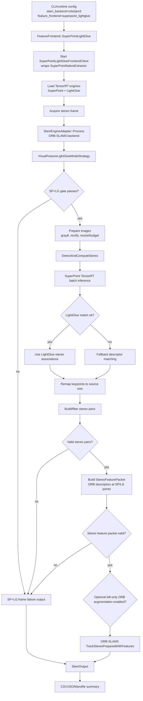
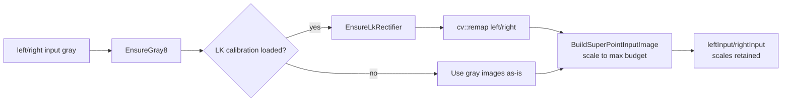
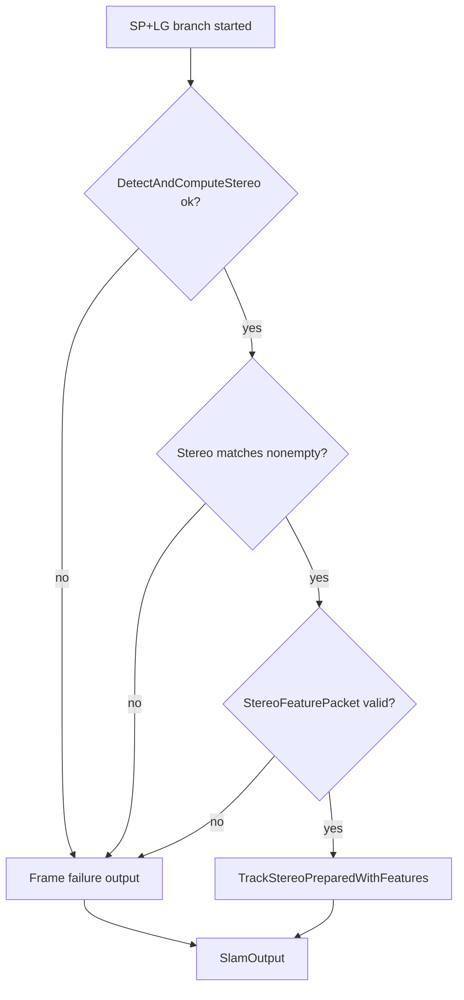

#SuperPoint + LightGlue ORB Backend Flow

## Purpose

SuperPoint + LightGlue mode is now a learned-feature frontend for the optional ORB-SLAM3 backend. Select it with
`--slam-backend orbslam3 --feature-frontend superpoint_lightglue` in a build compiled with
`SMART_DRONE_ENABLE_ORB_SLAM3=ON`.

It is not the default production path. The default runtime backend is native KLT/PnP, and DPVO TensorRT is a separate
backend-level route. The SP+LG legacy adapter architecture is:

1. TensorRT SuperPoint detects/describes features.
2. LightGlue matching is attempted when the TensorRT LightGlue engine is available.
3. Descriptor matching is used as an in-process fallback when LightGlue matching cannot produce a valid stereo association.
4. SmartDrone filters stereo pairs and converts them into ORB-SLAM3-compatible stereo feature packets.
5. ORB-SLAM3 tracks using `TrackStereoPreparedWithFeatures(...)`.

SP+LG mode does not fall back to native ORB tracking. If the learned frontend cannot produce a valid stereo feature packet,
the frame is reported without a valid SP+LG tracking update so the failure is visible in DFX.

## Main Flow



## Code Entry Points

| Layer | Code | Responsibility |
| --- | --- | --- |
| CLI/offline replay | `tests/euroc/offline_replay_main.cpp` | Parses SP+LG options, starts frontend client, runs replay. |
| Live runtime | `src/native/core/application/session/slam_session_runtime.cpp` | Resolves repo/engine paths and starts TensorRT frontend for runtime sessions. |
| Live frame loop | `src/native/core/application/session/slam_frame_input_port.cpp`, `src/native/core/application/session/slam_frame_tracking_port.cpp` | Applies frontend mode, load shedding, input size budget, and calls SLAM engine. |
| Frontend client | `src/native/adapters/slam/superpoint/superpoint_lightglue_frontend_client.cpp` | Owns frontend lifetime and delegates native extraction/matching to `SuperPointNativeExtractor`. |
| TensorRT frontend | `src/native/adapters/slam/superpoint/superpoint_native_extractor.cpp` | Loads engines, runs SuperPoint batch inference, attempts LightGlue matching, applies descriptor-match fallback, records stats. |
| Mode strategy | `src/native/adapters/slam/superpoint/visual_feature_lightglue_mode_strategy.cpp` | Maps LightGlue-style visual feature frontends to the ORB-SLAM3 stereo-feature tracking path. |
| Tracking backend | `src/native/adapters/slam/orb/orb_slam3_backend.cpp`, `src/native/adapters/slam/engine/slam_tracking_backend.cpp` | Calls ORB-SLAM3 prepared stereo tracking with the SP+LG stereo feature packet. |

## Startup and Engine Loading

Offline replay starts the frontend only in SP+LG mode:

```cpp
if (opts.featureFrontend == FeatureFrontend::SuperPointLightGlue && SuperPointLightGlueInjectionEnabled()) {
  slamControl->SetVisualFeatureFrontend(&superpointFrontendClient);
  superpointFrontendClient.Start(opts.superpointRepo, opts.superpointDevice,
                                 opts.superpointTopK, opts.superpointMaxPoints,
                                 &superpointErr);
}
```

`SuperPointLightGlueFrontendClient::Start(
    ...)` creates `SuperPointNativeExtractor` and calls its `Start(...)`.

`SuperPointNativeExtractor::Start(...)` creates an
    implementation object and loads :

    -SuperPoint TensorRT engine
    -
    LightGlue TensorRT engine

    The engine resolution logic prefers names such as :

    - `superpoint_dense_640x409_fp16
        .engine` - `lightglue_superpoint_512_fp16.engine`

                   Runtime parameters are
                   controlled by CLI flags and environment variables :

    - `--superpoint
    - repo` - `--superpoint
    - device` (`auto` or `cuda` in the native TensorRT runtime) - `--superpoint
    - top - k` - `--superpoint - max - points` - `--superpoint - input - max
    - width` - `--superpoint
    - input - max - height` - `SMART_DRONE_SUPERPOINT_MAX_POINTS` in the Jetson regression script - `SMART_DRONE_SUPERPOINT_STEREO_EXTRACTION_BUDGET` - `SMART_DRONE_SUPERPOINT_DESCRIPTOR_LIMIT` - `SMART_DRONE_SUPERPOINT_DESCRIPTOR_NEAREST` - `SMART_DRONE_TRT_PINNED_HOST_OUTPUT` - `SMART_DRONE_SUPERPOINT_PARALLEL_POST` - `SMART_DRONE_DESCRIPTOR_SUPPLEMENT_CANDIDATES` - `SMART_DRONE_LIGHTGLUE_POINTS` - `SMART_DRONE_LIGHTGLUE_EVERY_N` - `SMART_DRONE_LIGHTGLUE_SCORE_ORIENTATION` - `SMART_DRONE_LIGHTGLUE_MIN_SCORE` - `SMART_DRONE_LIGHTGLUE_MAX_Y_DIFF_PX` - `SMART_DRONE_LIGHTGLUE_MIN_DISPARITY_PX`

                                                                                                                                                                                                                                                                                                                                                                                                                                                                                                                                                                              ##Runtime
                                                                                                                                                                                                                                                                                                                                                                                                                                                                                                                                                                              Gate
                                                                                                                                                                                                                                                                                                                                                                                                                                                                                                                                                                                  and Load
                                                                                                                                                                                                                                                                                                                                                                                                                                                                                                                                                                              Budget

`SlamEngineAdapter::Process(...)` delegates frontend dispatch to `SlamModeStrategy`.The SP
    +
    LG strategy enables the shared ORB backend path with stereo-feature
    injection :

```cpp RunSlamTrackingBackend(..., &stereoFeatureTrackRequest)
```

    The visual-feature frontend gate then
      requires
    :

```cpp !monoMode && state.m_externalFeatureFrontendClient != nullptr &&
          state.m_externalFeatureFrontendClient->Running()
```

              Live runtime also applies adaptive input
              -
              size budgeting
                  . `SlamFrameInputPort` computes `superpointLoadSheddingLevel`,
          derives a budget, and calls :

```cpp m_ctx.slamControl->SetVisualFeatureInputSizeLimit(
                                superpointBudgetWidth, superpointBudgetHeight);
```

This means SP+LG may run at a lower input size under load, while the ORB-SLAM3 prepared-stereo path continues to receive the prepared stereo frame and the stereo feature packet.

## Image Preparation



The adapter records preparation time in `input_prepare_ms`.

The scale factors from `BuildSuperPointInputImage(...)` are retained so keypoints can be mapped back to the source/rectified image coordinate system after inference.

## TensorRT Frontend

`SuperPointLightGlueFrontendClient::DetectAndComputeStereo(...)` calls:

```cpp
m_superPointNativeExtractor->DetectAndComputeStereo(leftGray, rightGray, ...)
```

`SuperPointNativeExtractor::DetectAndComputeStereo(...)` performs:

1. `PrepareGrayImage(...)` for left and right.
2. Batched SuperPoint inference:

```cpp
m_impl->DetectAndComputeBatch({leftGray8, rightGray8}, extractionBudget, rawOutputs,
                              &inputMs, &forwardMs, &postMs, err)
```

3. LightGlue matching:

```cpp
m_impl->MatchWithLightGlue(rawOutputs[0], rawOutputs[1], maxPoints, width, height,
                           leftFeatures, rightFeatures, &lightGlueMatchMs, err)
```

4. If LightGlue is skipped by `SMART_DRONE_LIGHTGLUE_EVERY_N` or fails, fallback descriptor matching:

```cpp
MatchStereoPairs(rawOutputs[0], rawOutputs[1], maxPoints, leftFeatures, rightFeatures);
```

5. Stats update:

- `prepareMs`
- `inputMs`
- `forwardMs`
- `postMs`
- `inferMs`
- `totalMs`
- `imageCount`
- `payloadBytes`

The replay log prints:

```text
[superpoint_trt_perf] batch=2 input_ms=... gpu_forward_ms=... cpu_post_ms=...
sp_desc_sample_ms=... sp_descriptor_rows=... lg_decode_ms=... lg_orientation=...
lightglue=Y skipped_lightglue=N lg_every_n=... lg_skip_reason=none
lg_requested_pts=... lg_input_pts=... lg_static_shape_fallback=... lightglue_ms=... total_ms=...
```

The adapter exposes native frontend time through both the generic `frontend_ms` path-level field and the SuperPoint-specific `superpoint_frontend_ms` aggregate used in replay summaries.

Stereo SuperPoint extraction is budgeted to the maximum needed by the downstream consumers rather than blindly using
`--superpoint-top-k`. The default budget is derived from:

- `--superpoint-max-points`
- `SMART_DRONE_LIGHTGLUE_POINTS`
- `SMART_DRONE_DESCRIPTOR_SUPPLEMENT_CANDIDATES`

`SMART_DRONE_SUPERPOINT_STEREO_EXTRACTION_BUDGET` can override that derived value for experiments.

Descriptor sampling can be capped independently with `SMART_DRONE_SUPERPOINT_DESCRIPTOR_LIMIT`. This preserves the raw
candidate budget while avoiding descriptor interpolation for tail candidates that are not consumed by LightGlue or the
descriptor fallback path. The `[superpoint_trt_perf]` log reports `sp_descriptor_rows` alongside `sp_selected`.

`SMART_DRONE_SUPERPOINT_DESCRIPTOR_NEAREST=1` switches descriptor sampling to nearest descriptor-grid lookup. The current
Jetson MH01 validation kept ATE/RPE stable and reduced `sp_desc_sample_ms` from roughly `3.1 ms` to `1.9 ms`.

`SMART_DRONE_LIGHTGLUE_SCORE_ORIENTATION` controls how LightGlue score tensors are decoded:

- unset or `auto`: try direct and transpose layouts and keep the better accepted match set.
- `direct`: decode only the direct layout.
- `transpose`: decode only the transposed layout.

The `direct` setting is the current runtime recommendation for the exported
`lightglue_superpoint_512_fp16.engine`; it reduced `lg_decode_ms` from roughly `0.61 ms` to `0.34 ms` on MH01. Use `auto`
when validating a newly exported LightGlue engine.

`SMART_DRONE_TRT_PINNED_HOST_OUTPUT=1` uses pinned host buffers for TensorRT output copies, and
`SMART_DRONE_SUPERPOINT_PARALLEL_POST=1` lets the two stereo SuperPoint post-processing jobs run in parallel. Both are
enabled in the Jetson service and regression script defaults.

`SMART_DRONE_SP_LG_ADAPTIVE_CADENCE=1` enables an experimental state-aware LightGlue cadence. The base cadence still
comes from `SMART_DRONE_LIGHTGLUE_EVERY_N`; after a stable OK streak and enough tracked map points, the frontend can use
`SMART_DRONE_SP_LG_STABLE_LIGHTGLUE_EVERY_N`. This is intentionally opt-in because MH04 adaptive `4 -> 5` trials
increased trajectory error more than the small throughput gain justified. The replay CSV and `slam_dfx` log expose the
selected cadence as `superpoint_lg_every_n`.

`SMART_DRONE_EXTERNAL_STEREO_INIT_MIN_CLOSE_RATIO` controls how many injected stereo points must be close points before
the ORB backend accepts the first SP+LG stereo map. The default is `0.30`, with
`SMART_DRONE_EXTERNAL_STEREO_INIT_MIN_CLOSE_POINTS=24`. MH04/MH05 validation showed the stricter `0.48` ratio can leave
hundreds of frames in `NOT_INITIALIZED`, while an overly loose `0.08` bootstrap hurts MH04 accuracy. The selected
threshold keeps initialization early enough without accepting the weakest first-frame geometry.

`SMART_DRONE_EXTERNAL_STEREO_INIT_MIN_FEATURES=72` is the current SP+LG initialization floor for the filtered stereo
path. It accepts the early SuperPoint/LightGlue frames in EuRoC MH04/MH05 and still rejects very sparse bootstrap
attempts.

`SMART_DRONE_SP_LG_FILTERED_STEREO_INJECT=1` is the default stereo injection path. It injects the ZNCC, epipolar,
disparity, and grid-balanced stereo pairs from `BuildAlignedStereoPairs(...)` instead of blindly using every frontend
pair. Current MH04/MH05 validation uses this path for strict realtime replay output.

`SMART_DRONE_EXTERNAL_STEREO_DEPTH_SCALE` defaults to `0.965` for SP+LG runs. The value compensates the stereo-feature
depth produced from SuperPoint/LightGlue keypoints before ORB map optimization. Leave it environment-overridable
when validating a new camera model or dataset.

`SMART_DRONE_ORB_WAIT_LOCAL_MAPPING_IDLE=1` is enabled by default for the current SP+LG realtime pose profile. It waits
up to `SMART_DRONE_ORB_WAIT_LOCAL_MAPPING_IDLE_TIMEOUT_MS=35` after each ORB-SLAM3 stereo tracking call so the pose
published for that replay frame can see the latest LocalMapping update. This is a deliberate latency/accuracy tradeoff:
the strict MH04/MH05 Jetson run averaged about `55-56 ms/frame`.

`SMART_DRONE_ORB_LIVE_EUROC_TRAJECTORY_POSE=0` keeps realtime output on the current pose returned by `Track()`. The EuRoC-style reference-keyframe trajectory pose remains an opt-in diagnostic path because it can include LocalMapping reference updates and is not the strict current-frame output contract. `SMART_DRONE_REALTIME_POSE_CONTINUITY=1` handles only current-frame bootstrap/transient lost outputs so the frame still emits a finite pose. It does not rewrite older CSV rows and does not use future frames to post-fill missing poses.

Keep the current stable runtime at SuperPoint `640x409`, LightGlue `512`, and injected SuperPoint max points `512`.
MH04 validation showed `640x409` gives materially better trajectory accuracy than `480x360` while still fitting the
current Jetson budget.

Do not use `superpoint_dense_480x360_fp16_output.engine` as the default SuperPoint engine. MH01 validation showed it is
both slower and less accurate in this runtime because dense descriptors are converted back to FP32 on the host before
post-processing and matching. The recommended default engine is `superpoint_dense_640x409_fp16.engine`.

`SMART_DRONE_SP_LG_NATIVE_DESCRIPTOR_INJECT=1` is an opt-in speed experiment. It bypasses ORB descriptor recomputation
inside `BuildStereoFeaturePacket(...)` and builds `StereoFeaturePacket` with SuperPoint `CV_32F` descriptors.
This cuts `external_pack_ms`, but it also changes backend descriptor semantics, disables BoW for those frames/keyframes,
and showed slightly worse MH01 trajectory metrics than the default ORB-descriptor pack path. Leave it disabled unless
the caller accepts that accuracy tradeoff.

Fixed-point remap maps and parallel ORB descriptor packing were tested on MH01 and rejected. They either degraded
trajectory quality or failed to reduce the target stage enough to justify the extra runtime switch. Filtered stereo
injection is no longer part of that rejected set;
MH04 accuracy validation now uses it by default.

    ##Stereo Pair Construction

```mermaid flowchart TD A[SP / LG left / right keypoints]-- >
    B[RemapKeypointsToSource] B-- > C[BuildAlignedStereoPairs] C-- >
    D[Epipolar y threshold] D-- > E[Disparity min / max] E-- >
    F[Patch ZNCC] F-- > G[Candidate quality score] G-- >
    H[Sort by quality] H-- > I[SelectGridBalancedPairs] I-- >
    J[FilterStereoPairsByDisparityConsistency] J-- >
    K[matchedLeftPoints / matchedRightPoints]
```

            Important implementation details :

    - `BuildAlignedStereoPairs(...)` assumes corresponding left
    /
    right feature vectors are already ordered as matched pairs.-
        It rejects pairs with high vertical error,
    invalid disparity, low ZNCC,
    or low candidate quality
                    .- `SelectGridBalancedPairs(...)` limits feature
                       concentration per image grid cell
                           .- `SMART_DRONE_EXTERNAL_STEREO_MAX_PAIRS_PER_CELL` can
                              tune pair density.

                              Profiling fields :

    - `stereo_pair_ms` - `superpointMatchedStereoCount`

                             ##Stereo Feature Packet

`BuildStereoFeaturePacket(...)` converts filtered SP
                             / LG points into ORB-compatible stereo feature data.

```mermaid flowchart TD A[matched left / right points]-- >
            B[Border safety check] B
            -- > C[Compute ORB descriptors at supplied points] C-- >
            D{Descriptor / keypoint counts valid ? } D-- no-- >
              E[packet invalid<br /> frame failure output] D-- yes-- >
              F[StereoFeaturePacket] F-- >
              G[matchedStereoPairs = true]
```

                  Why ORB descriptors are computed here :

                      -ORB -
                  SLAM3's backend expects ORB-style binary descriptors. -
                  SP / LG supplies point locations and stereo association.-
                  SmartDrone computes ORB descriptors at learned -
                  feature point positions so ORB -
                  SLAM3 can consume them.

                  Profiling field :

                      - `external_pack_ms`

                  ##Optional Mono Augmentation

                      If the ORB backend has already initialized,
              the adapter can append left - only ORB features when explicitly
                  enabled :

```cpp AppendOrbLeftOnlyFeatures(tracker->GetLeftORBExtractor(), leftPrepared,
                                  externalData, maxLeftFeatures);
```

    This improves left -
    image feature availability while preserving the pre - matched stereo pairs,
    but it costs another ORB extraction pass.It is disabled
        by default.The controls are :

    - `SMART_DRONE_SP_LG_ORB_LEFT_AUGMENT =
        1` - `SMART_DRONE_EXTERNAL_STEREO_MAX_LEFT_FEATURES`

        Profiling field :

    - `mono_augment_ms`

    ##Backend Tracking

        When stereo feature data is valid :

```cpp tcw = m_system->TrackStereoPreparedWithFeatures(
            leftPrepared, rightPrepared, externalData, input.frameTimeSec);
```

If IMU is enabled, the overload with `input.imu` is used.

ORB-SLAM3 still owns:

- pose tracking
- map state
- tracking state
- inlier counts
- local/tracked map point counts
- reference-keyframe pose history

Profiling fields:

- `orb_track_ms`
- `orb_extract_ms`
- `orb_stereo_ms`
- `superpoint_total_ms`

`superpoint_total_ms` is set only when stereo-feature tracking succeeds and covers the visual-feature frontend path through backend tracking.

## Failure Path

SP+LG failures are deliberate and visible:



This matters for interpreting results. A failed frame may show:

- nonzero `frontend_ms`
- zero `external_pack_ms`
- zero `superpoint_total_ms`
- zero `orb_track_ms`

That means TensorRT frontend ran, but the frame was not tracked by the SP+LG external-feature path.

## Output and Artifacts

`SlamOutput` includes:

- SP/LG counts:
  - `superpointRawLeftCount`
  - `superpointRawRightCount`
  - `superpointMatchedStereoCount`
  - `superpointInjectedLeftCount`
  - `superpointInjectedRightCount`
- SP/LG timing:
  - `inputPrepareMs`
  - `superpointPrepareMs`
  - `superpointInputMs`
  - `superpointForwardMs`
  - `superpointFrontendMs`
  - `frontendMs`
  - `stereoPairMs`
  - `featurePackMs`
  - `monoAugmentMs`
  - `superpointTotalMs`
- ORB backend timing:
  - `orbTrackMs`
  - `orbExtractMs`
  - `orbStereoMatchMs`
- pose, map, and tracking telemetry

Offline replay writes each row to `euroc_pose.csv` from the replay frame callback and flushes it immediately. The CSV is
therefore the realtime output stream, not a shutdown trajectory export. `euroc_summary.json` aggregates means/maxes,
`euroc_metrics.json` evaluates the CSV, and the run script rolls them into `profile_summary.md`.

Strict realtime regression uses `evaluate_euroc_regression.py --require-realtime-pose`. The gate requires every output
row to have a valid pose;
the only allowed identity pose is the first bootstrap row before tracking has initialized. A
pose that appears only after replay shutdown is considered a failure, even if a final ORB-SLAM3 trajectory export could
recover it later.

## Profiling Interpretation

| Field | Meaning |
| --- | --- |
| `input_prepare_ms` | Gray conversion, rectification, and frontend input scaling. |
| `frontend_ms` | Generic path-level frontend wall time as observed by the adapter. |
| `superpoint_input_ms` | Native TensorRT input upload/preparation time inside `SuperPointNativeExtractor`. |
| `superpoint_forward_ms` | SuperPoint network forward time. |
| `superpoint_frontend_ms` | SuperPoint-specific native frontend total reported by the extractor/client. |
| `sp_desc_sample_ms` | Descriptor sampling time inside SuperPoint CPU post-processing. |
| `lg_decode_ms` | LightGlue score tensor decode and filtering time after TensorRT forward. |
| `lg_orientation` | LightGlue score-layout choice: `direct`, `transpose`, or `none`. |
| `stereo_pair_ms` | SmartDrone stereo pair filtering after frontend keypoint output. |
| `external_pack_ms` | Backward-compatible CSV field for ORB descriptor computation and stereo feature packet creation. |
| `mono_augment_ms` | Optional left-only ORB augmentation. |
| `superpoint_total_ms` | Full visual-feature path through ORB-SLAM3 tracking when injection succeeds. |
| `orb_track_ms` | ORB-SLAM3 backend tracking call, with or without injected stereo-feature observations. |

## Current Jetson Finding

Strict realtime run:

`/home/nvidia/euroc_eval/results/mh04_mh05_splg_realtime_wait35_strict_20260507_184710`

Summary:

- MH04: `2032/2032` pose-valid rows, `ATE RMSE=0.0970 m`, `RPE RMSE=0.0258 m`, `slam_total_ms_mean/max=56.20/97.48`.
- MH05: `2273/2273` pose-valid rows, `ATE RMSE=0.0686 m`, `RPE RMSE=0.0246 m`, `slam_total_ms_mean/max=54.98/102.16`.

Historical archived run:

`docs/jetson_euroc_key_profile_20260503_080401.md`

Summary:

- Average SLAM path: `101.85 ms/frame`
- Average TensorRT frontend: `64.73 ms/frame`
- Average ORB tracking after frontend: `33.70 ms/frame`

Important caveat:

- The run showed nonzero `frontend_ms` but zero `external_pack_ms`, zero `stereo_pair_ms`, and zero `superpoint_total_ms`.
- Smoke logs showed TensorRT lines with `left_pts=0 right_pts=0`.
- Therefore this old run should be interpreted as frontend-on/failure behavior, not confirmed successful SP+LG stereo-feature injection.

## Engineering Interpretation

SP+LG in this repository is currently a learned frontend plus optional ORB backend path. The decisive health
indicators are not only accuracy and frontend timing, but also the injection counters:

- `superpointRawLeftCount/right`
- `superpointMatchedStereoCount`
- `superpointInjectedLeftCount/right`
- `external_pack_ms`
- `superpoint_total_ms`

If those remain zero, the TensorRT frontend ran but did not produce a valid external-feature tracking update. The next
engineering target should be verifying TensorRT output decoding and LightGlue matched point emission before optimizing
performance.
